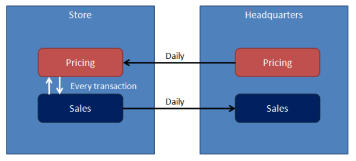

The number of multi-site deployments of enterprise .NET systems is increasing due to requirements of high availability and low-latency response times for users by moving servers and data closer to them.

RPC technologies quickly run into trouble in these environments as they treat local and remote sites the same way, disregarding the challenges of a potentially unstable network in-between.

In these cases, messaging is better than RPC, but many developers mistakenly represent physical site boundaries as logical boundaries, resulting in problems. NServiceBus prevents developers from going down the wrong path but may leave them wondering how NServiceBus handles multi-site communication.

## Disaster recovery and physical sites

In some cases, physical sites are replicas of one other. This is a common configuration for the purposes of disaster recovery and is largely influenced by technology, cost, and performance.

NServiceBus provides no special facilities for disaster recovery other than to enable developers to plug in their own specific technologies. This can take the form of database replication of subscription information, configuring MSMQ to store its message data on a SAN, etc. The difference in price and performance of the various options is quite large and is not covered here.

The next section describes the use of NServiceBus in logically significant, physical sites.

## Logically significant physical sites

While each branch of a bank or retail store has significance in each domain, when looking at the behavior of each site there is a great deal of similarity even to the point of identical functionality. This may not be true across all sites, especially when examining sites that serve as regional centers or headquarters.

The logical services that make up the business solution can have components installed at multiple physical sites. Some of the components may be the same; others may be different. Multiple logical services in the same site often collaborate closely with each other, and possibly less closely than with their own components at other sites.

For example, expect the Sales service in a store to talk to the pricing service in the same store for every transaction. On the other hand, the pricing service at the headquarters most likely pushes updated prices daily at most to the stores. Similarly, expect an end-of-day push of transactions from the sales service at each store to the headquarters.

This approach is not only common but recommended for use in situations where physical sites have logical significance, keeping all inter-site communication within logical service boundaries.

## Intra-service cross-site messaging

When sites have logical significance, the messages passed between them are different from the messages sent within the site.

For example, the act of publishing prices from the headquarters has logical significance. The manager of a store explicitly performs an end-of-day operation after collecting and counting all cash in the tills. Therefore, design separate classes for the messages passed between sites.

## Cross-site data transfer

partial: direct

This model is recommended as it provides all the benefits of durable messaging between unreliably connected machines; at several sites, the same as within a single site. It is possible to read a great deal of information on [setting up and managing a Windows VPN](https://technet.microsoft.com/en-us/library/hh831539.aspx).

In cases with only access to HTTP(S) for connections between sites, it is possible to enable the NServiceBus Gateway on each site so it transmits messages from a queue in one site to a queue in another site, including the hash of the messages to ensure that the message was transmitted correctly. The following diagram shows how it works:

The sending process in site A sends a message to the gateway's input queue. The gateway then initiates an HTTP(S) connection to its configured target site. The gateway in site B accepts HTTP(S) connections, takes the message transmitted, hashes it, and returns the hash to site A. If the hashes match, the gateway in site B transmits the message it receives to a configured queue. If the hashes don't match, the gateway in site A re-transmits.

## Configuration and code

To send a message to a remote site, use the `SendToSites` API call, as shown:

snippet: SendToSites

`SiteA` and `SiteB` is the list of remote sites where the message(s) are sent.

### Configuring Destination

partial: sites

NServiceBus automatically sets the required headers to enable sending messages back over the gateway using the familiar `Reply`.

{{NOTE:
The gateway is opinionated. It considers cross-site interactions through it to be inside the boundaries of a logical service. 

This internal communication between logically connected, but separately deployed components is restricted to use send semantics. The gateway exposes this through the `SendToSites()` method. 

Since publish/subscribe semantics are intended for communication between different logical services; the gateway does not support it. Publish/subscribe is fine between the endpoints on the same site, however.

In a scenario with multiple logical services deployed cross-site, run separate gateways for each one.
}}

## Securing the gateway with SSL

To provide data encryption for messages transmitted between sites, configure SSL on the machines in each site where the gateway is running.

Follow the steps for [configuring SSL](https://docs.microsoft.com/en-us/dotnet/framework/wcf/feature-details/configuring-http-and-https) and make sure to configure the gateway to listen on the appropriate port, as well as to contact the remote gateway on the same port.

## Automatic de-duplication

Going through alternate channels like HTTP(S) means that the MSMQ safety guarantees of exactly-once message delivery are not available. This means that communication errors resulting in retries can lead to receiving messages more than once. To avoid being burdened with de-duplication, the NServiceBus gateway supports this out of the box. Message IDs are stored in the configured [Persistence](/persistence) so duplicates can be detected and discarded.

partial: dedup

## Incoming channels

partial: channels

partial: wildcard

partial: timeouts
