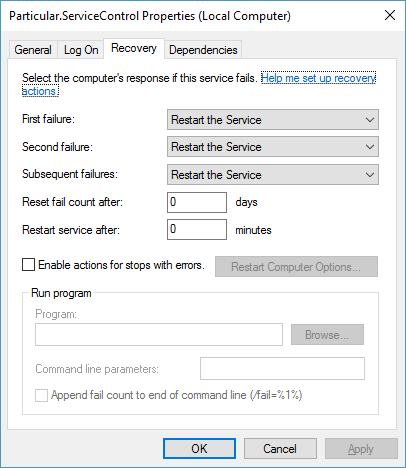

Running inside a [Windows Service](https://msdn.microsoft.com/en-us/library/d56de412.aspx) is the most common approach to hosting NServiceBus.


## Example Windows Service Hosting

 * Create a new Console Application.
 * Reference `System.ServiceProcess.dll`.
 * Change the program to inherit from. [ServiceBase](https://msdn.microsoft.com/en-us/library/system.serviceprocess.servicebase.aspx)

snippet: windowsservicehosting

NOTE: The use of `Environment.UserInteractive` to provide a dual console/service experience, i.e. this process can be executed from the command line or run as a Windows Service.


## Bootstrapping NuGet

There is a [Bootstrapping starter package](https://www.nuget.org/packages/NServiceBus.Bootstrap.WindowsService) on NuGet that automates most of the above code.


### How to use

Create a new Console Application (**.NET 4.5.2 or higher**) and install the NuGet package. A minimal NServiceBus configuration will be setup along with a `ProgramService.cs` class that can be used as both a interactive console for development purposes and a windows service for production use.

NOTE: This will also delete the default `Program.cs` since it is superseded by `ProgramService.cs`.


### Single use NuGet

This is a "single use NuGet". So it after install, and adding code to the project, it will remove itself. Since it is single use there will never be any "upgrade", this is a "use and then own the code" approach.


### For new self hosting applications

This NuGet helps get started on a new self hosted NServiceBus application. For existing NServiceBus projects the problems this NuGet attempts to address are most likely already solved.


### In Memory Persistence

This NuGet configures everything to be in memory. The reason is that it makes no assumptions about the choice of persistence and it also aims to be run-able with no other dependencies.

WARNING: Choose a durable persistence before deploying to production.


## Installation

When self-hosting a Windows service the startup code is in full control of installation. Windows supports these features though the use of the [Service Control tool](https://technet.microsoft.com/en-us/library/cc754599.aspx). For example a basic install and uninstall commands would be:

```dos
sc.exe create SalesEndpoint binpath= "c:\SalesEndpoint\SalesEndpoint.exe"
sc.exe delete SalesEndpoint
```

For completeness here are some other common usages of the Service Control tool:


### Service Name

The Windows Service Name can be configured, at creation time, as follows:

```dos
sc.exe create [ServiceName] binpath= [BinaryPathName]
sc.exe create SalesEndpoint binpath= "c:\SalesEndpoint\SalesEndpoint.exe"
```


### Display Name

Display name can be configured, at creation time, using the `displayname` argument:

```dos
sc.exe create [ServiceName] displayname= [Description] binpath= [BinaryPathName]
sc.exe create SalesEndpoint displayname= "Sales Endpoint" binpath= "c:\SalesEndpoint\SalesEndpoint.exe"
```


### Description

Description can be changed, after the service has been created, using the [sc description](https://technet.microsoft.com/en-us/library/cc742069.aspx) command.

```dos
sc.exe description [ServiceName] [Description]
sc.exe description SalesEndpoint "Service for hosting the Sales Endpoint"
```


### Service Dependencies

Service dependencies can be configured after the service has been created using the [sc config](https://technet.microsoft.com/en-us/library/cc990290.aspx) command.

```dos
sc.exe config [ServiceName] depend= <Dependencies(separated by / (forward slash))>
sc.exe config SalesEndpoint depend= MSMQ/MSDTC/RavenDB
```

### Restart Recovery

Windows Services can fail and Windows has a Windows Service Recovery mechanism that makes sure that a crashed service will be restarted.\

The endpoint can fail when using the [NServiceBus Host](nservicebus-host/) or [self hosting and implementing a critical error handler that exits the process](critical-errors.md#default-action-handling-in-nservicebus) when a critical error occurs. Not having Windows Service Recovery configured will result in message processing to halt.

When an NServiceBus endpoint is hosted as a Windows Service it is important to configure its Recovery options. These can be set by the service properties or via `sc.exe` which has advanced configuration options.


#### Via sc.exe

The default restart duration is 1 minute when enabling recovery via the Windows Service management console, but a different restart duration may be defined for the 1st, 2nd, 3rd and more using `sc.exe`. The following example will restart the service after 5 seconds, then after 10 seconds and then every 60 seconds. If the service doesn't crash within an hour (3600 seconds) the restart count is reset.

```dos
sc.exe failure [ServiceName] reset= [seconds] actions= restart/[milliseconds]/restart/[milliseconds]/restart/[milliseconds]
sc.exe failure SalesEndpoint reset= 3600 actions= restart/5000/restart/10000/restart/60000
```


#### Via Windows Service properties

Open the services snapin, select the endpoint Windows service and open its properties. This dialog has a Recovery tab which should look like the following screenshot.



NOTE: Restart durations are only configurable using `sc.exe`.

### Username and Password

Username and password can be configured, at creation time, using the `obj` and `password` parameters.

```dos
sc.exe create [ServiceName] obj= [AccountName] password= [Password] binpath= [BinaryPathName]
sc.exe create SalesEndpoint obj= MyDomain\SalesUser password= 9t6X7gkz binpath= "c:\SalesEndpoint\SalesEndpoint.exe"
```


### Start Mode

The Windows Service start mode can be configured, at creation time, using the `start` parameter.

```dos
sc.exe create [ServiceName] start= {auto | demand | disabled} binpath= [BinaryPathName]
sc.exe create SalesEndpoint start= demand binpath= "c:\SalesEndpoint\SalesEndpoint.exe"
```


### Uninstall

A service can be uninstalled using the [sc delete](https://technet.microsoft.com/en-us/library/cc742045.aspx) command.

```dos
sc.exe delete [ServiceName]
sc.exe delete SalesEndpoint
```


## Compared to NServiceBus Host


### Code similarity

When using a self hosted approach, inside a windows service, this code will share many similarities with other hosting code such as send only clients and web service hosting. This similarity will result in more consistent (and hence easier to understand code and increased opportunities for code re-use.


### Performance

Self host is a specific solution to a problem that can be more specialized and has less dependencies. This results in

 * Reduced memory usage
 * Faster startup/debugging time
 * Smaller deployment size


### Debugging

The NServiceBus Host is a non-trivial piece of software, especially when including its dependency on TopShelf. As such the NServiceBus Host can add complexity to debugging issues. Taking full control via self hosting allows less layers of abstraction which result in a simpler debugging experience.


### Controlling the entry point

When using the NServiceBus Host, the host is calling the endpoint configuration code. As such the configuration code and behaviors (such as startup and shutdown) need to plug into very specific APIs. For example `IWantCustomLogging`, `IWantCustomInitialization`, `IWantToRunWhenEndpointStartsAndStops` and `IConfigureLogging`. If the scenario is inverted, i.e. the developers code calls NServiceBus configuration, then the requirement for these APIs no longer exists.
