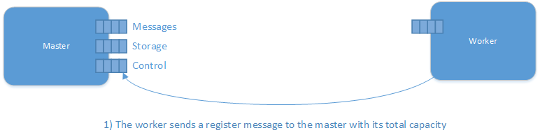
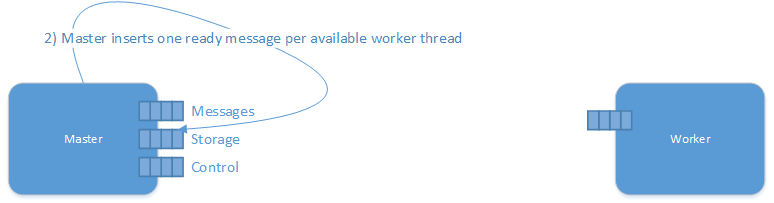
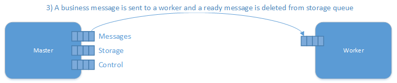
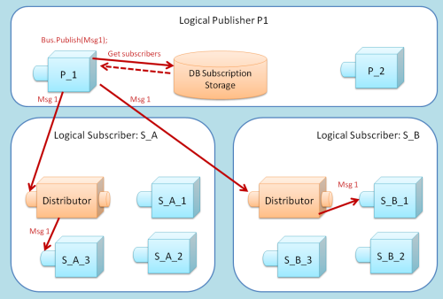

The NServiceBus Distributor is similar in behavior to standard [load balancers](http://en.wikipedia.org/wiki/Load_balancing_(computing)). It is the key to transparently scaling out message processing over many machines.

As a standard NServiceBus process, the Distributor maintains all the fault-tolerant and performance characteristics of NServiceBus but is designed never to overwhelm any of the worker nodes configured to receive work from it.

## When to use it?
Scaling out (with or without a Distributor) is only useful for where the work being done by a single machine takes time and therefore more computing resources helps. To help with this, monitor the [CriticalTime performance counter](monitoring-nservicebus-endpoints.md) on the endpoint and when you have the need, add in the Distributor. Scaling out using the Distributor when needed is made easy by not having to change code, just starting the same endpoint in Distributor and Worker profiles and this article explains how.

The Distributor is applicable only when using MSMQ as the transport for exchanging messages. NServiceBus uses MSMQ as the default transport. The Distributor is not required when using other brokered transports like SqlServer and RabbitMQ, since they share the same queue, even if there are multiple instances of the endpoints running. NServiceBus will ensure that only one of these instances of that endpoint will process that message in this case.

## Why use it?
When starting to use NServiceBus, you'll see that you can easily run multiple instances of the same process with the same input queue. This may look like scaling-out at first, but is really no different from running multiple threads within the same process. You'll see that you can't share a single input queue across multiple machines.

The Distributor gets around this limitation.

## What about MSMQ V4?
Version 4 of MSMQ, made available with Vista and Server 2008, can perform [remote transactional receive](http://msdn.microsoft.com/en-us/library/ms700128.aspx). This means that processes on other machines can transactionally pull work from a queue on a different machine. If the machine processing the message crashes, the message roll back to the queue and other machines could then process it.

Even though the Distributor provided similar functionality even before Vista was released, there are other reasons to use it even on the newer operating systems. The problem with 'remote transactional receive' is that it gets proportionally slower as more worker nodes are added. This is due to the overhead of managing more transactions, as well as the longer period of time that these transactions are open.

In short, the scale-out benefits of MSMQ V4 by itself are quite limited.

## Performance?
The Distributor is doing multiple operations for each message, it is processing (receives a ready message form a Worker, sends the work message to the Worker, receives a ready message post processing) so its performance is limited although it is doing very little work, therefore the benefit of using a Distributor is more suitable for relatively long running units of work (high I/O like http calls, writing to disk) as opposed to very short lived units of work (a quick read from the database and dispatching a message using `Bus.Send` or  `Bus.Publish`)

To get a sense of the expected performance you can divide your regular endpoint performance and divide it by 4.

If you need to scale out small units of work you might want to consider slicing your handlers to smaller vertical slices of functionality and deploying them on their own end points.

## How does it work?
Worker nodes send messages to the Distributor, telling it when they're ready for work. These messages arrive at the distributor via a separate 'control' queue:



Then the distributor creates a ready message per available thread:



The distributor stores this information. When a message arrives at the Distributor, it uses previously stored information to find a free Worker node, and sends the message to it. If no Worker nodes are free, the Distributor waits before repeating the previous step.




All pending work stays in the Distributor's queue (rather than building up in each of the Workers' queues), giving visibility of how long messages are actually waiting. This is important for complying with time-based service level agreements (SLAs).

For more information on monitoring, see [Monitoring NServiceBus Endpoints](monitoring-nservicebus-endpoints.md).

## Distributor configuration

### When hosting endpoints in NServiceBus.Host.exe
If you are running with [NServiceBus.Host.exe](the-nservicebus-host.md), the following profiles start your endpoint with the Distributor functionality:

To start your endpoint as a Distributor ensure you install the [NServiceBus.Distributor.MSMQ NuGet](https://www.nuget.org/packages/NServiceBus.Distributor.MSMQ) and then run the host from the command line, as follows:

```cmd
NServiceBus.Host.exe NServiceBus.MSMQDistributor
```
or if using a version of NServiceBus that is earlier than v4.3:
```cmd
NServiceBus.Host.exe NServiceBus.Distributor
```

The NServiceBus.[MSMQ]Distributor profile instructs the NServiceBus framework to start a Distributor on this endpoint, waiting for workers to enlist to it. Unlike the NServiceBus.[MSMQ]Master profile, the NServiceBus.[MSMQ]Distributor profile does not execute a Worker on its node.

You can use the NServiceBus.[MSMQ]Master to start a Distributor on your endpoint with a Worker on its endpoint.
To start your endpoint as a Master ensure you install the [NServiceBus.Distributor.MSMQ NuGet](https://www.nuget.org/packages/NServiceBus.Distributor.MSMQ) and then run the host from the command line, as follows:
```cmd
NServiceBus.Host.exe NServiceBus.MSMQMaster
```
or if using a version of NServiceBus that is earlier than v4.3:
```cmd
NServiceBus.Host.exe NServiceBus.Master
```

### When self-hosting
When you [self host](hosting-nservicebus-in-your-own-process.md) your endpoint, use this configuration:

For v3:
<!-- import ConfiguringDistributor-V3 -->

For v4 using [NServiceBus.Distributor.MSMQ NuGet](https://www.nuget.org/packages/NServiceBus.Distributor.MSMQ):
<!-- import ConfiguringDistributor-V4 -->

For v5:
<!-- import ConfiguringDistributor-V5 -->

## Worker Configuration
Any NServiceBus endpoint can run as a Worker node. To activate it, create a handler for the relevant messages and ensure that the `app.config` file contains routing information for the Distributor.

### When hosting in NServiceBus.Host.exe
If you are hosting your endpoint with NServiceBus.Host.exe, to run as a Worker, use this command line:
```cmd
NServiceBus.Host.exe NServiceBus.MSMQWorker
```
or if using a version of NServiceBus that is earlier than v4.3:
```cmd
NServiceBus.Host.exe NServiceBus.Worker
```
Configure the name of the master node server as shown in this `app.config` example. Note the `MasterNodeConfig` section:

```XML
<?xml version="1.0" encoding="utf-8" ?>
<configuration>
  <configSections>
    <!-- Other sections go here -->
    <section name="MasterNodeConfig" type="NServiceBus.Config.MasterNodeConfig, NServiceBus.Core" />
  </configSections>
  <!-- Other config options go here -->
  <MasterNodeConfig Node="MachineWhereDistributorRuns"/>
</configuration>
```

Read about the `DistributorControlAddress` and the `DistributorDataAddress` in the [Routing with the Distributor](#routing-with-the-distributor) section.

### When self-hosting
If you are self-hosting your endpoint here is the code required to enlist the endpoint with a Distributor.

For v3:
<!-- import ConfiguringWorker-V3 -->

For v4 using [NServiceBus.Distributor.MSMQ NuGet](https://www.nuget.org/packages/NServiceBus.Distributor.MSMQ):
<!-- import ConfiguringWorker-V4 -->

For v5:
<!-- import ConfiguringWorker-V5 -->

Similar to self hosting, ensure the `app.config` of the Worker contains the `MasterNodeConfig` section to point to the host name where the master node (and a Distributor) are running.

## Routing with the Distributor
The Distributor uses two queues for its runtime operation. The `DataInputQueue` is the queue where the client processes send their applicative messages. The `ControlInputQueue` is the queue where the worker nodes send their control messages.

To use values other than the NServiceBus defaults you can override them, as shown in the `UnicastBusConfig` section below:

```XML
<UnicastBusConfig DistributorControlAddress="distributorControlBus@Cluster1" DistributorDataAddress="distributorDataBus@Cluster1">
  <MessageEndpointMappings>
    <!-- regular entries -->
  </MessageEndpointMappings>
</UnicastBusConfig>
```

If those settings do not exist, the control queue is assumed as the endpoint name of the worker, concatenated with the `distributor.control@HostWhereDistributorIsRunning` string.

Similar to standard NServiceBus routing, you do not want high priority messages to get stuck behind lower priority messages, so just as you have separate NServiceBus processes for different message types, you also set up different Distributor instances (with separate queues) for different message types.

In this case, name the queues just like the messages. For example, `SubmitPurchaseOrder.StrategicCustomers.Sales`. This is the name of the distributor's data queue and the input queues of each of the workers. The distributor's control queue is best named with a prefix of
'control', as follows: `Control.SubmitPurchaseOrder.StrategicCustomers.Sales`.

When using the Distributor in a full publish/subscribe deployment, you see is a Distributor within each subscriber balancing the load of events being published, as follows:



Keep in mind that the Distributor is designed for load balancing within a single site, so do not use it between sites. In the image above, all publishers and subscribers are within a single physical site. For information on using NServiceBus across multiple physical sites, see [the gateway](the-gateway-and-multi-site-distribution.md).

## High availability
If the Distributor goes down, even if its worker nodes remain running, they do not receive any messages. Therefore, it is important to run the Distributor on a cluster that has its its queues configured as clustered resources.

Since the Distributor does not do CPU or memory intensive work, you can often put several Distributor processes on the same clustered server. Be aware that the network IO may end up being the bottleneck for the Distributor, so take into account message sizes and throughput when sizing your infrastructure.


## Next steps
Build a scalable solution using Master node and the workers solution that are in the [ScaleOut sample](scale-out-sample.md) .

