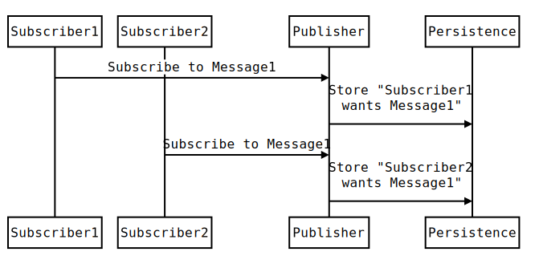
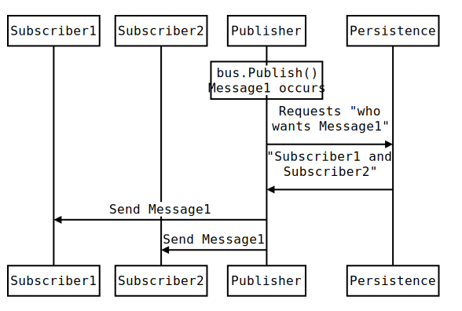
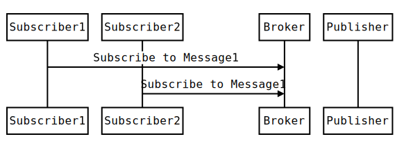

NServiceBus has a built in implementation of the [Publish-subscribe pattern](https://en.wikipedia.org/wiki/Publish%E2%80%93subscribe_pattern).

> publish–subscribe is a messaging pattern where senders of messages, called publishers, do not program the messages to be sent directly to specific receivers, called subscribers. Instead, published messages are characterized into classes, without knowledge of what, if any, subscribers there may be. Similarly, subscribers express interest in one or more classes, and only receive messages that are of interest, without knowledge of what, if any, publishers there are.

Or in simpler terms

> Subscribers let the publisher know they're interested, and the publisher stores their addresses so that it knows where to send which message.

## Mechanics

Depending on the features provided by a given transport there are two possible implementations of  Publish-Subscribe mechanics: "Persistence based" and "Native".

Note: For simplicity these explanations refer to specific endpoints as "Subscribers" and "Publishers". However in reality any endpoint can be both a publisher and/or and a subscriber. 

### Persistence Based

Persistence based publish-subscribe relies on the publisher having access to a location to store the connection between message types and their subscribers.

Available subscription persistences include

 * [MSMQ](/nservicebus/msmq)
 * [RavenDB](/nservicebus/ravendb)
 * [NHibernate](/nservicebus/ravendb)
 * [InMemory](/nservicebus/persistence/in-memory.md)
 * [Azure Storage](/nservicebus/azure/azure-storage-persistence.md)

Transports that require persistences

 * [MSMQ](/nservicebus/msmq)
 * [SQLServer](/nservicebus/sqlserver)
 * [Azure Storage Queues](/nservicebus/azure/azure-storage-queues-transport.md)

#### Subscribe

The subscribe workflow for persistence based transports is as follows

 1. Subscribers request to a publisher the intent to subscribe to certain message types.
 1. Publisher stores both the subscriber names and the message types in the persistence.

<!-- 
https://bramp.github.io/js-sequence-diagrams/
Participant Subscriber1 As Subscriber1
Participant Subscriber2 As Subscriber2
Subscriber1->Publisher: Subscribe to Message1 
Publisher->Persistence: Store "Subscriber1\nwants Message1" 
Subscriber2->Publisher: Subscribe to Message1 
Publisher->Persistence: Store "Subscriber2\nwants Message1"
-->

#### Publish

The subscribe workflow for persistence based transports is as follows

 1. Some code (eg a saga or a handler) request that a message be published.
 1. Publisher queries the storage for a list of subscribers.
 1. Publisher loops through the list and sends a copy of that message to each subscriber.

<!-- 
https://bramp.github.io/js-sequence-diagrams/
Participant Subscriber1 As Subscriber1
Participant Subscriber2 As Subscriber2
Note over Publisher: bus.Publish()\nMessage1 occurs
Publisher->Persistence: Requests "who\nwants Message1" 
Persistence->Publisher: "Subscriber1 and\nSubscriber2" 
Publisher->Subscriber1: Send Message1 
Publisher->Subscriber2: Send Message1 
-->

### Native Based

For transports that support publish–subscribe natively no persistence is required.

Transport that support native publish–subscribe

 * [Azure Service Bus](/nservicebus/azure/azure-servicebus-transport.md)
 * [RabbitMQ](/nservicebus/rabbitmq/)
 

#### Subscribe

The subscribe workflow for native transports is as follows

 1. Subscribers send request to the broker with the intent to subscribe to certain message types.
 1. Broker stores the subscription information.

Note that in this case the publisher does not interact in the subscribe workflow.
 
<!-- 
https://bramp.github.io/js-sequence-diagrams/
Participant Subscriber1 As Subscriber1
Participant Subscriber2 As Subscriber2
Participant Broker As Broker
Participant Publisher As Publisher
Subscriber1->Broker: Subscribe to Message1 
Subscriber2->Broker: Subscribe to Message1 
-->

#### Publish

The publish workflow for native transports is as follows

 1. Some code (eg a saga or a handler) request that a message be published.
 1. Publisher sends the message to the Broker.
 1. Broker sends a copy of that message to each subscriber.

<!-- 
https://bramp.github.io/js-sequence-diagrams/
Participant Subscriber1 As Subscriber1
Participant Subscriber2 As Subscriber2
Participant Transport As Transport
Note over Publisher: bus.Publish()\nMessage1 occurs
Publisher->Transport: Sends Message1
Transport->Subscriber1: Send Message1 
Transport->Subscriber2: Send Message1 
-->

## Versioning subscriptions

In NServiceBus version 3.0 and onwards subscriptions for types with the same Major version are considered compliant. This means that a subscription for MyEvent 1.1.0 will be considered valid for MyEvent 1.X.Y as well.  Be aware that if your assembly uses a fourth build number, i.e. 1.X.Y.Z, the Z numbers must match in each assembly to be considered compliant.

NOTE: Version 2.X required a perfect match. This should make it easier to upgrade your publishers without affecting the subscribers.

## Authorizations

You may not want to allow any endpoints to subscribe to a given publisher or event. NServiceBus provides a way for you to intervene in the subscription process and decide whether a given client should be allowed to subscribe to a given message. 

NOTE: Subscription authorization is only available when using transports that require persistence based publish-subscribe.

The class implements the `IAuthorizeSubscriptions` interface, which requires the `AuthorizeSubscribe` and `AuthorizeUnsubscribe` methods. The implementation that comes in the sample doesn't do very much, returning true for both. In a real project, you may access some Access Control System, Active Directory, or maybe just a database to decide if the action should be allowed.
