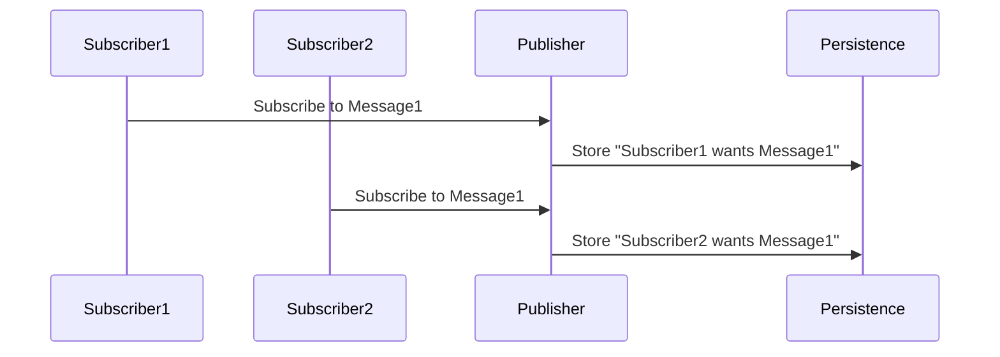
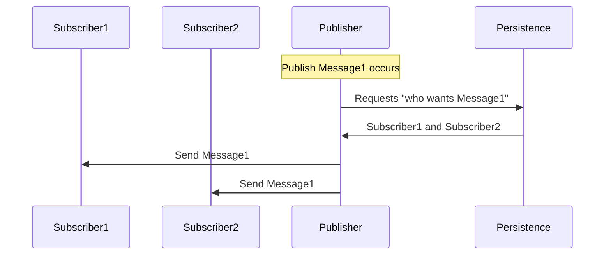
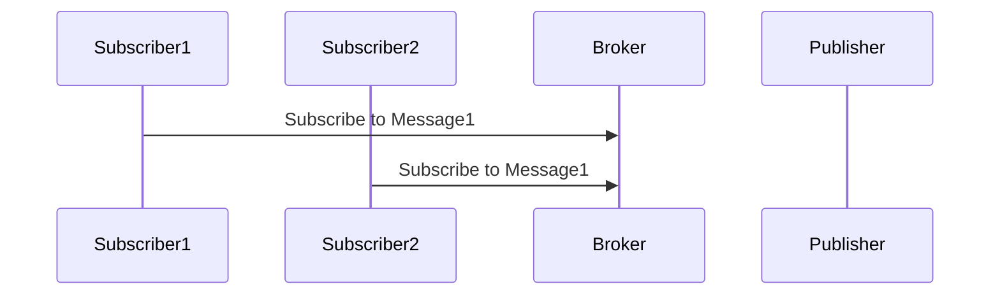
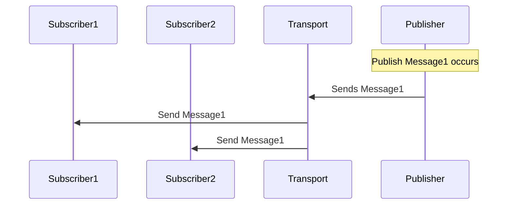

NServiceBus has a built in implementation of the [Publish-subscribe pattern](https://en.wikipedia.org/wiki/Publish%E2%80%93subscribe_pattern).

> publish–subscribe is a messaging pattern where senders of messages, called publishers, do not program the messages to be sent directly to specific receivers, called subscribers. Instead, published messages are characterized into classes, without knowledge of what, if any, subscribers there may be. Similarly, subscribers express interest in one or more classes, and only receive messages that are of interest, without knowledge of what, if any, publishers there are.

Or in simpler terms

> Subscribers let the publisher know they're interested, and the publisher stores their addresses so that it knows where to send which message.

## Mechanics

Depending on the features provided by a given transport there are two possible implementations of Publish-Subscribe mechanics: message-driven (persistence-based) and native.

Note: For simplicity these explanations refer to specific endpoints as "Subscribers" and "Publishers". However in reality any endpoint can be both a publisher and/or and a subscriber.

### Message-driven (persistence-based)

Message-driven publish-subscribe is controlled by *subscribe* and *unsubscribe* system messages sent by the subscriber to the publisher and relies on the publisher having access to a persistent store for maintaining the mapping between message types and their subscribers.

Available subscription persisters include

 * [MSMQ](/persistence/msmq)
 * [RavenDB](/persistence/ravendb)
 * [NHibernate](/persistence/nhibernate)
 * [InMemory](/persistence/in-memory.md)
 * [Azure Storage](/persistence/azure-storage)
 * [SQL Server](/persistence/sql)

The message-driven publish-subscribe implementation is used by the [unicast transports](/transports/types.md#unicast-only-transports). These transports are limited to unicast (point-to-point) communication and have to simulate multicast delivery via a series of point-to-point communications.

#### Subscribe

The subscribe workflow for unicast transports is as follows

 1. Subscribers request to a publisher the intent to subscribe to certain message types.
 1. Publisher stores both the subscriber names and the message types in the persistence.

The publisher's address is provided via [routing configuration](/nservicebus/messaging/routing.md).

#### Publish

The publish workflow for [unicast transports](/transports/types.md#unicast-only-transports) is as follows

 1. Some code (e.g. a saga or a handler) request that a message be published.
 1. Publisher queries the storage for a list of subscribers.
 1. Publisher loops through the list and sends a copy of that message to each subscriber.

### Native

For multicast transports that [support publish–subscribe natively](/transports/types.md#multicast-enabled-transports) neither persistence nor control message exchange is required to complete the publish-subscribe workflow. 

#### Subscribe

The subscribe workflow for multicast transports is as follows

 1. Subscribers send request to the broker with the intent to subscribe to certain message types.
 1. Broker stores the subscription information.

Note that in this case the publisher does not interact in the subscribe workflow.

#### Publish

The publish workflow for multicast transports is as follows

 1. Some code (e.g. a saga or a handler) request that a message be published.
 1. Publisher sends the message to the Broker.
 1. Broker sends a copy of that message to each subscriber.

