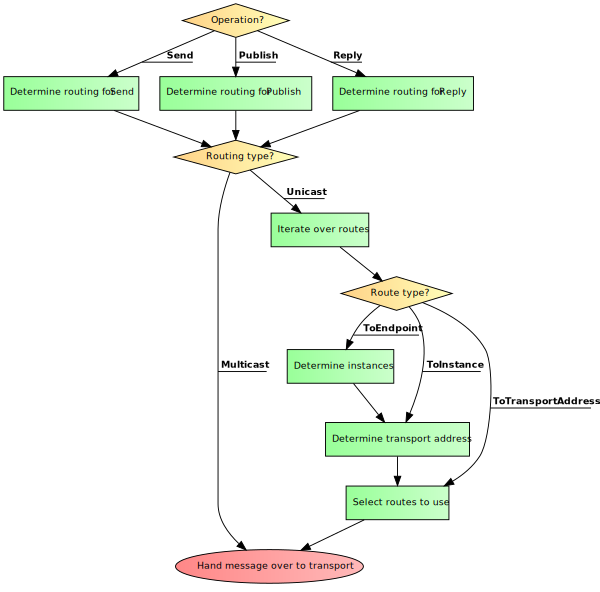

One of the core features of NServiceBus is routing of messages. The only thing required is to perform a Send, Publish or Reply and the actual message destination is calculated by the framework. Flexible message routing is a feature added in Version 6. In previous versions NServiceBus used fixed [message ownership mappings](/nservicebus/messaging/message-owner.md) that allowed only to map the message type (or all types in an assembly or a namespace) to physical addresses (queue names). The flexible routing in Version 6 splits this mapping up into a series of individually configurable steps. NServiceBus 6 still understands the old configuration in form of message-endpoint mappings for backwards compatibility.

<!--
http://code2flow.com/#
switch (Operation?) {
  case Send:
    Determine routing for `Send`;
    break;
  case Publish:
    Determine routing for `Publish`;
    break;
  case Reply:
    Determine routing for `Reply`;
    break;
}

switch (Routing type?)
{
  case Multicast:
    Hand message over to transport;
    break;
  case Unicast:
    Iterate over routes;
    switch (Route type?) {
      case ToEndpoint:
         Determine instances;
      case ToInstance:
         Determine transport address;
         break;
      case ToTransportAddress:
         break;
    }
    Select routes to use;
    Hand message over to transport;
    break;
}
-->

## Endpoint and endpoint instances

Endpoint is a logical concept that relates to a program that uses NServiceBus to communicate with other similar programs. Each endpoint has a name e.g. `Sales` or `OrderProcessing`.

During deployment each endpoint might be materialized in form of one or many instances. Each instance is an identical copy of binaries resulting from building the endpoint program code base. Usually each endpoint instance is placed in separate directory or separate machine. Each instance has its unique identity that consists of the name of the endpoint (e.g. `Sales`) and a discriminator. The discriminator can be provided either by the hosting infrastructure (e.g. Azure role ID) or by the user himself. In addition to these, an endpoint instance identity can include transport-specific information (e.g. machine name in MSMQ or schema name in SQL Server). The discriminator can be absent.

## Send, Publish and Reply

NServiceBus offers three top-level API calls for sending messages, namely Send, Publish and Reply. Each of these calls can have different behavior in terms of message routing.

## Types of routing

There are two types of routing recognized by NServiceBus, unicast routing and multicast routing.

### Unicast routing

Unicast routing uses queues which are inherently point-to-point channels. Each endpoint instance has an input queue. When sending a message to multiple destinations, a message is copied in-memory at sender endpoint and a copy of the message is dispatched to each destination's input queue.

### Multicast routing

Multicast routing uses topics. Multiple receivers can subscribe to a single topic and each message published to the topic is copied by the messaging infrastructure and delivered to each interested receiver.

### Transport

The [transport selected by the user](/nservicebus/transports/) decides, for each of action (Send, Publish or Reply), which routing type is used. For example, [MSMQ transport](/nservicebus/msmq/) uses the unicast routing for all the APIs while [RabbitMQ transport](/nservicebus/rabbitmq/) uses the unicast routing for Send and Reply but multicast routing for Publish.

## Unicast routing

Unicast routing is built into the core of NServiceBus. In absence of advanced transport features it takes care of implementing complex message routing patterns (e.g. Publish/Subscribe) using most basic primitives (sending a message to a single destination).

### Roles and responsibilities

Unicast routing in NServiceBus uses a layered model. The task of mapping a message type to a collection of transport addresses is split into three layers:

 * type mapping
 * endpoint mapping
 * instance mapping

Each layer is the responsibility of people in a different organizational role and has different reasons and speed of change.

### Type mapping layer

Mapping a message type to the destination is the responsibility of the **architect** role (which can be fulfilled by the whole team of developers). It tells NServicesBus to which endpoint a given type of message should be send or, when it comes to events, which endpoint is responsible for publishing.

#### Static routes

The most common way of specifying the type mapping is through static routes. Most of the times the routing should specify the destination endpoint 

snippet:Routing-StaticRoutes-Endpoint

When necessary (e.g. for integration with legacy systems) you can specify the static routing to a given transport-level address but this should be avoided in most scenarios and the address resolution should be delegated to lower layers of routing. 

snippet:Routing-StaticRoutes-Address

#### Dynamic routes

Dynamic routes are meant to provide a convenient extensibility point that can be used both by users and NServiceBus add-ons. To add a dynamic route you need to pass a function that takes a `Type` and a `ContextBag` containing the context of current message processing and returns a collection of destinations.

snippet:Routing-DynamicRoutes

Following example shows how you could implement a shared-store based routing where destinations of messages are managed e.g. in a database.

snippet:Routing-CustomRoutingStore

NOTE: The function passed to the `AddDynamic` call is executed **each time** a message is sent so it is essential to make sure it is performant (e.g. by caching the results if getting the result requires crossing a process boundary).

### Endpoint mapping layer

Mapping of an endpoint to the collection of instances is the responsibility of **operations engineers**. They usually know where a given endpoint has been deployed.

#### Default mapping

By default, NServiceBus assumes that each endpoint has a single non-scaled-out instance without a *discriminator*. This default allows for running without any configuration on transports like SQL Server or RabbitMQ.

#### Using config file

In most scenarios endpoint mapping should be done via a config file so it can be modified without the need for re-deploying the binaries. 

snippet:Routing-FileBased-Config

To read more about file-based endpoint mapping, go [here](nservicebus/messaging/file-based-routing.md).

NOTE: If you use static type mapping to an address instead of an endpoint you won't be able to take advantage of file-based instance resolution.

#### Static mapping

The `EndpointInstances` class provides a method that let you register a static mapping. This API is useful in very specific scenarios where developers need to take control over a certain mapping.

snippet:Routing-StaticEndpointMapping

#### Dynamic mapping

Dynamic mapping is meant to provide a convenient extension point for both users and NServiceBus add-ons. To add a dynamic mapping rule you need to pass a function that takes an endpoint name and returns a collection of endpoint instance names.

snippet:Routing-DynamicEndpointMapping

In this example the rule returns two instances in which case providing a discriminator is mandatory. In addition to that, the instance "1" specifies a custom property which can be used by the transport to generate the actual address. The instance "2" usues an MSMQ-specific convenience method to achieve the same goal.

### Instance mapping layer

Mapping of the endpoint instance to a transport address is a responsibility of the transport infrastructure. Usually it does not require intervention from the user as the selected transport automatically registers its translation rule. The only times where user is required to configure the instance mapping is when the default translation violates some naming rules implied by the transport infrastructure (e.g. the generated transport address is too long for a queue name in MSMQ).

#### Special cases

Sometimes there is a need to override the address translation for the single endpoint instance e.g. because the auto-generated address violates a constraint imposed by the transport. Such special case mappings have precedence over other mappings. In order to register an exception you need to use following API:

snippet:Routing-SpecialCaseTransportAddress

#### Rules

User-provided rules override the transport defaults. In order to register a rule you need to use following API:

snippet:Routing-TransportAddressRule

A rule is a function that takes the instance name as the input and return a transport address or null if it does not provide translation for that particular instance name. All rules registered via this API have equal importance. It is expected that the user is responsible for providing a set of mutually exclusive rules so that for each endpoint instance name there is only one not-null translation result. In case there is more than one, an exception is raised.
