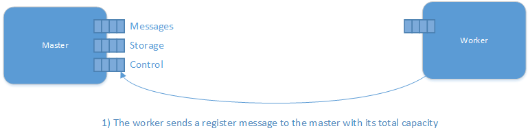
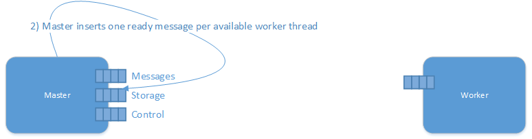
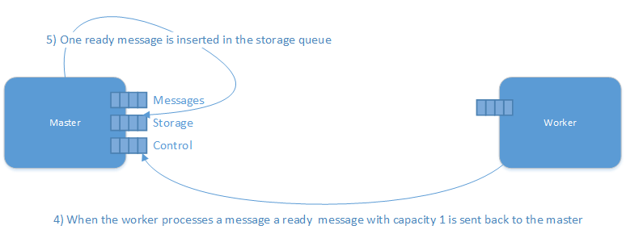

The NServiceBus Distributor is similar in behavior to standard [load balancers](https://en.wikipedia.org/wiki/Load_balancing_%28computing%29). It is the key to transparently scaling out message processing over many machines.

As a standard NServiceBus process, the Distributor maintains all the fault-tolerant and performance characteristics of NServiceBus but is designed never to overwhelm any of the worker nodes configured to receive work from it.

WARNING: Keep in mind that the Distributor is designed for load balancing within a single site, so do not use it between sites. For information on using NServiceBus across multiple physical sites, see [the gateway](/nservicebus/gateway/multi-site-deployments.md).


## How the Distributor works

Worker nodes send messages to the Distributor, telling it when they're ready for work. These messages arrive at the distributor via a separate 'control' queue:



Then the distributor creates a ready message per available thread:



The distributor stores this information. When a message arrives at the Distributor, it uses previously stored information to find a free Worker node, and sends the message to it. If no Worker nodes are free, the Distributor waits before repeating the previous step.





All pending work stays in the Distributor's queue (rather than building up in each of the Workers' queues), giving visibility of how long messages are actually waiting. This is important for complying with time-based service level agreements (SLAs).

For more information on monitoring, see [Performance Counters](/nservicebus/operations/performance-counters.md).

For more information about Pub/Sub in a distributor scenario see the [Distributor and Publish-Subscribe](/nservicebus/msmq/distributor/publish-subscribe.md) article.


## Performance

For each message being processed, the Distributor performs a few additional operations: it receives a ready message from a Worker, sends the work message to the Worker and receives a ready message post processing. That means that using Distributor introduces a certain processing overhead, that is independent of how much actual work is done. Therefore the Distributor is more suitable for relatively long running units of work (high I/O like http calls, writing to disk) as opposed to very short lived units of work (a quick read from the database and dispatching a message using `Bus.Send` or  `Bus.Publish`).

To get a sense of the expected performance take the regular endpoint performance and divide it by 4.

If scale out small units of work is required consider splitting the handlers into smaller vertical slices of functionality and deploying them on their own endpoints.

WARNING: The default concurrency of Distributor is set to 1. That means the messages are processed sequentially. Make sure that the [**MaximumConcurrencyLevel** has been increased in the configuration](/nservicebus/operations/tuning.md#tuning-concurrency) on the Distributor endpoint. 

Increasing the concurrency on the workers might not lead to increased performance if the executed code is multi-threaded, e.g. if the worker does CPU-intensive work using all the available cores such as video encoding.


## Routing with the Distributor

The Distributor uses two queues for its runtime operation. The `DataInputQueue` is the queue where the client processes send their applicable messages. The `ControlInputQueue` is the queue where the worker nodes send their control messages.

To use values other than the NServiceBus defaults override them, as shown in the `UnicastBusConfig` section below:

```xml
<UnicastBusConfig DistributorControlAddress="EndpointName.Distributor.Control@MachineWhereDistributorRuns"
                  DistributorDataAddress="EndpointName@MachineWhereDistributorRuns">
  <MessageEndpointMappings>
    <!-- regular entries -->
  </MessageEndpointMappings>
</UnicastBusConfig>
```

If those settings do not exist, the control queue is assumed as the endpoint name of the worker, concatenated with the `distributor.control@HostWhereDistributorIsRunning` string.

Similar to standard NServiceBus routing, it is not desirable to have high priority messages to get stuck behind lower priority messages, so just as it is possible to have separate NServiceBus processes for different message types, it is also possible set up different Distributor instances (with separate queues) for different message types.

In this case, name the queues just like the messages. For example, `SubmitPurchaseOrder.StrategicCustomers.Sales`. This is the name of the distributor's data queue and the input queues of each of the workers.


## Worker QMId needs to be unique

Every installation of MSMQ on a Windows machine is represented uniquely by a Queue Manager ID (QMId). The QMId is stored as a key in the registry, `HKEY_LOCAL_MACHINE\Software\Microsoft\MSMQ\Parameters\Machine Cache`. MSMQ uses the QMId to know where is should send acks and replies for incoming messages.

It is very important that all the machines have their own unique QMId. If two or more machines share the same QMId, only one of those machines are able so successfully send and receive messages with MSMQ. Exactly which machine works changes in a seemingly random fashion.

The primary reason for machines ending up with duplicate QMIds is cloning of virtual machines from a common Windows image without running the recommended [Sysprep](https://technet.microsoft.com/en-us/library/cc766049.aspx) tool.

If there are two or more machines with the same QMId reinstall the MSMQ feature to generate a new QMId.

Check out [John Breakwell's blog](https://blogs.msdn.microsoft.com/johnbreakwell/2007/02/06/msmq-prefers-to-be-unique/) for more details.


## High availability

If the Distributor goes down, even if its worker nodes remain running, they do not receive any messages. It is important to run the Distributor on a cluster that has its its queues configured as clustered resources.

Since the Distributor performs no CPU or memory intensive work, several Distributor processes can be placed on the same clustered server. Be aware that the network IO may end up being the bottleneck for the Distributor, so take into account message sizes and throughput when sizing the infrastructure.