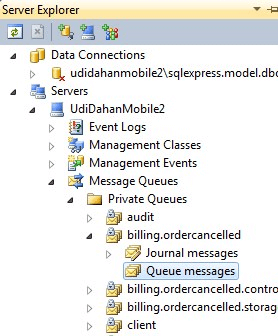
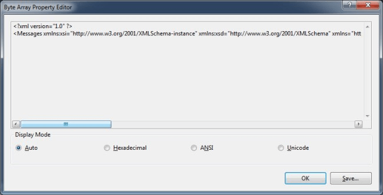
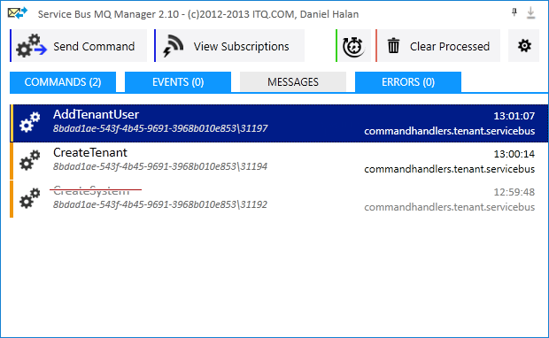

### Visual Studio

The queues on the local machine can be listed using Server Explorer in Visual Studio:



If there is a message in one of the queues, select it and view the properties of the message in the property panel in Visual Studio (usually on the bottom right):


The most interesting property is the BodyStream as it allows the contents of the message to be seen:




### Windows native tools

The MSMQ MMC snap-in can be used to manage queues.

Use one of the following based on the OS

```
Start > Run > compmgmt.msc (Computer Management) > Features > Message Queuing
```

or

```
Start > Run > compmgmt.msc (Computer Management) > Services and Applications > Message Queuing
```


### Queue Explorer

Queue Explorer is a commercial 3rd party product for managing MSMQ.

http://www.cogin.com/mq/

> QueueExplorer can do much more than with built-in management console - copy, move or delete messages, save and load, stress test, view and edit full message bodies (with special support for .NET serialized objects), and much more.


### Mqueue Viewer

Fast and free tool to manage MSMQ messages and queues.

https://www.mqueue.net/

> Mqueue Viewer - is a fast and simple tool to manage MSMQ queues, view, edit, add, delete messages. Works with multiple machines/servers.


### Service Bus MQ Manager

A free application to view and manage MSMQ messages.

https://github.com/danielHalan/ServiceBusMQManager


