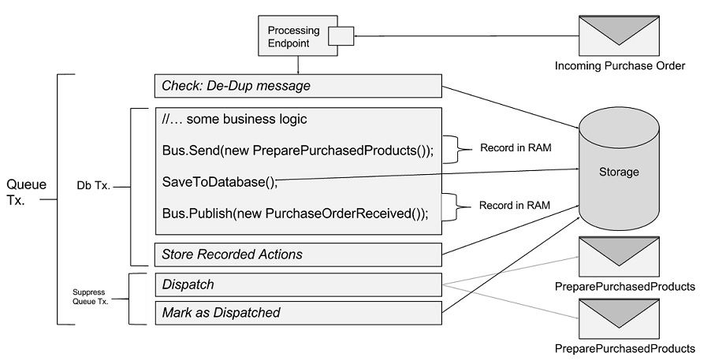

NServiceBus Version 5 brings the option of running endpoints with the same reliability we all got accustomed to while running under DTC, but now without it. 

## Supported Transports

Out of the box RabbitMQ is the only transport that is enabled automatically by default.

SqlServer is also supported but in a different way (for details, see [SqlServer Transport](#sqlserver-transport) section below).
All other transports need to be enabled explicitly using both of the following configuration settings when configuring the endpoint:

<!-- import OutboxEnablineInFluent -->  

and also the following configuration in the config file:

<!-- import OutboxEnablingInAppConfig --> 

NOTE: It may seem extreme to require double opt-in configuration for all other transports, but this is because we want users to be very aware that this new feature should not be used with existing endpoints that currently use DTC, unless those endpoints are [idempotent](http://en.wikipedia.org/wiki/Idempotence). Otherwise, problems could arise from double-processing messages sent (via an at-least-once guarantee) more than once.

## How does it work

These feature has been implemented using both the [Outbox pattern](http://gistlabs.com/2014/05/the-outbox/) and the [Deduplication pattern](http://en.wikipedia.org/wiki/Data_deduplication#In-line_deduplication).
As a message is dequeued we check to see if we have previously processed it. If so, we then deliver any messages in the outbox for that message but do not invoke message-processing logic again. If the message wasn't previously processed, then we invoke the regular handler logic, storing all outgoing message in a durable storage in the same transaction as the users own database changes. Finally we send out all outgoing messages and update the deduplication storage.

Here is a diagram how it all works:

## Caveats

- Currently only NHibernate storage has been implemented;
- Both the business data and dedupplication data need to share the same database;

## SqlServer Transport

SqlServer transport supports No-DTC without Outbox.

To enable SqlServer transport to not use MSDTC you need to ensure that all of the following connection strings are exactly the same (including the casing) in your config file:

<!-- import OutboxSqlServerConnectionStrings --> 

Next you need to configure `NHibernate` to be the default persistence and pass the business data [NHibernate Configuration instance](http://www.nhforge.org/doc/nh/en/#configuration-programmatic) to it, eg:

<!-- import OutboxShareNHibernateConfiguration -->  

## How to access NHibernate Session

To get access to the current `IDbConnection`, `ISession` or/and `ITransaction`, all it is required is to inject via DI the `NServiceBus.Persistence.NHibernate.NHibernateStorageContext` into your own sagas or/and handlers.
Here is an example:

<!-- import OutboxNHibernateAccessSession -->

## What extra tables does NHibernate create 

To keep track duplicate messages, the NHibernate implementation of Outbox requires the creation of two additional tables in your database, these are called `OutboxRecord` and `OutboxOperation`.

## How long are the deduplication records kept

The NHibernate implementation by default keeps deduplication records for 7 days and runs the purge every 1 minute.
These default settings can be changed by specifying new defaults in the config file using [TimeStamp strings](http://msdn.microsoft.com/en-us/library/ee372286.aspx), here is how to do it:

<!-- import OutboxNHibernateTimeToKeep -->

## Samples

### [Sql Server Transport without MSDTC Sample](https://github.com/Particular/NServiceBus.SqlServer/archive/Samples.zip)

This sample shows how to configure an Endpoint that uses SQL Server transport and NHibernate as it business data storage and how to access the NHIbernate `ISession` for a `Saga` and a `Handler`.

### [Outbox Sample](https://github.com/Particular/NServiceBus.NHibernate/archive/Samples.zip) 

This sample shows how to enable Outbox on an endpoint and how to access the NHibernate `ISession` for a `Saga` and a `Handler`. 
