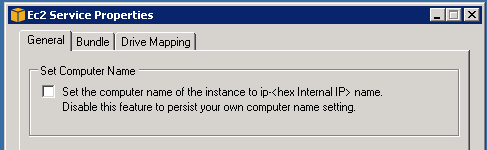

Stale endpoint naming issues may occur when shutting down and restarting the server instance from the [AWS Management Console](https://aws.amazon.com/console/) due to AWS changing the host name of the instance.

It is possible to turn off this server name change feature using a tool called EC2ConfigService Settings which is installed on the server instance:

In this tool, uncheck "Set Computer Name" in the General tab and click OK:

