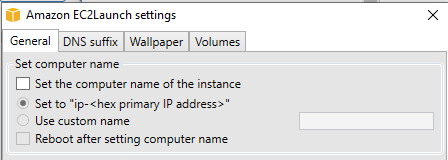

Stale endpoint naming issues may occur when you shut down and restart the server instance from the AWS console. It happens as AWS is changing the host name.

It is possible to turn off this server name change feature, using a tool installed on the server instance called EC2ConfigService Settings:

In this tool, uncheck "Set Computer Name" in the General tab and click OK:

