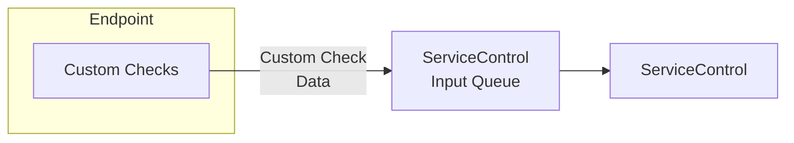

The CustomChecks Plugin enables custom endpoint monitoring. It allows the developer of an NServiceBus endpoint to define a set of conditions that are checked on endpoint startup or periodically.

These conditions are solution and/or endpoint specific. It is recommended that they include the set of explicit (and implicit) assumptions about what enables the endpoint to function as expected versus what will make the endpoint fail.

For example, custom checks can include checking that a third-party service provider is accessible from the endpoint host, verifying that resources required by the endpoint are above a defined minimum threshold, and more.

As mentioned above, there are two types of custom checks.

### One-time custom check

A one-time custom check is executed once when the endpoint host starts. NServiceBus assembly scanning mechanism detects a class inheriting from `CustomCheck` and creates an instance of that class. The check should happen in the constructor for NServiceBus Version 5 and the result needs to be communicated back using either `ReportPass` or `ReportFailed` methods. For NServiceBus Version 6 the check should happen in the `PerformCheck` method and the result needs to be communicated back using either `CheckResult.Pass` or `CheckResult.Failed` methods.

NOTE: Only the instance of a custom check which has been created by the NServiceBus framework is able to report status. The check instances created in user code will not function.

snippet: CustomCheck

### Periodic check

A periodic check is executed at defined intervals. The check happens not in the constructor but in a dedicated `PerformCheck` method which returns the check result.

snippet: PeriodicCheck

### Results

The result of a custom check is either success or a failure (with a detailed description defined by the developer). This result is sent as a message to the ServiceControl queue and status will be shown in the ServicePulse UI.

NOTE: It is essential to deploy this plugin to the endpoint in production in order to receive error notifications about the custom check failures in the ServicePulse dashboard.

### Configuration

The CustomChecks plugin is enabled via

snippet: CustomCheckNew_Enable

In order to prevent running it in Development environment at all times it is advised to enable it conditionally, based on an environment variable or configuration setting.

The `timeToLive` (TTL) parameter is optional and defaults to four times the interval for periodic checks or infinite for one-time checks. Some queue systems (e.g. MSMQ) handle TTL proactively by removing timed out messages from the queues. Others do it only when a message is about to be received. Running the CustomChecks without installed ServiceControl may cause the destination queue to grow infinitely and consume all available system resources.