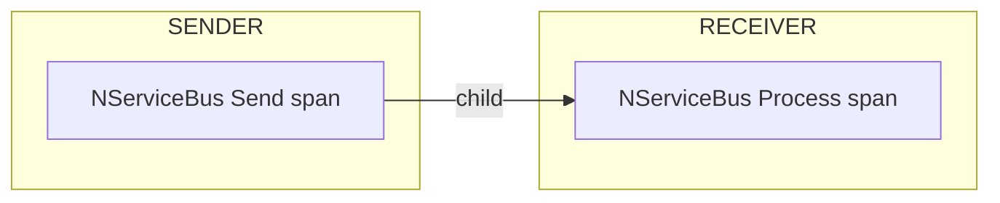
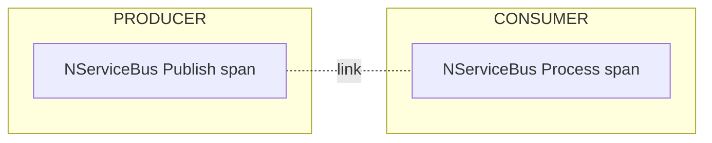
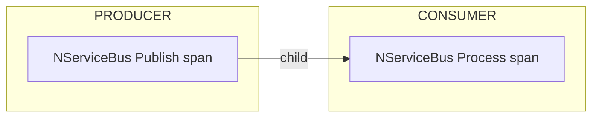

### Span relationships

#### Send operations

A span is emitted for each message sent by an NServiceBus endpoint. When the message is received, a receive span is created as a child to the send span.

To force the creation of a new trace when receiving the message, the `SendOptions`-API can be used as follows:

snippet: opentelemetry-sendoptions-start-new-trace

This ensures a new trace is created, and links the send and receive spans, which looks as follows:

#### Publish operations

A span is emitted for each message published by an NServiceBus endpoint. When the message is processed by a subscriber, a process span is created in a new trace, which is linked to the publish span.

To force the continuation of the existing trace when receiving the message, the `PublishOptions`-API can be used as follows:

snippet: opentelemetry-publishoptions-continue-trace

This ensures the trace is continued and the receive span to be created as a child of the publish span, which looks as follows:

### Delayed messages

In some cases, the user can choose to delay the delivery of a message to some point in the future. This is also the mechanism that's used for [delayed retries](/nservicebus/recoverability/#delayed-retries).
When a message is delayed, a new trace will always be created for the receive operation, as it happens at a different moment in time. Therefore, any delayed retry or delayed message, will automatically appear linked to the send or publish context.

### Exception recording

When a span fails, NServiceBus must decide where to record the exception details - the type, message, and stack trace. The `ExceptionRecordingMode` property on `InstrumentationOptions` controls this behavior.

> [!NOTE]
> The [OpenTelemetry semantic conventions for exceptions](https://opentelemetry.io/docs/specs/semconv/exceptions/exceptions-logs/) are moving away from span events toward log records as the canonical signal for exception details. NServiceBus follows this transition path. The `Logs` mode is the future direction; `SpanAndLogs` is provided for backward compatibility during the migration period.

#### SpanAndLogs mode (default)

In the default `SpanAndLogs` mode, NServiceBus records exception details in two places:

- **As a span event** on the activity that failed. The event includes the `exception.type`, `exception.message`, and `exception.stacktrace` attributes. This makes exception details visible directly in trace backends such as Jaeger or Zipkin without needing to correlate with log output.
- **In log output**, when a recoverability decision is made. Log entries are written for immediate retries, delayed retries, moves to the error queue, and discards, and each includes the full exception.

This mode preserves the behavior from earlier NServiceBus versions and is appropriate during a migration period, or when trace backends are the primary tool for investigating failures. It corresponds to the `logs/dup` value defined in the OpenTelemetry transition guidance.

#### Logs mode

To record exception details only via logging and not as span events, configure `ExceptionRecordingMode` to `Logs`:

snippet: opentelemetry-exception-recording-logs

In `Logs` mode, NServiceBus logs the exception exactly once, at the point where the exception was thrown - on the innermost span where the failure originated. Recoverability decisions (immediate retry, delayed retry, move to error queue, discard) are still logged, but those log entries contain only the action metadata such as message ID, destination queue, and retry delay. The exception details are not repeated.

This is the mode recommended by the OpenTelemetry semantic conventions, which define exceptions as log records rather than span events. It is a good fit when:

- Log aggregation (such as structured logging sent to Elasticsearch or Azure Monitor) is the primary tool for investigating failures.
- Span event storage is expensive or not supported in the observability backend being used.
- Teams prefer a single, authoritative log entry per failure rather than exception details appearing in both trace and log outputs.

> [!NOTE]
> Even after switching to `Logs` mode, existing trace consumers do not lose access to exception details. OpenTelemetry SDKs can be configured to route exception log records to span events, preserving backward compatibility at the SDK layer rather than the instrumentation layer.

#### Exception deduplication

NServiceBus processing involves nested spans. An incoming message is processed under a pipeline span, and each message handler runs under its own handler span nested inside it. When a handler throws, the exception propagates outward through the pipeline span.

Without deduplication, the same exception would be recorded on every span it propagates through, creating duplicate events in the trace. NServiceBus tracks exception instances using reference equality and records details only the first time an exception is seen on a given message processing attempt. The innermost span - the handler span - captures the details. Outer spans, such as the pipeline span, are marked as failed but do not add another exception event or log entry for the same exception.

#### Environment variable override

The exception recording mode can also be set via the [`OTEL_SEMCONV_EXCEPTION_SIGNAL_OPT_IN`](https://opentelemetry.io/docs/specs/semconv/exceptions/exceptions-logs/) environment variable, which is part of the standard OpenTelemetry transition mechanism for migrating from span events to log records. Because the environment variable takes precedence over any value configured in code, operators can drive the entire migration through deployment configuration - without requiring code changes at each step. For example, `logs/dup` can be set first to emit exceptions to both signals simultaneously, giving teams time to verify that their log aggregation pipeline captures exception details correctly before switching to `logs` to stop emitting span events entirely.

This also gives ops teams independent control over observability behavior in each environment. If a developer has hardcoded `ExceptionRecordingMode.SpanAndLogs` in the application, an operator can still force `Logs` mode in production by setting the environment variable, without waiting for a code change to be approved, merged, and deployed.

| Environment variable value | Equivalent `ExceptionRecordingMode` |
|---|---|
| `logs` | `Logs` |
| `logs/dup` | `SpanAndLogs` |

When the environment variable is not set, the value configured in code is used, defaulting to `SpanAndLogs` if not explicitly configured.

See the [OpenTelemetry samples](/samples/open-telemetry/) for instructions on how to send trace information to different tools.
