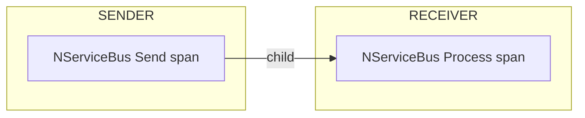
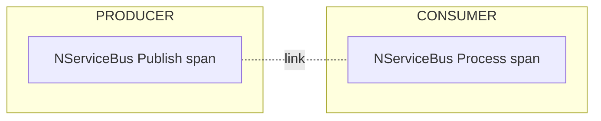
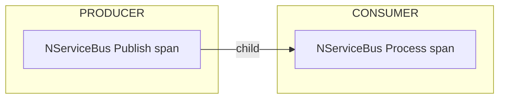
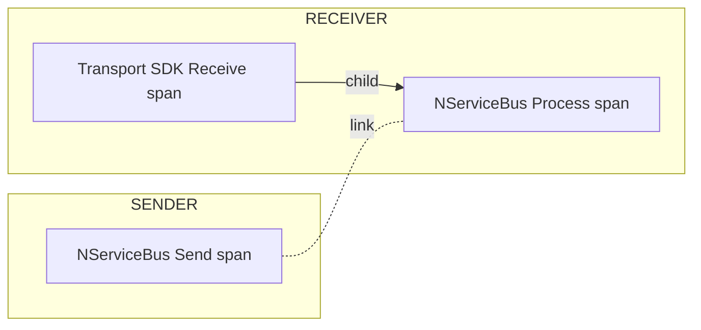

### Trace sources

NServiceBus emits spans from three ActivitySources:

| Source | Description |
|---|---|
| `NServiceBus.Core` | Pipeline spans: send, publish, process |
| `NServiceBus.Core.Handler` | Handler invocation spans (one per handler per message) |
| `NServiceBus.Core.Recoverability` | Recoverability action spans (immediate retry, delayed retry, move to error, discard) |

Subscribe to the sources needed for the endpoint's observability requirements:

snippet: opentelemetry-enabletracing-all-sources

> [!NOTE]
> In version 10, handler spans are emitted from `NServiceBus.Core`. They move to `NServiceBus.Core.Handler` only when the version 11 behavior is enabled, as described under *Version 11 behavior opt-in* below. In version 11 they always come from `NServiceBus.Core.Handler`.
>
> A tracer that subscribes only to `NServiceBus.Core` therefore receives no handler spans once the version 11 behavior is active.

All three sources report version `0.1.0` in version 10, and `1.0.0` when the version 11 behavior is enabled. Use the version to tell the two sets of span names and tags apart.

Subscribing to `NServiceBus.Core.Handler` without subscribing to `NServiceBus.Core` suppresses handler spans - `Activity.Current` inside handlers and behaviors becomes the pipeline span. This enables a flattened trace view where handler work appears directly on the process span.

### Version 11 behavior opt-in

Some OpenTelemetry behaviors change in version 11. Version 10 keeps the version 10 behavior by default. One AppContext switch enables all of the changes together, so an endpoint can adopt the version 11 telemetry before it upgrades:

snippet: opentelemetry-v11-behavior-switch

The switch can also be set without code. With an environment variable:

```text
DOTNET_NServiceBus_Core_OpenTelemetry_UseV11Behavior=true
```

Or in the project file:

```xml
<ItemGroup>
  <RuntimeHostConfigurationOption Include="NServiceBus.Core.OpenTelemetry.UseV11Behavior" Value="true" />
</ItemGroup>
```

The switch is read once, before the endpoint starts, and applies to the whole process. Two endpoints in the same process cannot use different modes.

The switch enables all of these changes:

| Behavior | Version 10 | Version 11 |
|---|---|---|
| Handler span source | `NServiceBus.Core` | `NServiceBus.Core.Handler` |
| ActivitySource version | `0.1.0` | `1.0.0` |
| Parent of the process span under an instrumented transport SDK | NServiceBus send span | SDK receive span, with a link to the send span |
| Span names | generic, for example `process message` | operation and target, for example `process orders` |
| Trace context and baggage propagation | custom propagator | `System.Diagnostics.DistributedContextPropagator` |
| `Start dispatching` and `Finished dispatching` span events | emitted | not emitted |
| `execution.result` metric tag | emitted | not emitted |
| `otel.status_code`, `otel.status_description` and `exception.escaped` | emitted on failures | not emitted |
| Outbox deduplication span tag | `nservicebus.outbox.deduplicate-message` | `nservicebus.outbox.deduplicated_message` |
| `nservicebus.event_types` and `nservicebus.enclosed_message_types` span tags | delimited string | array of type names |

`PublishTraceMode` is not part of the switch. It stays configurable in version 11; only its default changes. See *Publish operations* below.

> [!WARNING]
> The switch changes what an OpenTelemetry consumer sees. Dashboards, alerts and queries that match on span names, on the `execution.result` metric tag, or on the span tags above must be updated. The baggage wire format changes as well, which affects endpoints that exchange baggage with endpoints that do not have the switch enabled. Read the [version 10 to 11 upgrade guide](/nservicebus/upgrades/10to11/) before the switch is enabled.

In version 11 these behaviors are the only behaviors, and the switch is removed.

### Span relationships

#### Send operations

A span is emitted for each message sent by an NServiceBus endpoint. When the message is received, a receive span is created as a child to the send span.



The default trace behavior for sends is to continue the existing trace: the receiver span is a child of the sender span. To override this for a specific message, use `SendOptions`:

snippet: opentelemetry-sendoptions-start-new-trace

This creates a new trace on the receiver and links the send and receive spans:


To change the default for all sends from an endpoint, set `SendTraceMode`:

snippet: opentelemetry-trace-mode-send

#### Publish operations

A span is emitted for each message published by an NServiceBus endpoint. When the message is processed by a subscriber, a process span is created in a new trace, which is linked to the publish span.




The default trace behavior for publishes is to start a new linked trace on each subscriber. To override this for a specific event, use `PublishOptions`:

snippet: opentelemetry-publishoptions-continue-trace

This continues the publisher's trace in the subscriber:



To change the default for all publishes from an endpoint, set `PublishTraceMode`:

snippet: opentelemetry-trace-mode-publish

Per-message overrides (`StartNewTraceOnReceive`, `ContinueExistingTraceOnReceive`) always take precedence over the endpoint-level defaults.

#### Transport SDK spans

Some transport SDKs, such as the Azure Service Bus, RabbitMQ, and Amazon SQS clients, emit their own spans for the native send and receive operations. When the endpoint subscribes to the SDK's ActivitySource, the SDK receive span is the ambient `Activity.Current` at the moment NServiceBus starts processing a message.

In version 10, the default is unchanged in that situation: the NServiceBus process span is a child of the NServiceBus send span. The process span becomes a child of the SDK receive span, with a link back to the NServiceBus send span, when the version 11 behavior is enabled:



If no listener is subscribed to the SDK's ActivitySource, no SDK span exists and the process span is created as described in the sections above, whether or not the switch is set. This is the only behavior in version 11.

### Delayed messages

When a message is delayed - whether by explicit delay (`SendOptions.DelayDeliveryWith`), saga timeout, or delayed retry - a new linked trace is started at delivery time by default. This reflects that the receive operation happens at a different moment in time than the send or retry decision.

The trace behavior for each category of delayed message is configurable independently:

snippet: opentelemetry-trace-mode-delayed

| Option | Default | Applies to |
|---|---|---|
| `DelayedDelivery.SendOperationTraceMode` | `StartNew` | `SendOptions.DelayDeliveryWith` / `DoNotDeliverBefore` |
| `DelayedDelivery.SagaTimeoutTraceMode` | `StartNew` | Saga timeouts (`Saga.RequestTimeout`) |
| `Recoverability.DelayedRetryTraceMode` | `StartNew` | Delayed retries driven by recoverability policy |

### Recoverability spans

When a message cannot be processed successfully, NServiceBus emits a recoverability span from the `NServiceBus.Core.Recoverability` ActivitySource. The span carries a `nservicebus.recoverability_action` tag indicating the outcome:

| Tag value | Meaning |
|---|---|
| `immediate_retry` | Message will be retried immediately |
| `delayed_retry` | Message will be retried after a delay |
| `move_to_error` | Message is moved to the error queue |
| `discard` | Message is discarded without further processing |

Recoverability spans are children of the process span. To receive them, subscribe to the `NServiceBus.Core.Recoverability` ActivitySource.

### Span names

In version 10, NServiceBus uses generic operation names for spans, such as `process message` and `publish event`. When the version 11 behavior is enabled, the names follow the OpenTelemetry messaging semantic convention format `{operation} {target}`. The target is the queue for receive and recoverability spans, and the message type name for outgoing spans:

| Operation | Version 10 | Version 11 |
|---|---|---|
| Process | `process message` | `process {receiveAddress}` |
| Send | `send message` | `send message {MessageType}` |
| Publish | `publish event` | `publish {EventType}` |
| Reply | `reply` | `reply {MessageType}` |
| Subscribe | `subscribe event` | `subscribe event {EventType}` |
| Unsubscribe | `unsubscribe event` | `unsubscribe event {EventType}` |
| Immediate retry | `immediate retry` | `immediate retry {receiveAddress}` |
| Delayed retry | `delayed retry` | `delayed retry {receiveAddress}` |
| Move to error | `move to error` | `move to {errorQueue}` |
| Discard | `discard` | `discard` |

A subscribe span for several event types lists the type names separated by spaces. Message type names are short names, not full type names.

### Dispatching events

When outgoing messages are dispatched during message processing, NServiceBus adds two span events to the incoming pipeline span:

- `"Start dispatching"` - emitted before dispatch, includes a `message-count` event tag
- `"Finished dispatching"` - emitted after dispatch completes

These events are emitted in version 10. They are not emitted when the version 11 behavior is enabled, and they are removed in version 11. There is no option to keep them.

### Context propagation

NServiceBus propagates the [W3C Trace Context](https://www.w3.org/TR/trace-context/) and [W3C Baggage](https://www.w3.org/TR/baggage/) headers between endpoints.

In addition to the W3C `traceparent` header, NServiceBus writes the context of the send or publish span to the `NServiceBus.TraceParent` header. Transport SDKs that emit their own spans overwrite `traceparent` on the message with the context of their native send span, and the NServiceBus-specific header keeps the NServiceBus send span reachable for the receiver. Receivers use `NServiceBus.TraceParent` when present and fall back to `traceparent`, so messages from endpoints on versions that only write the W3C header continue the trace as before.

#### Which messages carry trace context

Only messages that flow through the outgoing pipeline - sends, publishes, replies, and delayed messages - receive the context of the current activity. Messages that NServiceBus forwards on behalf of a received message keep the trace headers of that message unchanged:

- Messages moved to the error queue
- Delayed retries
- Audit copies
- Messages forwarded with `IMessageProcessingContext.ForwardCurrentMessageTo`

This keeps the forwarded message correlated to its original sender instead of the span that happened to be active while it was forwarded. Control messages that NServiceBus sends outside the outgoing pipeline, such as message-driven subscribe and unsubscribe requests and ServiceControl retry acknowledgements, carry the current activity's context.

Custom `RecoverabilityAction` and `AuditAction` implementations that forward the received message get the same behavior: the headers are dispatched as they were received, so the trace stays intact without any additional work.

In version 10, NServiceBus uses a custom propagator. Propagation moves to the built-in .NET `DistributedContextPropagator` when the version 11 behavior is enabled, and the custom propagator is removed in version 11. The `baggage` header format changes with it. See the [version 10 to 11 upgrade guide](/nservicebus/upgrades/10to11/) for the serialization details and for the effect on a rolling upgrade.

#### Baggage

NServiceBus writes the [baggage](https://www.w3.org/TR/baggage/) of the current activity to the `baggage` header of every message that flows through the outgoing pipeline. On receive, NServiceBus applies the baggage from that header to the process span, so handlers and behaviors can read it with `Activity.Current.GetBaggageItem`. Baggage therefore flows end to end on every transport, including transports whose SDK has no OpenTelemetry instrumentation. This requires tracing to be enabled: when nothing listens to the `NServiceBus.Core` activity source, no process span is created and the baggage from the message is not applied.

On receive, the following rules apply:

- Baggage and `tracestate` are read from the message only when it also carries NServiceBus trace context, that is a `NServiceBus.TraceParent` or `traceparent` header. The W3C specifications define both headers as companions of `traceparent`. A message without a trace header gets a process span that is a child of `Activity.Current`, if any, and inherits the baggage of that activity. The `baggage` header of such a message is ignored.
- When the version 11 behavior is enabled and the process span is a child of a transport SDK receive span, as described under Transport SDK spans above, NServiceBus still applies the baggage from the message. The Azure Service Bus, RabbitMQ, and Amazon SQS clients do not propagate baggage, so without this step the baggage would not reach the handlers. Should the SDK receive span already carry a baggage key with the same name, the item from the message is not added again and the value on the SDK span is used. This prevents the same key from being written twice when the message is sent on.
- Baggage follows the message, not the trace. When the receiver starts a new trace, for example for a delayed message or because `StartNewTraceOnReceive` was used, the baggage from the message is still applied to the process span. The `tracestate` header is not, because trace state belongs to the trace it was recorded in.

> [!NOTE]
> Baggage is meant for a small number of cross-cutting values, such as a tenant identifier or the identifier of the originating request. Baggage is never removed along a conversation and travels with every message to every receiver, including subscribers, the audit queue, and the error queue. Do not put sensitive or large values in baggage. NServiceBus does not limit the size of the baggage. The W3C Baggage specification only requires systems to propagate up to 64 list members and 8,192 bytes, so larger baggage may be truncated or dropped by other systems along the way.

NServiceBus reads and writes baggage through `System.Diagnostics.Activity`. It does not use the `Baggage` API of the `OpenTelemetry.Api` package. The two are separate stores, and neither one reads the other:

- In handler, behavior, and library code, use `Activity.Current?.SetBaggage(...)` and `Activity.Current?.GetBaggageItem(...)`. NServiceBus writes those items to the `baggage` header of outgoing messages, and applies the header to the process span on receive.
- Baggage set through `Baggage.SetBaggage(...)` from `OpenTelemetry.Api` is not written to outgoing messages. Copy the value onto `Activity.Current` before sending when a message has to carry it.

### Failed spans and the error.type tag

When a span fails, NServiceBus sets the span status to `Error` and adds an `error.type` tag containing the fully qualified exception type name. This tag is set on the innermost span where the exception was thrown.

### Exception recording

When a span fails, NServiceBus must decide where to record the exception details - the type, message, and stack trace. The `ExceptionRecordingMode` property on `InstrumentationOptions` controls this behavior.

> [!NOTE]
> The [OpenTelemetry semantic conventions for exceptions](https://opentelemetry.io/docs/specs/semconv/exceptions/exceptions-logs/) are moving away from span events toward log records as the canonical signal for exception details. NServiceBus follows this transition path. The `Logs` mode is the future direction; `SpanAndLogs` is provided for backward compatibility during the migration period.

#### SpanAndLogs mode (default)

In the default `SpanAndLogs` mode, NServiceBus records exception details in two places:

- **As a span event** on the activity that failed. The event includes the `exception.type`, `exception.message`, and `exception.stacktrace` attributes. This makes exception details visible directly in trace backends such as Jaeger or Zipkin without needing to correlate with log output.
- **In log output**, when a recoverability decision is made. Log entries are written for immediate retries, delayed retries, moves to the error queue, and discards, and each includes the full exception.

This mode preserves the behavior from earlier NServiceBus versions and is appropriate during a migration period, or when trace backends are the primary tool for investigating failures. It corresponds to the `logs/dup` value defined in the OpenTelemetry [transition guidance](https://opentelemetry.io/docs/specs/semconv/exceptions/).

#### Logs mode

To record exception details only via logging and not as span events, configure `ExceptionRecordingMode` to `Logs`:

snippet: opentelemetry-exception-recording-logs

In `Logs` mode, NServiceBus logs the exception exactly once, at the point where the exception was thrown - on the innermost span where the failure originated. Recoverability decisions (immediate retry, delayed retry, move to error queue, discard) are still logged, but those log entries contain only the action metadata such as message ID, destination queue, and retry delay. The exception details are not repeated.

This is the mode recommended by the OpenTelemetry semantic conventions, which define exceptions as log records rather than span events. It is a good fit when:

- Log aggregation (such as structured logging sent to Elasticsearch or Azure Monitor) is the primary tool for investigating failures.
- Span event storage is expensive or not supported in the observability backend being used.
- Teams prefer a single, authoritative log entry per failure rather than exception details appearing in both trace and log outputs.

#### Environment variable override

The exception recording mode can also be set via the [`OTEL_SEMCONV_EXCEPTION_SIGNAL_OPT_IN`](https://opentelemetry.io/docs/specs/semconv/exceptions/exceptions-logs/) environment variable, which is part of the standard OpenTelemetry transition mechanism for migrating from span events to log records. Because the environment variable takes precedence over any value configured in code, operators can drive the entire migration through deployment configuration - without requiring code changes at each step. For example, `logs/dup` can be set first to emit exceptions to both signals simultaneously, giving teams time to verify that their log aggregation pipeline captures exception details correctly before switching to `logs` to stop emitting span events entirely.

This also gives ops teams independent control over observability behavior in each environment. If the application hardcodes `ExceptionRecordingMode.SpanAndLogs`, the `Logs` mode can be forced in production by setting the environment variable, without the need for a redeploy.

| Environment variable value | Equivalent `ExceptionRecordingMode` |
|---|---|
| `logs` | `Logs` |
| `logs/dup` | `SpanAndLogs` |

When the environment variable is not set, the value configured in code is used, defaulting to `SpanAndLogs` if not explicitly configured.

See the [OpenTelemetry samples](/samples/open-telemetry/) for instructions on how to send trace information to different tools.
