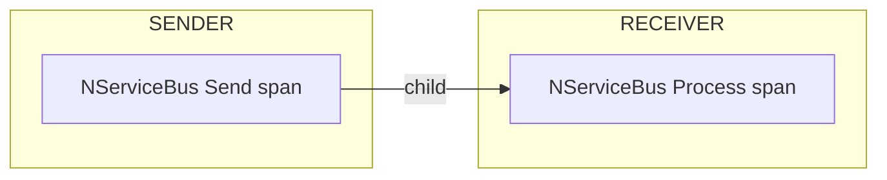
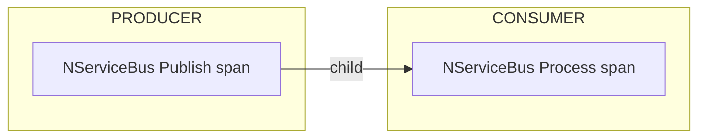
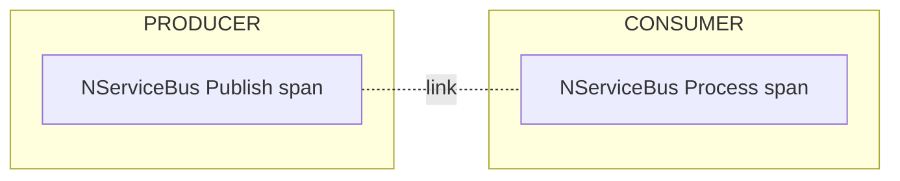
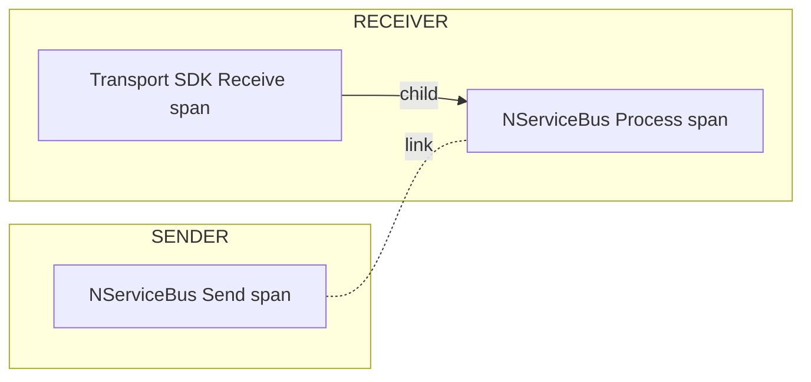

### Trace sources

NServiceBus emits spans from three ActivitySources:

| Source | Description |
|---|---|
| `NServiceBus.Core` | Pipeline spans: send, publish, process |
| `NServiceBus.Core.Handler` | Handler invocation spans (one per handler per message) |
| `NServiceBus.Core.Recoverability` | Recoverability action spans (immediate retry, delayed retry, move to error, discard) |

Subscribe to the sources needed for the endpoint's observability requirements:

snippet: opentelemetry-enabletracing-all-sources

Subscribing to `NServiceBus.Core.Handler` without subscribing to `NServiceBus.Core` suppresses handler spans - `Activity.Current` inside handlers and behaviors becomes the pipeline span. This enables a flattened trace view where handler work appears directly on the process span.

### Span relationships

#### Send operations

A span is emitted for each message sent by an NServiceBus endpoint. When the message is received, a receive span is created as a child to the send span.

The default trace behavior for sends is to continue the existing trace: the receiver span is a child of the sender span. To override this for a specific message, use `SendOptions`:

snippet: opentelemetry-sendoptions-start-new-trace

This creates a new trace on the receiver and links the send and receive spans:

To change the default for all sends from an endpoint, set `SendTraceMode`:

snippet: opentelemetry-trace-mode-send

#### Publish operations

A span is emitted for each message published by an NServiceBus endpoint. When the message is processed by a subscriber, a process span is created as a child of the publish span, continuing the publisher's trace.

To start a new trace on the subscribers for a specific event, use `PublishOptions`:

snippet: opentelemetry-publishoptions-start-new-trace

This creates a new trace on each subscriber and links the publish and process spans:

To change the default for all publishes from an endpoint, set `PublishTraceMode`:

snippet: opentelemetry-trace-mode-publish-start-new

Per-message overrides (`StartNewTraceOnReceive`, `ContinueExistingTraceOnReceive`) always take precedence over the endpoint-level defaults.

#### Transport SDK spans

Some transport SDKs, such as the Azure Service Bus, RabbitMQ, and Amazon SQS clients, emit their own spans for the native send and receive operations. When the endpoint subscribes to the SDK's ActivitySource, the SDK receive span is the ambient `Activity.Current` at the moment NServiceBus starts processing a message. The process span is then created as a child of the SDK receive span, with a link back to the NServiceBus send span:

If no listener is subscribed to the SDK's ActivitySource, no SDK span exists and the process span is a child of the NServiceBus send span, as described in the sections above.

### Delayed messages

When a message is delayed - whether by explicit delay (`SendOptions.DelayDeliveryWith`), saga timeout, or delayed retry - a new linked trace is started at delivery time by default. This reflects that the receive operation happens at a different moment in time than the send or retry decision.

The trace behavior for each category of delayed message is configurable independently:

snippet: opentelemetry-trace-mode-delayed

| Option | Default | Applies to |
|---|---|---|
| `DelayedDelivery.SendOperationTraceMode` | `StartNew` | `SendOptions.DelayDeliveryWith` / `DoNotDeliverBefore` |
| `DelayedDelivery.SagaTimeoutTraceMode` | `StartNew` | Saga timeouts (`Saga.RequestTimeout`) |
| `Recoverability.DelayedRetryTraceMode` | `StartNew` | Delayed retries driven by recoverability policy |

### Recoverability spans

When a message cannot be processed successfully, NServiceBus emits a recoverability span from the `NServiceBus.Core.Recoverability` ActivitySource. The span carries a `nservicebus.recoverability_action` tag indicating the outcome:

| Tag value | Meaning |
|---|---|
| `immediate_retry` | Message will be retried immediately |
| `delayed_retry` | Message will be retried after a delay |
| `move_to_error` | Message is moved to the error queue |
| `discard` | Message is discarded without further processing |

Recoverability spans are children of the process span. To receive them, subscribe to the `NServiceBus.Core.Recoverability` ActivitySource.

### Span names

Span names follow the OpenTelemetry messaging semantic convention format `{operation} {destination}`:

| Operation | Span name |
|---|---|
| Receive | `process {receiveAddress}` |
| Send | `send message {destination}` |
| Reply | `reply {destination}` |
| Move to error | `move to {errorQueue}` |

### Context propagation

NServiceBus propagates the [W3C Trace Context](https://www.w3.org/TR/trace-context/) and [W3C Baggage](https://www.w3.org/TR/baggage/) headers between endpoints using the built-in .NET `DistributedContextPropagator`.

In addition to the W3C `traceparent` header, NServiceBus writes the context of the send or publish span to the `NServiceBus.TraceParent` header. Transport SDKs that emit their own spans overwrite `traceparent` on the message with the context of their native send span, and the NServiceBus-specific header keeps the NServiceBus send span reachable for the receiver. Receivers use `NServiceBus.TraceParent` when present and fall back to `traceparent`.

### Failed spans and the error.type tag

When a span fails, NServiceBus sets the span status to `Error` and adds an `error.type` tag containing the fully qualified exception type name. This tag is set on the innermost span where the exception was thrown.

### Exception recording

When a span fails, NServiceBus must decide where to record the exception details - the type, message, and stack trace. The `ExceptionRecordingMode` property on `InstrumentationOptions` controls this behavior.

> [!NOTE]
> The [OpenTelemetry semantic conventions for exceptions](https://opentelemetry.io/docs/specs/semconv/exceptions/exceptions-logs/) are moving away from span events toward log records as the canonical signal for exception details. NServiceBus follows this transition path. The `Logs` mode is the future direction; `SpanAndLogs` is provided for backward compatibility during the migration period.

#### SpanAndLogs mode (default)

In the default `SpanAndLogs` mode, NServiceBus records exception details in two places:

- **As a span event** on the activity that failed. The event includes the `exception.type`, `exception.message`, and `exception.stacktrace` attributes. This makes exception details visible directly in trace backends such as Jaeger or Zipkin without needing to correlate with log output.
- **In log output**, when a recoverability decision is made. Log entries are written for immediate retries, delayed retries, moves to the error queue, and discards, and each includes the full exception.

This mode preserves the behavior from earlier NServiceBus versions and is appropriate during a migration period, or when trace backends are the primary tool for investigating failures. It corresponds to the `logs/dup` value defined in the OpenTelemetry [transition guidance](https://opentelemetry.io/docs/specs/semconv/exceptions/).

#### Logs mode

To record exception details only via logging and not as span events, configure `ExceptionRecordingMode` to `Logs`:

snippet: opentelemetry-exception-recording-logs

In `Logs` mode, NServiceBus logs the exception exactly once, at the point where the exception was thrown - on the innermost span where the failure originated. Recoverability decisions (immediate retry, delayed retry, move to error queue, discard) are still logged, but those log entries contain only the action metadata such as message ID, destination queue, and retry delay. The exception details are not repeated.

This is the mode recommended by the OpenTelemetry semantic conventions, which define exceptions as log records rather than span events. It is a good fit when:

- Log aggregation (such as structured logging sent to Elasticsearch or Azure Monitor) is the primary tool for investigating failures.
- Span event storage is expensive or not supported in the observability backend being used.
- Teams prefer a single, authoritative log entry per failure rather than exception details appearing in both trace and log outputs.

#### Environment variable override

The exception recording mode can also be set via the [`OTEL_SEMCONV_EXCEPTION_SIGNAL_OPT_IN`](https://opentelemetry.io/docs/specs/semconv/exceptions/exceptions-logs/) environment variable, which is part of the standard OpenTelemetry transition mechanism for migrating from span events to log records. Because the environment variable takes precedence over any value configured in code, operators can drive the entire migration through deployment configuration - without requiring code changes at each step. For example, `logs/dup` can be set first to emit exceptions to both signals simultaneously, giving teams time to verify that their log aggregation pipeline captures exception details correctly before switching to `logs` to stop emitting span events entirely.

This also gives ops teams independent control over observability behavior in each environment. If the application hardcodes `ExceptionRecordingMode.SpanAndLogs`, the `Logs` mode can be forced in production by setting the environment variable, without the need for a redeploy.

| Environment variable value | Equivalent `ExceptionRecordingMode` |
|---|---|
| `logs` | `Logs` |
| `logs/dup` | `SpanAndLogs` |

When the environment variable is not set, the value configured in code is used, defaulting to `SpanAndLogs` if not explicitly configured.

See the [OpenTelemetry samples](/samples/open-telemetry/) for instructions on how to send trace information to different tools.
