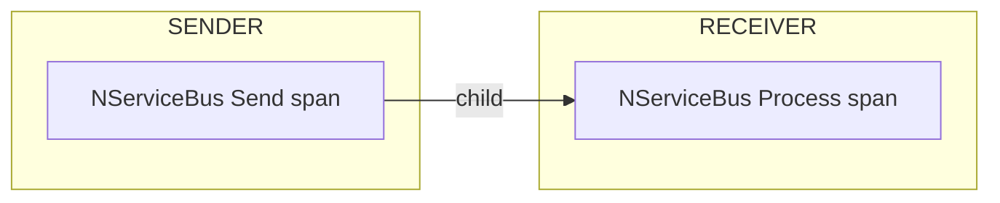
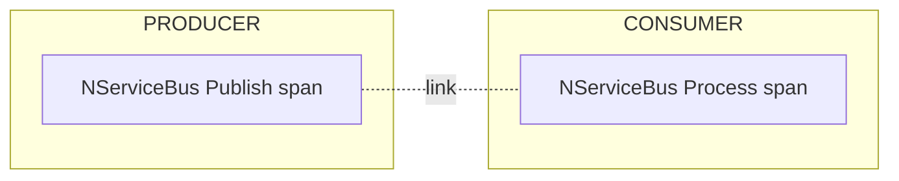
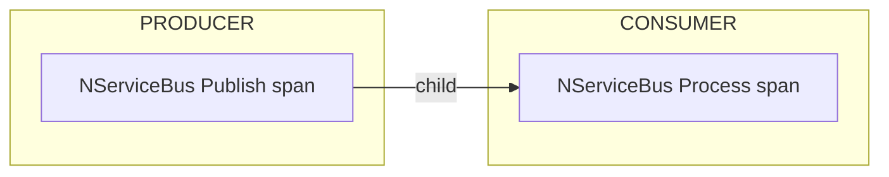

### Span relationships

#### Send operations

A span is emitted for each message sent by an NServiceBus endpoint. When the message is received, a receive span is created as a child to the send span.

To force the creation of a new trace when receiving the message, the `SendOptions`-API can be used as follows:

snippet: opentelemetry-sendoptions-start-new-trace

This ensures a new trace is created, and links the send and receive spans, which looks as follows:

#### Publish operations

A span is emitted for each message published by an NServiceBus endpoint. When the message is processed by a subscriber, a process span is created in a new trace, which is linked to the publish span.

To force the continuation of the existing trace when receiving the message, the `PublishOptions`-API can be used as follows:

snippet: opentelemetry-publishoptions-continue-trace

This ensures the trace is continued and the receive span to be created as a child of the publish span, which looks as follows:

### Delayed messages

In some cases, the user can choose to delay the delivery of a message to some point in the future. This is also the mechanism that's used for [delayed retries](/nservicebus/recoverability/#delayed-retries).
When a message is delayed, a new trace will always be created for the receive operation, as it happens at a different moment in time. Therefore, any delayed retry or delayed message, will automatically appear linked to the send or publish context.

See the [OpenTelemetry samples](/samples/open-telemetry/) for instructions on how to send trace information to different tools.
