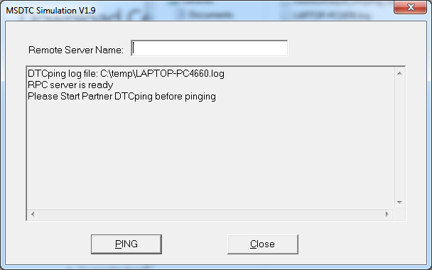

NServiceBus offers four levels of consistency guarantees with regard to message processing, depending on the selected transport. The default consistency level is `TransactionScope` (Distributed Transaction), but a different level can be specified using the code configuration API.

See the [Transports Transactions](/transports/transactions.md) article to learn more about NServiceBus consistency guarantees.

The default [`TransactionScope`](https://learn.microsoft.com/en-us/dotnet/api/system.transactions.transactionscope) timeout limit is 1 minute. This limit can be adjusted up to the machine-wide maximum timeout value. The machine-wide maximum is 10 minutes by default, but it can be adjusted if needed.

## Distributed Transaction Coordinator

In Windows, the Distributed Transaction Coordinator (DTC) is an OS-level service that manages transactions spanning multiple resources, such as queues and databases.

The easiest way to configure DTC for NServiceBus is to follow the [installation guide](https://support.microsoft.com/en-us/help/817064/how-to-enable-network-dtc-access-in-windows-server-2003), or to use the dedicated [PowerShell cmdlets](/transports/msmq/management-using-powershell.md).

### Troubleshooting Distributed Transaction Coordinator

The [DTCPing](https://www.microsoft.com/en-us/download/details.aspx?id=2868) tool is useful for verifying that the DTC service is configured correctly, as well as for troubleshooting:

> [!NOTE]
> If the `DTCPing WARNING: The CID Values for Both Test Machines Are the Same` message appears when running the DTCPing tool, check to see if the machine name is longer than 14 characters. For DTCPing and MSDTC to work, the machine name should be 14 characters or shorter.

## Message processing loop

Messages are processed in NServiceBus in the following steps:

 1. The queue is peeked to see if there is a message.
 1. If there is a message, a transaction is started.
 1. The queue is contacted again to receive a message. Multiple threads may have peeked the same message, but the queue ensures that only one thread actually gets a given message.
 1. If the thread is able to get the message, NServiceBus tries to deserialize it. If deserialization fails, the message is moved to the configured error queue and the transaction commits.
 1. After successful deserialization, NServiceBus invokes all infrastructure, message mutators, and handlers. An exception in this step causes the transaction to roll back and the message to return to the input queue. The message is re-sent for a configured number of times; if all attempts fail, it is moved to the error queue.

Refer to the [Message Handling Pipeline](/nservicebus/pipeline/) article to learn more about message processing.

Refer to the [Recoverability](/nservicebus/recoverability/) and the [ServicePulse: Failed Message Monitoring](/servicepulse/intro-failed-messages.md) articles to learn more about error handling, automatic and manual retries, as well as processing failures monitoring.

## Limitations

When [enabling MSDTC on Amazon RDS for SQL Server](https://docs.aws.amazon.com/AmazonRDS/latest/UserGuide/Appendix.SQLServer.Options.MSDTC.html), a set of [limitations](https://docs.aws.amazon.com/AmazonRDS/latest/UserGuide/Appendix.SQLServer.Options.MSDTC.html#Appendix.SQLServer.Options.MSDTC.Limitations) must be taken into account.