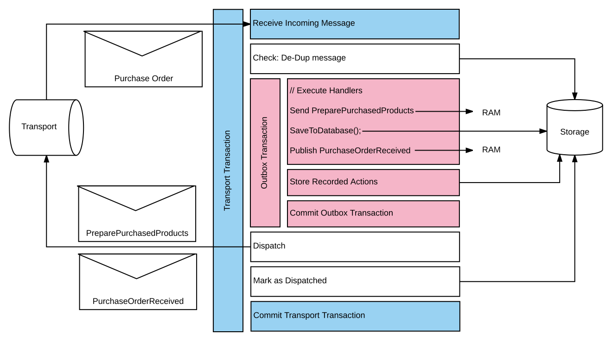

The Outbox is an infrastructure feature which simulates the reliability of distributed transactions without requiring use of the Distributed Transaction Coordinator (DTC).

The DTC is used by NServiceBus to guarantee consistency between messaging operations and data persistence. Messaging operations include the receipt and successful processing of an incoming message, and the sending of any outgoing messages as part of that processing. Data persistence includes any business data persisted by a message handler, as well as any NServiceBus saga or timeout data stored at the same time. The DTC ensures that these operations either all complete successfully or are all rolled back.

The Outbox feature can be used instead of the DTC, to mimic the same level of consistency without using distributed transactions. This is done by storing outgoing messages in the database using the same local (non-distributed) transaction which is used to store business and NServiceBus data. After that transaction is successfully committed, the stored outgoing messages are dispatched to their destinations as a separate operation.

## How it works

The Outbox feature is implemented using the [Outbox](http://gistlabs.com/2014/05/the-outbox/) and the [Deduplication](https://en.wikipedia.org/wiki/Data_deduplication#In-line_deduplication) patterns.

Every time an incoming message is processed, a copy of that message is stored in the persistent _Outbox storage_. Whenever a new message is received, the framework determines whether that message has been processed already by checking for its presence in Outbox storage.

If the message is not found in Outbox storage then it is processed in the regular way, shown in the following diagram:

Processing a new incoming message consists of the following steps:

 * The handlers responsible for processing the message are invoked.
 * The _downstream messages_ (messages sent while processing the message, e.g. from inside handlers) are stored in Outbox storage and business data is saved. Both operations are executed within a single (non-distributed) transaction.
 * The downstream messages are sent and then marked as _dispatched_ in Outbox storage.

If an incoming message is found in Outbox storage, then it is treated as a duplicate and is not processed again.

Even though an incoming message has been processed and business data has been saved, the framework might fail to immediately send the downstream messages. For example, the message queueing system may be unavailable, or the NServiceBus endpoint may be stopped before the messages can be dispatched. However, whenever an NServiceBus endpoint is started or is already running, and the framework detects downstream messages in Outbox storage which are not marked as dispatched, it will attempt to dispatch them at that time.

Note: On the wire level, the Outbox guarantees `at-least-once` message delivery, meaning downstream messages may be sent and processed multiple times. At the handler level, however, the Outbox guarantees `exactly-once` message processing, similar to distributed transactions. This higher guarantee level is due to the deduplication that happens on the receiving side.

## Important design considerations

WARNING: Because the Outbox uses a single (non-distributed) database transaction to store all data, the business data and Outbox storage *must exist in the same database*.

 * The Outbox feature works only for messages sent from NServiceBus message handlers.
 * Endpoints using DTC can only communicate with endpoints using the Outbox if either of the following conditions are satisfied:
   * Endpoints using the Outbox do not send messages to endpoints using DTC. However, endpoints using DTC can send messages to endpoints using the Outbox.
   * If endpoints using the Outbox send messages to endpoints using DTC, then the handlers processing those messages are [idempotent](https://en.wikipedia.org/wiki/Idempotence).
 * The Outbox may generate duplicate messages if outgoing messages are successfully dispatched but the _Mark as dispatched_ phase fails. This may happen for a variety of reasons, including _Outbox storage_ connectivity issues and deadlocks.

## Enabling the Outbox

partial: enable-outbox

To learn about Outbox configuration options such as time to keep deduplication data, or deduplication data clean up interval, refer to the dedicated pages for [NHibernate](/persistence/nhibernate/outbox.md), [RavenDB](/persistence/ravendb/outbox.md) or [ServiceFabric](/persistence/service-fabric/outbox.md) persistence.

## Converting from DTC to Outbox

When converting a system from using the DTC to the Outbox, care must be taken to ensure the system does not process duplicate messages incorrectly.

Because the Outbox feature uses an "at least once" consistency guarantee at the transport level, endpoints that enable the Outbox may occasionally send duplicate messages. These duplicate messages will be properly handled by deduplication in other Outbox-enabled endpoints, but will be processed more than once by endpoints which still use the DTC.

In order to gradually convert an entire system from the DTC to the Outbox:

1. Enable the Outbox on any endpoints that receive messages but do not send or publish any messages.
1. Enable the Outbox on any endpoints that only send or publish messages to already-converted endpoints, where the Outbox will be able to properly handle any duplicate messages.
1. Progress outward until all endpoints are converted.

WARNING: When verifying outbox functionality, it can sometimes be helpful to temporarily [stop the MSDTC Service](https://technet.microsoft.com/en-us/library/cc770732.aspx). This ensures that the Outbox is working as expected, and no other resources are enlisting in distributed transactions.

## Message identity and idempotent processing

If handlers are idempotent then outbox might not be required at all. When implementating idempotent processing keep in mind that any generated message *must* apply the same message identifier if invoked more then once to have deduplication working on the infrastructure level or to solve this at the logical level by validating message data.

- [Message Identity](/nservicebus/messaging/message-identity.md)

## Concurrency

Outbox cannot prevent that handlers or sagas are invoked at most once. Under certain scenarios this can happen:

- Sender sends multiple physical message with the same message identifier (submit order form)
- Transport can send multiple messages when having a failover, they operate in a at-least-once delivery model
- The outbox dispatch stage can be invoked more then once if the previous dispatch (partially) failed and is now retried.

Multiple physical copied of the same logical message now exist. If an endpoint allows concurrent message processing or is scaled out it can happen that these multiple copies are processed concurrently.

## Non transactional resources

Outbox does not perform deduplication! If you are using non-transactional resources then make sure processing is idempotent. If this is unwanted then this can be almost prevented completely by making sure only a single endpoint instance and have [configured the endpoint to process messages sequentially by setting the maximum concurrency to 1](/nservicebus/operations/tuning.md#tuning-concurrency).

NOTE: This problem is not specific to Outbox but mentioned here as sometimes it is assumed Outbox does deduplication.

Try to avoid mixing transaction and non transactional tasks. If performing non transactional tasks send a message to perform this tasks in isolation.

## Outbox expiration duration

Part of the outbox is guarantee that the data remains consistent if the same message is processed more-than-once. A message with the exact same identification can be detected and ignored. This data is stored in the outbox record and kept for a configurable duration. The default expiration duration depends per persistence implementation. All implemetations can be configured on how long an outbox record needs to be stored and some can be configured on how often outbox cleanup needs to occur.

Keep in mind that the maximum lifetime is not set too low! If the time window is set to 30 minutes, a message is forwarded to the error queue and manually retried by an operator potentially hours or days later while the original message was already correctly processed then this manual retry could apply the same data modifications again because the outbox record that prevents this is already purged as it was expired.

## Required storage

Outbox requires storage. The required space can be calculated as follows:

    Total outbox records = Message througput per second * Deduplication period in seconds

A single outbox record - after all transport operations have been dispatched - usually requires less then 50 bytes of which most are taken for storing the original message ID as this is a string value.

NOTE: If the system is processing a high volume of messages per second having a large deduplication timeframe might not be ideal as outbox records will occupy storage.

## Outbox cleanup interval

How outbox cleanup is performed is different per persistence implementation. Most persisters run a cleanup task every minute. Depending on the throughput this cleanup interval can be run more often to make a single cleanup operation purge less records per interval.

## Persistence

The Outbox feature requires persistence in order to perform deduplication and store outgoing downstream messages.

Refer to the dedicated persistence pages:

- [NHibernate](/persistence/nhibernate/outbox.md)
- [RavenDB](/persistence/ravendb/outbox.md)
- [SQL](/persistence/sql/outbox.md)
- [ServiceFabric](/persistence/service-fabric/outbox.md)
