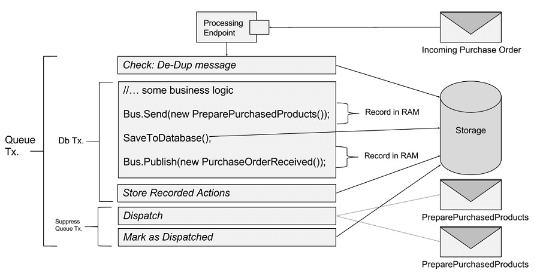

Using Outbox allows for running endpoints with similar reliability to DTC while not actually using DTC.

## How it works

The Outbox feature has been implemented using the [Outbox](http://gistlabs.com/2014/05/the-outbox/) and the [Deduplication](https://en.wikipedia.org/wiki/Data_deduplication#In-line_deduplication) patterns.

Every time a message is processed, the copy of that message is stored in the persistent _Outbox storage_. Whenever a new message is received, the framework verifies if that message has been processed already by checking if it's present in the Outbox storage. 

If the message is not found in the Outbox storage, then it is processed in a regular way 
as shown in the following diagram:

Processing a new incoming message consists of the following steps:

- The handlers processing that message are invoked.
- The _downstream messages_ (messages sent during processing the message, e.g. from inside the handlers) are stored in a durable storage and business data is saved. Both operations are executed within a single transaction.
- The downstream messages are sent and marked as dispatched.

If the message is found in the Outbox storage, then it is treated as a duplicate and not processed again. However, even though the message has been processed and business data has been saved, it might happen that the framework failed to send downstream messages. In case the downstream messages are not marked as dispatched, they will be dispatched again. 

Note: On the wire level the Outbox guarantees `at-least-once` message delivery, meaning that the downstream messages can be sent and processed multiple times. On the handler level, however, the Outbox guarantees `exactly-once` message processing, same as working with distributed transactions. This higher guarantee level is due to the deduplication that happens on the receiving side.

## Important design considerations

 * The business data and deduplication data need to be stored in the same database.
 * The Outbox feature works only for messages sent from NServiceBus message handlers.
 * The endpoints using DTC can communicate with endpoints using Outbox only if either of the following conditions are satisfied:
   - The endpoints using Outbox don't send messages to endpoints using DTC. However, endpoints using DTC can send messages to endpoints using Outbox.
   - If endpoints using Outbox send messages to endpoints using DTC, then the handlers processing those messages are [idempotent](https://en.wikipedia.org/wiki/Idempotence).

## Enabling the Outbox

In order to enable the Outbox for transports that don't support distributed transactions, e.g. RabbitMQ transport, use the following code API:

snippet: OutboxEnablineInCode

In order to enable the Outbox for transports that support distributed transactions, e.g. MSMQ or SQL Server transport, it is additionally required to add the following `app.config` setting:

snippet: OutboxEnablingInAppConfig

Note: When Outbox is enabled then NServiceBus automatically lowers the default delivery guarantee level to `ReceiveOnly`. A different level can be explicitly [specified in configuration](/nservicebus/transports/transactions.md).

Warning: The double opt-in configuration for transports supporting DTC is ensuring that Outbox is not accidentally used in combination with DTC. If endpoints using Outbox send messages to endpoints using DTC, then messages might get duplicated. As a result, the same messages might be processed multiple times. 

## Persistence

The Outbox feature requires persistence in order to store the messages and enable deduplication.

Refer to the dedicated pages for [NHibernate](/nservicebus/nhibernate/outbox.md) or [RavenDB](/nservicebus/ravendb/outbox.md) persistence.
