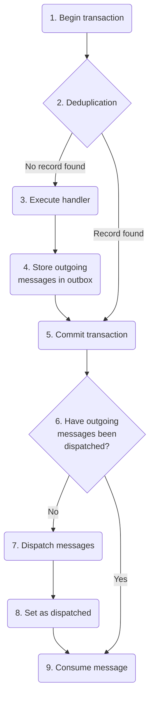

Because message queues generally do not support any form of transactions, message handlers that modify business data in a database run into problems when the messages that are sent become inconsistent with the changes made to business data, resulting in **ghost messages** or **phantom records**.

The **Outbox** is an NServiceBus feature that makes changes to business data consistent with messaging operations as if both the database and messaging layer were bound by an atomic transaction.

## The consistency problem

Consider a message handler that creates a `User` in the business database, and also publishes a `UserCreated` event. If a failure occurs during the execution of the message handler, two different scenarios can occur based on the order of operations.

1. **Phantom record**: The handler inserts the `User` in the database, then publishes `UserCreated` event.
   * If a failure occurs between these two operations, the `User` would be committed to the database, but no `UserCreated` event is published.
   * The message handler did not complete, so the message is retried, and both operations are repeated. This results in a duplicate `User` in the database, known as a phantom record, which is never announced to the rest of the system.
2. **Ghost message**: The handler publishes the `UserCreated` event first, then inserts the `User` in the database.
   * If a failure occurs between these two operations, the `UserCreated` event is published and dispatched immediately, but the `User` it refers to is never committed to the database.
   * The rest of the system is notified about the creation of data that never existed, causing further errors in other message handlers down the line.

To avoid these problems, developers of distributed systems have two options:

* Be very careful to make every single message handler [idempotent](https://en.wikipedia.org/wiki/Idempotence)—that is, coded so that the message handler can be executed multiple times without adverse side effects.
* Implement infrastructure to create consistency between messaging and data operations so that hard idempotency is no longer a requirement.

The Outbox is that piece of infrastructure.

## How it works

The Outbox guarantees exactly-once message processing by taking advantage of the database transaction used to store business data.

Returning to the earlier example of creating a `User` and then publishing a `UserCreated` event, NServiceBus will follow this process when processing a message using the outbox feature. Extended descriptions can be found beneath the diagram.

Here is more detail on each stage of the process:

1. Begin a database transaction on the business database.
2. Check the outbox storage in the business database to see if this message has been processed before. This is called **deduplication**.
   * If the message has been processed before, skip to **Step 5**.
   * If the message has never been seen before, continue to **Step 3**.
3. Execute the message handler.
   * Any outgoing messages are not dispatched immediately but stored in RAM.
4. Create a record in outbox storage in the business database containing the details of all outgoing messages.
5. Commit the transaction on the business database.
   * This is the operation that ensures consistency between messaging and database operations.
6. Determine if the outgoing messages have been dispatched yet.
   * If messages have already been dispatched, this message is a duplicate, so skip to **Step 9**.
   * If there are still messages to dispatch, continue to **Step 7**.
7. Dispatch the outgoing messages stored in the outbox storage to the message transport.
   * If processing fails at this point, it's possible that duplicate messages will be dispatched to the message transport. These messages will all have the same `MessageId`, and will be deduplicated by the outbox feature (in Step 2) by the message endpoint that receives the duplicate messages.
8. Update the outbox storage to show that the outgoing messages have been dispatched.
9. Consume (ACK) the incoming message so that the messaging infrastructure knows it has been processed successfully.

## Important design considerations

* Outbox data must be stored in the same database as business data, so that the outbox is able to take advantage of the single local database transaction.
* The outbox works only in an NServiceBus message handler.
* Because deduplication is done using `MessageId`, messages sent outside of an NServiceBus message handler (i.e. from a Web API) cannot be deduplicated unless they are sent with the same `MessageId`.
* The outbox is _expected to_ generate duplicate messages from time to time, especially if there is unreliable communication between the endpoint and the message broker.
* Endpoints using the outbox feature should not send messages to endpoints using DTC (see below) as the DTC-enabled endpoints will treat duplicates coming from Outbox-enabled endpoints as multiple messages.

## Comparison to DTC

The Distributed Transaction Coordinator (DTC) is a Windows technology that enlists multiple local transactions (called resource managers) within a single distributed `TransactionScope` so that all enlisted transactions either complete successfully as a set or are all rolled back.

DTC is a very chatty protocol, due to the need for multiple resource managers needing to continually check up on each other to make sure they are prepared to commit their results. An example of where this works well would be a distributed transaction between an MSMQ message queue and business data stored in SQL Server. The communication with MSMQ is local and therefore very low-latency, and there are only two resource managers to coordinate with only one communication path between them. The very first versions of NServiceBus primarily used only MSMQ and SQL Server and so with those systems, use of the DTC is prevalent.

The more resource managers involved and/or the higher the latency between them, the more poorly DTC performs. Cloud environments, in particular, have much higher latency when the message queue and the data store are probably not even located in the same server rack.

The rise of cloud infrastructure and [decline of MSMQ](https://particular.net/blog/msmq-is-dead) have contributed to the overall decline in use of DTC in the software development industry.

The outbox feature is designed to provide the same utility to developers in terms of consistency between messaging and data operations so that it is easier to design distributed systems without needing to make every operation idempotent.

## Enabling the outbox

partial: enable-outbox

Each NServiceBus persistence package contains different configuration options, such as a time to keep deduplication data and deduplication data cleanup interval. For details, refer to the specific page for each persistence package in the [Persistence section](#persistence) below.

## Converting from DTC to outbox

When converting a system from using the DTC to the outbox, care must be taken to ensure the system does not process duplicate messages incorrectly.

Because the outbox feature uses an "at least once" consistency guarantee at the transport level, endpoints that enable the outbox may occasionally send duplicate messages. These duplicate messages will be properly handled by deduplication in other Outbox-enabled endpoints, but will be processed more than once by endpoints which still use the DTC.

In order to gradually convert an entire system from the DTC to the outbox:

1. Enable the outbox on any endpoints that receive messages but do not send or publish any messages.
1. Enable the outbox on any endpoints that only send or publish messages to already-converted endpoints, where the outbox will be able to properly handle any duplicate messages.
1. Progress outward until all endpoints are converted.

WARNING: When verifying outbox functionality, it can sometimes be helpful to temporarily [stop the MS DTC Service](https://technet.microsoft.com/en-us/library/cc770732.aspx). This ensures that the outbox is working as expected, and no other resources are enlisting in distributed transactions.

## Message identity

The outbox only uses the incoming [message identifier](/nservicebus/messaging/message-identity.md) as a unique key for deduplicating messages. If the sender does not use outbox when sending messages, it is responsible for ensuring that the message identifier value is consistent when that message is sent multiple times.

## Outbox expiration duration

To determine if a message has been processed before, the identification data for each outbox record is retained. The duration that this data is retained for will vary depending on the persistence chosen for the outbox. The default duration, as well as the frequency of data removal, can be overridden for all outbox persisters.

After the outbox data retention period has lapsed, a retried message will be seen as the first of its kind and will be reprocessed. It is important to ensure that the retention period of outbox data is longer than the maximum time the message can be retried, including delayed retries and manual retries via ServicePulse.

Depending on the throughput of the system's endpoints, the outbox cleanup interval may need to be run more frequently. Increased frequency will allow each cleanup operation to purge the fewest records possible each time it runs. Purging fewer records will make the purge operation run faster which will ensure that it completes before the next purge operation is due to start.

## Storage requirements

The amount of storage space required for the outbox can be calculated as follows:

`Total outbox records = Message throughput per second * Deduplication period in seconds`

A single outbox record, after all transport operations have been dispatched, usually requires less than 50 bytes, most of which are taken for storing the original message ID as this is a string value.

NOTE: If the system is processing a high volume of messages, having a long deduplication time frame will increase the amount of storage space that is required by outbox.

## Persistence

The outbox feature requires persistence in order to perform deduplication and to store outgoing downstream messages.

For more information on the outbox persistence options available refer to the dedicated persistence pages:

* [NHibernate](/persistence/nhibernate/outbox.md)
* [RavenDB](/persistence/ravendb/outbox.md)
* [SQL](/persistence/sql/outbox.md)
* [ServiceFabric](/persistence/service-fabric/outbox.md)
* [MongoDB](/persistence/mongodb/#outbox-cleanup)
