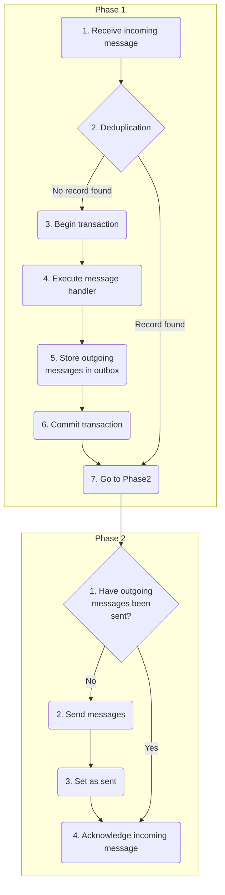

Most message queues and some data stores do not support distributed transactions. This may cause problems when message handlers modify business data. Business data and messages may become inconsistent in the form of **zombie records** or **ghost messages** (see below).

The NServiceBus **outbox** feature ensures consistency between business data and messages. It simulates an atomic transaction, distributed across both the data store used for business data and the message queue used for messaging.

> [!NOTE]
> Messages sent with [immediate dispatch](/nservicebus/messaging/send-a-message.md#dispatching-a-message-immediately) will be sent immediately and won't be handled by the outbox.

> [!NOTE]
> Messages sent using `IMessageSession` won't be handled by the outbox. The outbox requires an incoming message context. Use the `IMessageHandlerContext` instance to dispatch messages handled by the outbox. Use the [Transactional Session](/nservicebus/transactional-session) when requiring outbox behavior without an incoming message.

## The consistency problem

Consider a message handler that creates a `User` in the business database, and also publishes a `UserCreated` event. If a failure occurs during the execution of the message handler, two scenarios may occur, depending on the order of operations.

1. **Zombie record**: The message handler creates the `User` in the database first, then publishes the `UserCreated` event. If a failure occurs between these two operations:
   * The `User` is created in the database, but the `UserCreated` event is not published.
   * The message handler does not complete, so the message is retried, and both operations are repeated. This results in a duplicate `User` in the database, known as a zombie record, which is never announced to the rest of the system.
2. **Ghost message**: The message handler publishes the `UserCreated` event first, then creates the `User` in the database. If a failure occurs between these two operations:
   * The `UserCreated` event is published, but the `User` is not created in the database.
   * The rest of the system is notified about the creation of the `User`, but the `User` does not exist in the database. This causes further errors in other message handlers, which expect the `User` to exist in the database.

To avoid these problems, developers of distributed systems have two options:

1. Ensure all message handlers are [idempotent](https://en.wikipedia.org/wiki/Idempotence). This means each message handler can handle the same message multiple times without adverse side effects. This is often difficult to achieve.
2. Implement infrastructure which guarantees consistency between business data and messages. This avoids the need for all message handlers to be idempotent.

The outbox feature is the infrastructure described in the second option.

## How it works

The outbox feature guarantees that each message is processed once and only once, using the database transaction used to store business data.

Returning to the earlier example of a message handler that creates a `User` and then publishes a `UserCreated` event, the following process occurs. Details are described following the diagram.

There is no single transaction that spans all the operations. The operations occur in two separate phases:

### Phase 1

1. Receive the incoming message from the queue.
   * Do not acknowledge receipt of the message yet, so that if processing fails, the message will be delivered again.
2. Check the outbox storage in the database to see if the incoming message has already been processed. This is called **deduplication**. NServiceBus uses the [message identity(`MessageId`)](#message-identity) to deduplicate messages.
   * If the message has already been processed, skip to **step 7**.
   * If the message has not yet been processed, continue to **step 3**.
3. Begin a transaction in the database.
4. Execute the message handler for the incoming message
   * Any outgoing messages are not immediately sent.
5. Store any outgoing messages in the outbox storage in the database.
6. Commit the transaction in the database.
   * This is the operation that ensures consistency between messaging and database operations.
7. Phase 2

### Phase 2

1. Check if the outgoing messages have already been sent.
   * If the outgoing messages have already been sent, the incoming message is a duplicate, so skip to **step 4**.
   * If the outgoing messages have not yet been sent, continue to **Step 2**.
2. Send the outgoing messages to the queue.
   * If processing fails at this point, duplicate messages may be sent to the queue. Any duplicates will have the same `MessageId`, so they will be deduplicated by the outbox feature (in **Phase 1, step 2**) in the endpoint that receives them.
3. Update outbox storage to show that the outgoing messages have been sent.
4. Acknowledge (ACK) receipt of the incoming message so that it is removed from the queue and will not be delivered again.

Outgoing messages are not sent immediately. They are serialized and persisted in outbox storage. This occurs in a single transaction (Phase 1, steps 3 to 6), which also includes changes to business data made by message handlers. This guarantees that changes to business data are not made without capturing outgoing messages, and vice versa.

> [!NOTE]
> This guarantee does not apply to operations in message handlers that do not enlist in [an outbox transaction](/nservicebus/handlers/accessing-data.md#synchronized-storage-session), such as sending emails, changing the file system, etc.

Outgoing messages are sent to the messaging infrastructure, and the outbox storage is updated to indicate that the outgoing messages have been sent (Phase 2, steps 1 to 3). Due to possible failures, a given message may be sent multiple times. For example, if an exception is thrown in step 3 (failure to update outbox storage), the message will be re-read from the outbox storage and sent again. As long as the receiving endpoints use the outbox feature, these duplicates will be handled by the deduplication(Phase 1, step 2).

## Important design considerations

* For best performance, outbox data should be stored in the same database as business data. For more information, see [_Transaction scope_](#important-design-considerations-transaction-scope) below.
* Using the outbox in an NServiceBus message handler does not require any additional dependencies. For use outside the context of a message handler, use the [TransactionalSession package](/nservicebus/transactional-session).
* Because deduplication is done using `MessageId`, messages sent outside of an NServiceBus message handler (i.e. from a Web API) cannot be deduplicated unless they are sent with the same `MessageId`.
* The outbox is _expected_ to generate duplicate messages from time to time, especially if there is unreliable communication between the endpoint and the message broker.
* Endpoints using the outbox feature should not send messages to endpoints using DTC (see below), as the DTC-enabled endpoints treat duplicates coming from outbox-enabled endpoints as multiple messages.

> [!NOTE]
> Endpoints that use a transport in a transaction mode less than [**TransactionScope**](/transports/transactions.md#transaction-modes-transaction-scope-distributed-transaction) are vulnerable to receiving the same message **more-than-once** regardless of whether the sender has the outbox feature enabled.

### Transaction scope

The performance of the outbox feature depends on the scope of the transactions used to update business data and outbox data. Transactions may be scoped to a single database, multiple databases on a single server, or multiple databases on multiple servers.

* All persisters support transactions scoped to a single database, and these typically offer the best performance. Therefore, it is generally recommended to store outbox data in the same database as business data.
* Transactions scoped to multiple databases on a single server, also known as cross-database transactions, are supported by some persisters, such as those that use SQL Server. These transactions may have reasonably good performance, but they may introduce other concerns. For example, [cross-database transactions are not supported by all types of tables in SQL Server](https://docs.microsoft.com/en-us/sql/relational-databases/in-memory-oltp/cross-database-queries).
* Transactions scoped to multiple databases on multiple servers, also known as _distributed transactions_, are supported by persisters which use SQL Server, but they require the use of MSDTC and should generally be avoided for the same reasons as those listed in the [comparison with MSDTC](#comparison-with-msdtc) below.

### Errors when dispatching the outbox messages

The dispatch of pending messages is triggered by the flow processing the message. This happens after the user transaction has been committed but before the incoming message is acknowledged.

If the message triggering the dispatch (incoming message in Phase 1, Step 1) fails to process (Phase 2, Step 4) but has been able to commit the database transaction (Phase 1, Step 6), the message processing is retried as usual. However, if the message fails to process through all the retry attempts, the message will be moved to the error queue, and the outbox messages will not be dispatched. Once the error is resolved, the failed message should be retried to ensure the outgoing messages are dispatched. If this doesn't happen, this may result in zombie records. If that's undesirable, the system should be returned to a consistent state through another action.

## Comparison with MSDTC

The [Microsoft Distributed Transaction Coordinator (DTC)](https://en.wikipedia.org/wiki/Microsoft_Distributed_Transaction_Coordinator) is a Windows technology that enlists multiple local transactions (called resource managers) within a single distributed `TransactionScope`. All enlisted transactions either complete successfully as a set or are rolled back completely.

MSDTC uses a chatty protocol due to the need for multiple resource managers to continually check on each other to make sure they are prepared to commit their results. An example of where this approach works well is a distributed transaction that involves consuming messages from an MSMQ message queue and storing business data in SQL Server. Communication with MSMQ is local and has very low latency, with only two resource managers to coordinate and a single communication path between them. Early versions of NServiceBus primarily used MSMQ and SQL Server, and systems built with those versions often utilised MSDTC.

The more resource managers involved and/or the higher the latency between them, the worse MSDTC performs. Cloud environments, in particular, have significantly higher latency, and the message queue and data store are often not even located in the same server rack.

The rise of cloud infrastructure and [the decline of MSMQ](https://particular.net/blog/msmq-is-dead) have contributed to the overall decline in the use of MSDTC in the software development industry.

The outbox feature is designed to provide the same level of consistency between business data and messages provided by MSDTC, without the need to coordinate multiple resource managers.

## Enabling the outbox

To enable the Outbox, use the following code API:

snippet: OutboxEnablineInCode

partial: configuration

Each NServiceBus persistence package may contain specific configuration options, such as a time to keep deduplication data and a deduplication data cleanup interval. For details, refer to the specific page for each persistence package in the [persistence section](#persistence) below.

> [!WARNING]
> If the outbox feature is disabled, deduplication will not take place. Therefore, the feature should be enabled on all endpoints that cannot perform an idempotency check.

## Converting from DTC to outbox

When converting a system from using the DTC to the outbox, care must be taken to ensure the system does not process duplicate messages incorrectly.

Because the outbox feature uses an "at least once" consistency guarantee at the transport level, endpoints that enable the outbox may occasionally send duplicate messages. These duplicate messages will be properly handled by deduplication in other outbox-enabled endpoints, but will be processed more than once by endpoints which still use the DTC.

To gradually convert an entire system from the DTC to the outbox:

1. Enable the outbox on any endpoints that receive messages but do not send or publish any messages.
1. Enable the outbox on any endpoints that only send or publish messages to already-converted endpoints, where the outbox will be able to properly handle any duplicate messages.
1. Progress outward until all endpoints are converted.

> [!WARNING]
> When verifying outbox functionality, it can be helpful to temporarily [stop the MSDTC Service](https://technet.microsoft.com/en-us/library/cc770732.aspx). This ensures that the outbox is working as expected, and no other resources are enlisting in distributed transactions.

## Message identity

The outbox uses the incoming [message identifier](/nservicebus/messaging/message-identity.md) as a unique key for deduplicating messages. When sending messages with a [custom message id](/nservicebus/messaging/message-identity.md#specifying-message-identity), the sender should ensure that the message identifier value is consistent if the message is sent multiple times.

Since message identifiers are [unique only within the scope of a logical endpoint from a processing perspective](/nservicebus/messaging/message-identity.md) it is the responsibility of the persister to ensure that message identities are scoped to the [logical endpoint](/nservicebus/endpoints/#logical-endpoints) that is processing the message to allow multiple endpoints to use the same database.

## Outbox expiration duration

To determine if a message has been processed before, the identification data for each outbox record is retained. The duration that this data is retained varies depending on the persistence chosen for the outbox. The default duration and frequency of data removal can be overridden for all outbox persisters.

After the outbox data retention period has lapsed, a retried message will be seen as the first of its kind and will be reprocessed. Therefore, it is important to ensure that the retention period of outbox data is longer than the maximum time the message can be retried, including delayed retries and manual retries via ServicePulse.

Depending on the throughput of the system's endpoints, the outbox cleanup interval may need to be run more frequently. The increased frequency will allow each cleanup operation to purge the fewest records possible each time it runs. Purging fewer records will make the purge operation run faster, ensuring it completes before the next scheduled purge operation.

## Storage requirements

The amount of storage space required for the outbox can be calculated as follows:

`Total outbox records = Message throughput per second * Deduplication period in seconds`

A single outbox record, after all transport operations have been dispatched, typically requires less than 50 bytes, with most of the space occupied by storing the original message ID, which is a string value.

> [!NOTE]
If the system is processing a high volume of messages, having a long deduplication time frame will increase the storage space required by the outbox.

## Persistence

The outbox feature requires persistent storage to perform deduplication and store outgoing downstream messages.

For more information on the outbox persistence options available, refer to the dedicated persistence pages:

* [Azure Table](/persistence/azure-table)
* [CosmosDB](/persistence/cosmosdb)
* [DynamoDB](/persistence/dynamodb)
* [MongoDB](/persistence/mongodb/#outbox)
* [NHibernate](/persistence/nhibernate/outbox.md)
* [RavenDB](/persistence/ravendb/outbox.md)
* [ServiceFabric](/persistence/service-fabric/outbox.md)
* [SQL](/persistence/sql/outbox.md)
