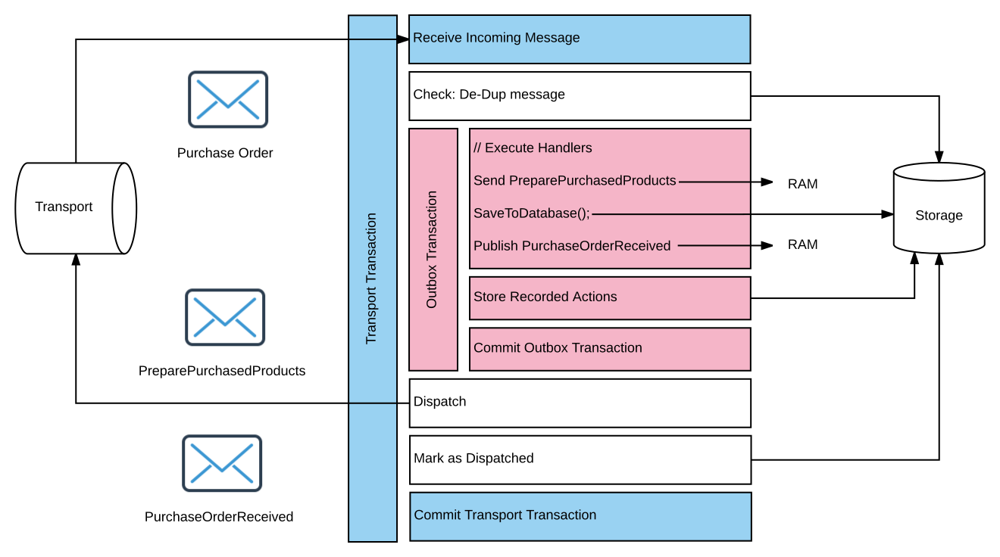

The Outbox is an infrastructure feature designed to simulate the reliability of distributed transactions (using the Distributed Transactions Coordinator or DTC) while not actually using the DTC.

The purpose of the DTC is to guarantee consistency between messaging operations and the data persistence. Messaging operations includes the message being processed as well as any messages being sent out as a result. Data persistence includes any business data persisted by a message handler, as well as any NServiceBus saga or timeout data stored at the same time. The DTC ensures that all these operations either complete successfully together, or are all rolled back.

Instead of the DTC, the NServiceBus Outbox feature can be used to mimic this level of consistency without the need for distributed transactions. It does this by first storing any outgoing messages in the database, taking advantage of the same (non-distributed) local transaction to ensure that the messaging operations are stored atomically with any changes to business data and NServiceBus data. Once that transaction is successfully committed, the stored outgoing messages are dispatched to their destinations separately.

## How it works

The Outbox feature has been implemented using the [Outbox](http://gistlabs.com/2014/05/the-outbox/) and the [Deduplication](https://en.wikipedia.org/wiki/Data_deduplication#In-line_deduplication) patterns.

Every time a message is processed, a copy of that message is stored in the persistent _Outbox storage_. Whenever a new message is received, the framework verifies if that message has been processed already by checking if it's present in the Outbox storage.

If the message is not found in the Outbox storage, then it is processed in a regular way as shown in the following diagram:

Processing a new incoming message consists of the following steps:

 * The handlers processing that message are invoked.
 * The _downstream messages_ (messages sent during processing the message, e.g. from inside the handlers) are stored in a durable storage and business data is saved. Both operations are executed within a single transaction.
 * The downstream messages are sent and marked as dispatched.

If the message is found in the Outbox storage, then it is treated as a duplicate and not processed again. However, even though the message has been processed and business data has been saved, framework might fail to send downstream messages. If the downstream messages are not marked as dispatched, they will be dispatched again.

Note: On the wire level the Outbox guarantees `at-least-once` message delivery, meaning that the downstream messages can be sent and processed multiple times. At the handler level, however, the Outbox guarantees `exactly-once` message processing, similar to distributed transactions. This higher guarantee level is due to the deduplication that happens on the receiving side.

## Important design considerations

WARNING: To take advantage of the same local database transaction to store all data and get a similar experience to using DTC, the business data and Outbox deduplication data *must be stored in the same database*.

 * The Outbox feature works only for messages sent from NServiceBus message handlers.
 * Endpoints using DTC can communicate with endpoints using Outbox only if either of the following conditions are satisfied:
   * Endpoints using Outbox don't send messages to endpoints using DTC. However, endpoints using DTC can send messages to endpoints using Outbox.
   * If endpoints using Outbox send messages to endpoints using DTC, then the handlers processing those messages are [idempotent](https://en.wikipedia.org/wiki/Idempotence).
 * The Outbox may generate duplicate messages if outgoing messages are successfully dispatched but the _Mark as dispatched_ phase fails. This may happen for a variety of reasons, including _Outbox storage_ connectivity issues and deadlocks.

## Enabling the Outbox

partial: enable-outbox

To learn about Outbox configuration options such as time to keep deduplication data or deduplication data clean up interval, refer to the dedicated pages for [NHibernate](/persistence/nhibernate/outbox.md), [RavenDB](/persistence/ravendb/outbox.md) or [ServiceFabric](/persistence/service-fabric/outbox.md) persistence.

## Converting from DTC to Outbox

When converting a system from using the DTC to the Outbox, care must be taken to ensure the system does not process duplicate messages incorrectly.

Because the Outbox feature uses an "at least once" consistency guarantee at the transport level, endpoints that enable the Outbox will occasionally send duplicate messages. These duplicate messages will be properly handled by deduplication in other Outbox-enabled endpoints, but would be processed in duplicate by endpoints still using the DTC.

In order to gradually convert an entire system from use of DTC to Outbox:

1. Enable the Outbox on any endpoints that receive messages but do not send or publish any messages out.
1. Enable the Outbox on any endpoints that only send or publish messages to already-converted endpoints, where the Outbox will be able to properly handle any duplicate messages.
1. Progress outward until all endpoints are converted.

WARNING: When verifying outbox functionality, it can sometimes be helpful to temporarily [stop the MSDTC Service](https://technet.microsoft.com/en-us/library/cc770732.aspx). This ensures that the Outbox behavior is working as expected, and no other resources are enlisting in distributed transactions.

## Persistence

The Outbox feature requires persistence in order to store the messages and enable deduplication.

Refer to the dedicated pages for [NHibernate](/persistence/nhibernate/outbox.md), [RavenDB](/persistence/ravendb/outbox.md) or [ServiceFabric](/persistence/service-fabric/outbox.md) persistence.
