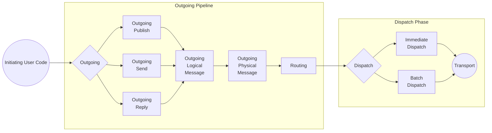
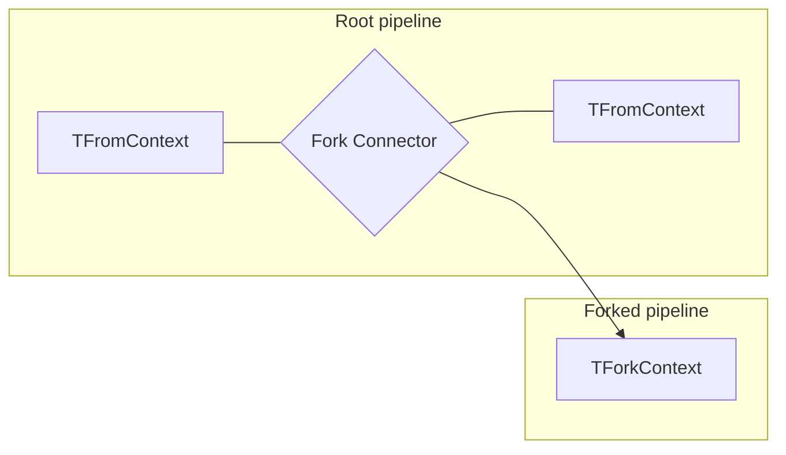
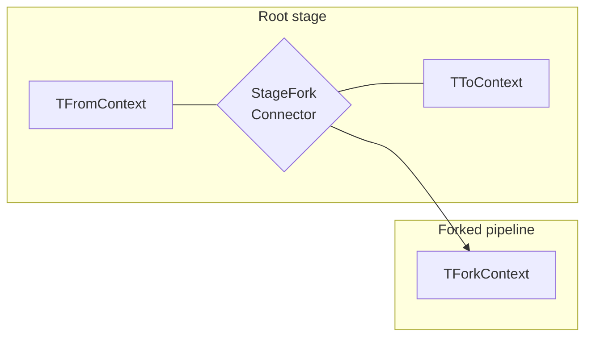

Each pipeline is composed of *steps*. Each step represents a behavior that will be executed at the given place within the pipeline. Add additional behavior to the pipeline by registering a new step or replacing the behavior of an existing step.

partial: stages

partial: incoming

### Outgoing Pipeline Stages

* Operation-specific processing: There is a dedicated stage for each context operation (e.g., Send, Publish, Subscribe, ...). Behaviors can use one of the following contexts: `IOutgoingSendContext`, `IOutgoingPublishContext`, `IOutgoingReplyContext`, `ISubscribeContext`, `IUnsubscribeContext`. Subscribe and Unsubscribe are not shown on the diagram below.
* Outgoing Logical Message: Behaviors on this stage have access to the message that should be sent. Use `IOutgoingLogicalMessageContext` in a behavior to enlist in this stage.
* Outgoing Physical Message: Enables access to the serialized message. This stage provides an `IOutgoingPhysicalMessageContext` instance to its behaviors.
* Routing: Allows the selected routing strategies for outgoing messages to be manipulated. If the incoming pipeline initiated the outgoing pipeline, this stage collects [all outgoing operations](/nservicebus/messaging/batched-dispatch.md) (except for [immediate dispatch messages](/nservicebus/messaging/send-a-message.md#dispatching-a-message-immediately)).
This stage provides an `IRoutingContext` instance to its behaviors.
* Batch Dispatch: Forwards all [collected outgoing operations](/nservicebus/messaging/batched-dispatch.md) to the dispatch stage once message processing has been completed. This stage provides access to the collection of transport operations that are to be dispatched. This stage provides an `IBatchDispatchContext` instance to its behaviors.
* Dispatch: Provides access to outgoing dispatch operations before they are handed off to the transport. This stage provides an `IDispatchContext` instance to its behaviors.

partial: recoverability

partial: optional

## Extension bag

Pipeline contexts have an extension bag that can be used to create, read, update, or delete custom state with a key identifier. For example, this can be used to *set* metadata- or pipeline-specific state in an incoming behavior that can be used in later pipeline stages if needed. State stored in the extension bag will not be available once the extension bag's scope ends at the end of the pipeline.

State set during a *forked* pipeline will not be available to the *forking* pipeline. For example, state changes during the *outgoing* pipeline will not be available in the *incoming* pipeline. If the state has to be propagated, have the *forking* pipeline set a context object that the *forked* pipeline later can get and modify as needed.

snippet: SetContextBetweenIncomingAndOutgoing

## Stage connectors

Stage connectors connect from the current stage (e.g., `IOutgoingLogicalMessageContext`) to another stage (e.g., `IOutgoingPhysicalMessageContext`). To override an existing stage, inherit from `StageConnector<TFromContext, TToContext>` and then replace an existing stage connector. Most pipeline extensions can be done by inheriting from `Behavior<TContext>`. It is rarely necessary to replace existing stage connectors. When implementing a stage connector, 
ensure that all required data is passed to the next stage.

snippet: CustomStageConnector

## Fork connectors

Fork connectors fork from a current stage (e.g., `IIncomingPhysicalMessageContext`) to another independent pipeline (e.g., `IAuditContext`). To override an existing fork connector, inherit from `ForkConnector<TFromContext, TForkContext>` and then replace an existing fork connector.

snippet: CustomForkConnector

## Stage Fork Connector

Stage fork connectors are essentially a combination of a stage connector and a fork connector. They have the ability to connect from the current stage (e.g., `ITransportReceiveContext`) to another stage (e.g., `IIncomingPhysicalMessageContext`) and fork to another independent pipeline (e.g., `IBatchedDispatchContext`). In order to override an existing stage fork connector, inherit from `StageForkConnector<TFromContext, TToContext, TForkContext` and then replace an existing stage fork connector.

snippet: CustomStageForkConnector
