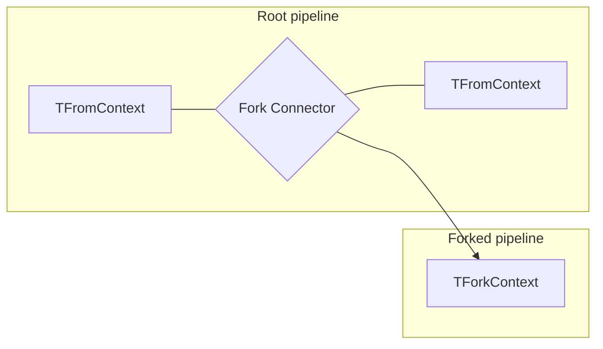
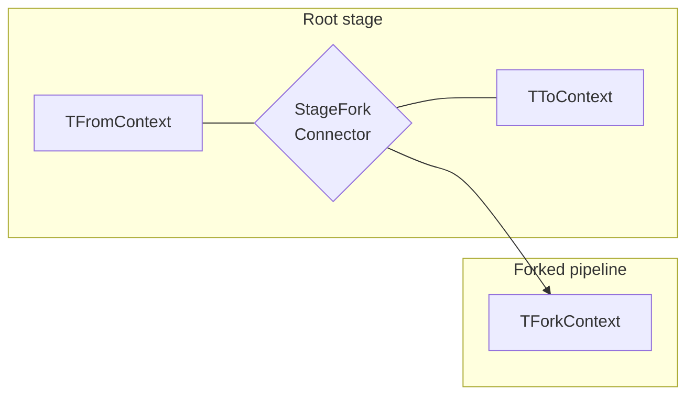

## Stage connectors

Stage connectors connect from the current stage (e.g. `IOutgoingLogicalMessageContext`) to another stage (e.g. `IOutgoingPhysicalMessageContext`). In order to override an existing stage, inherit from `StageConnector<TFromContext, TToContext>` and then replace an existing stage connector. Most pipeline extensions can be done by inheriting from `Behavior<TContext>`. It is rarely necessary to replace existing stage connectors. When implementing a stage connector, ensure that all required data is passed along for the next stage.

snippet: CustomStageConnector

## Fork connectors

Fork connectors fork from a current stage (e.g. `IIncomingPhysicalMessageContext`) to another independent pipeline (e.g. `IAuditContext`). In order to override an existing fork connector inherit from `ForkConnector<TFromContext, TForkContext>` and then replace an existing fork connector.

snippet: CustomForkConnector

## Stage Fork Connector

Stage fork connectors are essentially a combination of a stage connector and a fork connector. They have the ability to connect from the current stage (e.g. `ITransportReceiveContext`) to another stage (e.g. `IIncomingPhysicalMessageContext`) and fork to another independent pipeline (e.g. `IBatchedDispatchContext`). In order to override an existing stage fork connector inherit from `StageForkConnector<TFromContext, TToContext, TForkContext` and then replace an existing stage fork connector.

snippet: CustomStageForkConnector
