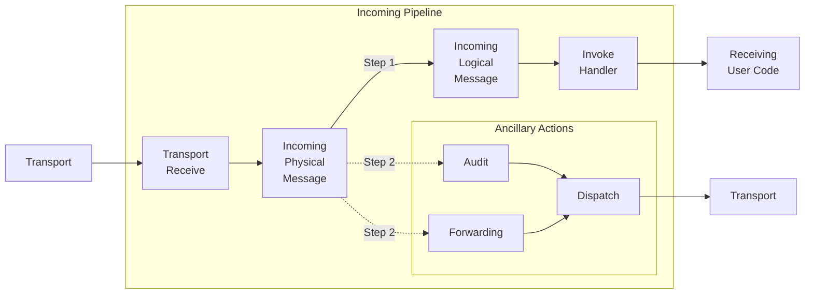

The pipeline is broken down into smaller composable units called *Stages* and *Connectors*. A stage is a group of steps acting on the same level of abstraction.

Note: There currently is no way to provide custom Pipelines, Stages, Fork Connectors, or Stage Connectors. Existing Stages, Fork Connectors, or Stage Connectors can be replaced but extreme caution has to be applied. Stages, Fork Connectors and Stage Connectors define the inner workings of NServiceBus core behavior. Wrongly replaced stages or connectors could lead to message loss. The examples below are included here for completeness. 


## Stages

The pipeline consists of two main parts: incoming and outgoing. Both parts are comprised from a number of stages. 

The following lists describe some of the common stages that behaviors can be built for. Each stage has a context associated with it (which is used when implementing a custom behavior).

NOTE: Data can be added to, and retrieved from, the context with the `Extensions` property of type `ContextBag`. Each following stage has access to data set in a previous stage but data set in a later stage is not available in a prior stage. The context bag is cloned at each stage transition and is not threadsafe.

In the diagram User Code can refer to a handler or a saga. If the handler or saga sends a message, publishes an event, or replies to a message, then the details from the incoming message will be added to the outgoing context.

### Incoming Pipeline Stages

 * TransportReceiveContext: Behaviors in this stage are responsible for signaling failure or success to the transport. In this stage no outgoing operations are supported. This stage provides `ITransportReceiveContext` to its behaviors.
 * Incoming Physical Message: Behaviors on this stage have access the raw message body before it is deserialized. This stage provides `IIncomingPhysicalMessageContext` to its behaviors.
 * Incoming Logical Message: This stage provides information about the received message type and it's deserialized instance. It provides `IIncomingLogicalMessageContext` to its behaviors.
 * Invoke Handlers: Each received message can be handled by multiple handlers. This stage will be executed once for every associated handler and provides `IInvokeHandlerContext` to the its behaviors.
 
The connection between the Incoming Physical Message stage and the Forwarding/Audit stages is an example of a fork. In both cases, the message will flow down the main path and then down the fork path. The fork paths are only followed if the corresponding feature (auditing, message forwarding) has been enabled.



### Outgoing Pipeline Stages

 * Operation specific processing: There is a dedicated stage for each context operation (e.g. Send, Publish, Subscribe, ...). Behaviors can use one of the following contexts: `IOutgoingSendContext`, `IOutgoingPublishContext`, `IOutgoingReplyContext`, `ISubscribeContext`, `IUnsubscribeContext`. Subscribe and Unsubscribe are not shown on the diagram below.
 * Outgoing Logical Message: Behaviors on this stage have access to the message which should be sent. Use `IOutgoingLogicalMessageContext` in a behavior to enlist in this stage.
 * Outgoing Physical Message: Enables to access the serialized message. This stage provides `IOutgoingPhysicalMessageContext` to it's behaviors.
 * Routing: Provides access to the routing strategies that have been selected for the outgoing message. This stage provides `IRoutingContext` to it's behaviors.
 * Batch Dispatch: when messages are sent as part of a message handler or saga handler, or when using `IMessageSession` to send messages. Outgoing messages are [collected into a batch](/nservicebus/messaging/batched-dispatch.md) and handed to the Batch Dispatch stage all at once once message processing has been completed. This stage provides access to the collection of transport operations that are to be dispatched. This stage provides `IBatchDispatchContext` to it's behaviors. The batch dispatch stage can be bypassed by specifying [immediate dispatch](/nservicebus/messaging/send-a-message.md) for an outgoing message.
 * Dispatch: provides access to outgoing dispatch operations before they are handed off to the transport. This stage provides `IDispatchContext` to it's behaviors.


```mermaid
graph LR
UC[Initiating<br>User Code]

subgraph Outgoing Pipeline
Outgoing{Outgoing}
OP[Outgoing<br>Publish]
OS[Outgoing<br>Send]
OR[Outgoing<br>Reply]
OLM[Outgoing<br>Logical<br>Message]
OPM[Outgoing<br>Physical<br>Message]
Routing[Routing]
end


subgraph Dispatch
Dispatch{Dispatch}
Transport[Transport]
BD[Batch<br>Dispatch]
ID[Immediate<br>Dispatch]
end

UC --> Outgoing
Outgoing --> OP
Outgoing --> OS
Outgoing --> OR
OP --> OLM
OS --> OLM
OR --> OLM
OLM --> OPM
OPM --> Routing
Routing --> Dispatch

ID--> Transport
Dispatch --> BD
Dispatch --> ID
BD --> Transport
```


### Optional Pipeline Stages

 * Audit: Behaviors in the Audit stage have access to the message to be audited/sent to the audit queue and audit address. Behaviors should use `IAuditContext` to enlist in this stage. This stage is only entered if [Message Auditing](/nservicebus/operations/auditing.md) is enabled. 
 * Forwarding: Behaviors in the Forwarding stage have access to the message to be sent to the forwarding queue and the address of the forwarding queue. Behaviors should use `IForwardingContext` to enlist in this stage. This stage is only entered if [Message Forwarding](/nservicebus/messaging/forwarding.md) is enabled.

## Extension bag

The pipeline has an extension bag which can be used to used to create, read, update or delete custom state with a key identifier. For example, this can be used to *set* metadata- or pipeline-specific state in an incoming behavior that can be used in later behavior pipeline stages if needed. State stored via the extension bag will be removed once the extension bag runs out of scope at the end of the pipeline.

State set during the *outgoing* pipeline will not be available in the *incoming* pipeline. If state has to be transfered from the *outgoing* into the *incoming* pipeline, use [message headers](/nservicebus/messaging/headers.md) in combination with serialization.

snippet: SetContextBetweenIncomingAndOutgoing

## Stage connectors

```mermaid
graph LR
subgraph 
    A[TFromContext] --- B{Connector}
    B --- C[TToContext]
end
```

Stage connectors connect from the current stage (i.e. `IOutgoingLogicalMessageContext`) to another stage (i.e. `IOutgoingPhysicalMessageContext`). In order to override an existing stage, inherit from `StageConnector<TFromContext, TToContext>` and then replace an existing stage connector. Most pipeline extensions can be done by inheriting from `Behavior<TContext>`. It is rarely necessary to replace existing stage connectors. When implementing a stage connector, ensure that all required data is passed along for the next stage.

snippet: CustomStageConnector


## Fork Connectors

```mermaid
graph LR
subgraph 
    A[TFromContext] --- B{Fork Connector}
    B --- C[TFromContext]
end
subgraph 
   B --> D[TForkContext]
end
```

Fork connectors fork from a current stage (i.e. `IIncomingPhysicalMessageContext`) to another independent pipeline (i.e. `IAuditContext`). In order to override an existing fork connector inherit from `ForkConnector<TFromContext, TForkContext>` and then replace an existing fork connector.

snippet: CustomForkConnector

## Stage Fork Connector

```mermaid
graph LR
subgraph 
    A[TFromContext] --- B{StageFork<br/>Connector}
    B --- C[TToContext]
end
subgraph 
   B --> D[TForkContext]
end
```

Stage fork connectors are essentially a combination of a stage connector and a fork connector. They have the ability to connect from the current stage (i.e. `ITransportReceiveContext`) to another stage (i.e. `IIncomingPhysicalMessageContext`) and fork to another independent pipeline (i.e. `IBatchedDispatchContext`). In order to override an existing stage fork connector inherit from `StageForkConnector<TFromContext, TToContext, TForkContext` and then replace an existing stage fork connector.

snippet: CustomStageForkConnector
