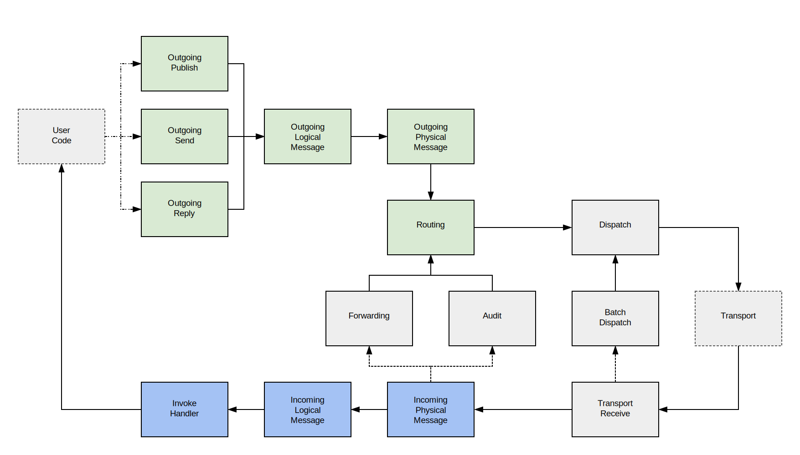

NServiceBus Version 6 further splits the existing pipelines into smaller composable units called *Stages* and *Connectors*. A stage is a group of steps acting on the same level of abstraction.

## Stages

This map shows all of the stages in the pipeline and how messages flow through them.    

The green stages are considered part of the outgoing pipeline and the blue stages are considered part of the incoming pipeline. The connection between the Incoming Physical Message stage and the Forwarding/Audit stages is an example of a fork. In both cases, the message will flow down the main path and then down the fork path. The fork paths are only followed if the corresponding feature (auditing, message forwarding) has been enabled.

In the diagram User Code can refer to a handler or a saga. If the handler or saga sends a message, publishes an event, or replies to a message, then the details from the incoming message will be added to the outgoing context.

The following lists describe some of the common stages that behaviors can be built for. Each stage has a context associated with it (which is used when implementing a custom behavior).

### Incoming Pipeline Stages

 * Incoming Physical Message: Behaviors on this stage have access the raw message body before it is deserialized. This stage provides `IIncomingPhysicalMessageContext` to it's behaviors.
 * Incoming Logical Message: This stage provides information about the received message type and it's deserialized instance. It provides `IIncomingLogicalMessageContext` to it's behaviors.
 * Invoke Handlers: Each received message can be handled by multiple handlers. This stage will be executed once for every associated handler and provides `IInvokeHandlerContext` to the behaviors.

### Outgoing Pipeline Stages

 * Operation specific processing: There is a dedicated stage for each bus operation (e.g. Send, Publish, Subscribe, ...). Behaviors can use one of the following contexts: `IOutgoingSendContext`, `IOutgoingPublishContext`, `IOutgoingReplyContext`, `ISubscribeContext`, `IUnsubscribeContext`. Subscribe and Unsubsscribe are not shown on the diagram above.
 * Outgoing Logical Message: Behaviors on this stage have access to the message which should be sent. Use `IOutgoingLogicalMessageContext` in a behavior to enlist in this stage.
 * Outgoing Physical Message: Enables to access the serialized message. This stage provides `IOutgoingPhysicalMessageContext` to it's behaviors.

### Other Pipeline Stages

 * Audit: Behaviors in the Audit stage have access to the message to be audited/sent to the audit queue and audit address. Behaviors should use `IAuditContext` to enlist in this stage.

## Stage Connectors

Stage connectors connect from the current stage (i.e. `IOutgoingLogicalMessageContext`) to another stage (i.e. `IOutgoingPhysicalMessageContext`). In order to override an existing stage to inherit from `StageConnector<TFromContext, TToContext>` and then replace an existing stage connector. Most pipeline extensions can be done by inheriting from `Behavior<TContext>`. It is rarely ever necessary to implement stage connectors or replace existing ones. When implementing a stage connector ensure that all required data is passed along for the next stage.

snippet:CustomStageConnector

## Fork Connectors

Fork connectors fork from a current stage (i.e. `IIncomingPhysicalMessageContext`) to another independent pipeline (i.e. `IAuditContext`). A fork connector has the required knowledge to create additional pipelines and cache them appropriately for performance reasons. In order to override an existing fork connector inherit from `ForkConnector<TFromContext, TForkContext>` and then replace an existing fork connector.

snippet:CustomForkConnector

Note: There is currently no mechanism available to create custom pipelines and stages.

## Stage Fork Connector

Stage fork connectors are essentially a marriage of a stage connector and a fork connector. They have the ability to connect from the current stage (i.e. `ITransportReceiveContext`) to another stage (i.e. `IIncomingPhysicalMessageContext`) and fork to another independent pipeline (i.e. `IBatchedDispatchContext`). Like a fork connector it has the required knowledge to create additional pipelines and cache them appropriately for performance reasons. In order to override an existing stage fork connector inherit from `StageForkConnector<TFromContext, TToContext, TForkContext` and then replace an existing stage fork connector.

snippet:CustomStageForkConnector

Note: There is currently no mechanism available to create custom pipelines and stages.
