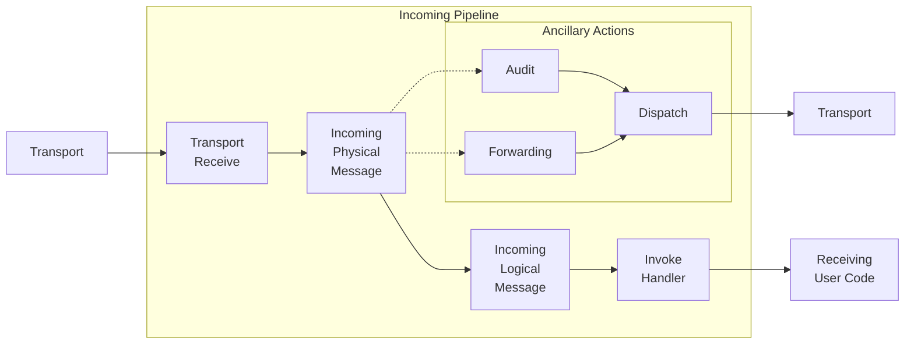

NServiceBus Version 6 further splits the existing pipelines into smaller composable units called *Stages* and *Connectors*. A stage is a group of steps acting on the same level of abstraction.

Note: There currently is no way to provide custom Pipelines, Stages, Fork Connectors, or Stage Connectors for NServiceBus. The existing elements can be customized. The examples below are included here for completeness.

## Stages

The pipeline consists of two main parts: incoming and outgoing. Both parts are comprised from a number of stages. 

The following lists describe some of the common stages that behaviors can be built for. Each stage has a context associated with it (which is used when implementing a custom behavior).

In the diagram User Code can refer to a handler or a saga. If the handler or saga sends a message, publishes an event, or replies to a message, then the details from the incoming message will be added to the outgoing context.


### Incoming Pipeline Stages

 * Incoming Physical Message: Behaviors on this stage have access the raw message body before it is deserialized. This stage provides `IIncomingPhysicalMessageContext` to it's behaviors.
 * Incoming Logical Message: This stage provides information about the received message type and it's deserialized instance. It provides `IIncomingLogicalMessageContext` to it's behaviors.
 * Invoke Handlers: Each received message can be handled by multiple handlers. This stage will be executed once for every associated handler and provides `IInvokeHandlerContext` to the behaviors.
 
The connection between the Incoming Physical Message stage and the Forwarding/Audit stages is an example of a fork. In both cases, the message will flow down the main path and then down the fork path. The fork paths are only followed if the corresponding feature (auditing, message forwarding) has been enabled.



### Outgoing Pipeline Stages

 * Operation specific processing: There is a dedicated stage for each bus operation (e.g. Send, Publish, Subscribe, ...). Behaviors can use one of the following contexts: `IOutgoingSendContext`, `IOutgoingPublishContext`, `IOutgoingReplyContext`, `ISubscribeContext`, `IUnsubscribeContext`. Subscribe and Unsubsscribe are not shown on the diagram below.
 * Outgoing Logical Message: Behaviors on this stage have access to the message which should be sent. Use `IOutgoingLogicalMessageContext` in a behavior to enlist in this stage.
 * Outgoing Physical Message: Enables to access the serialized message. This stage provides `IOutgoingPhysicalMessageContext` to it's behaviors.
 * Routing: Provides access to the routing strategies that have been selected for the outgoing message. This stage provides `IRoutingContext` to it's behaviors.


```mermaid
graph LR
UC[Initiating<br>User Code]

subgraph Outgoing Pipeline
Outgoing{Outgoing}
OP[Outgoing<br>Publish]
OS[Outgoing<br>Send]
OR[Outgoing<br>Reply]
OLM[Outgoing<br>Logical<br>Message]
OPM[Outgoing<br>Physical<br>Message]
Routing[Routing]
end


subgraph Dispatch
Dispatch{Dispatch}
Transport[Transport]
BD[Batch<br>Dispatch]
ID[Immediate<br>Dispatch]
end

UC --> Outgoing
Outgoing --> OP
Outgoing --> OS
Outgoing --> OR
OP --> OLM
OS --> OLM
OR --> OLM
OLM --> OPM
OPM --> Routing
Routing --> Dispatch

ID--> Transport
Dispatch --> BD
Dispatch --> ID
BD --> Transport
```


### Optional Pipeline Stages

 * Audit: Behaviors in the Audit stage have access to the message to be audited/sent to the audit queue and audit address. Behaviors should use `IAuditContext` to enlist in this stage. This stage is only entered if [Message Auditing](/nservicebus/operations/auditing.md) is enabled. 
 * Forwarding: Behaviors in the Forwarding stage have access to the message to be sent to the forwarding queue and the address of the forwarding queue. Behaviors should use `IForwardingContext` to enlist in this stage. This stage is only entered if [Message Forwarding](/nservicebus/messaging/forwarding.md) is enabled.


### Other Pipeline Stages

NOTE: These stages are documented for the sake of completeness. Replacing behaviors in these stages is not recommended without a fully understanding of the entire pipeline. 

 * Transport Receive: provides access to the raw incoming message before any other stages have been invoked. This stage provides `ITransportReceiveContext` to it's behaviors.
 * Dispatch: provides access to outgoing dispatch operations before they are handed off to the transport. This stage provides `IBatchDispatch` to it's behaviors.
 * Batch Dispatch: when messages are sent as part of a message handler or saga handler, they are not immediately dispatched. Those messages are [collected into a batch](/nservicebus/messaging/batched-dispatch.md) and handed to the Batch Dispatch stage all at once once message processing has been completed. This stage provides access to the collection of transport operations that are to be dispatched. This stage provides `IBatchDispatchContext` to it's behaviors. The batch dispatch stage can be bypassed by specifying [immediate dispatch](/nservicebus/messaging/send-a-message.md) for an outgoing message.


## Stage Connectors

```mermaid
graph LR
subgraph 
    A[TFromContext] --- B{Connector}
    B --- C[TToContext]
end
```

Stage connectors connect from the current stage (i.e. `IOutgoingLogicalMessageContext`) to another stage (i.e. `IOutgoingPhysicalMessageContext`). In order to override an existing stage to inherit from `StageConnector<TFromContext, TToContext>` and then replace an existing stage connector. Most pipeline extensions can be done by inheriting from `Behavior<TContext>`. It is rarely ever necessary to implement stage connectors or replace existing ones. When implementing a stage connector ensure that all required data is passed along for the next stage.

snippet:CustomStageConnector


## Fork Connectors

```mermaid
graph LR
subgraph 
    A[TFromContext] --- B{Fork Connector}
    B --- C[TFromContext]
end
subgraph 
   B --> D[TForkContext]
end
```

Fork connectors fork from a current stage (i.e. `IIncomingPhysicalMessageContext`) to another independent pipeline (i.e. `IAuditContext`). A fork connector has the required knowledge to create additional pipelines and cache them appropriately for performance reasons. In order to override an existing fork connector inherit from `ForkConnector<TFromContext, TForkContext>` and then replace an existing fork connector.

snippet:CustomForkConnector

## Stage Fork Connector

```mermaid
graph LR
subgraph 
    A[TFromContext] --- B{StageFork<br/>Connector}
    B --- C[TToContext]
end
subgraph 
   B --> D[TForkContext]
end
```

Stage fork connectors are essentially a marriage of a stage connector and a fork connector. They have the ability to connect from the current stage (i.e. `ITransportReceiveContext`) to another stage (i.e. `IIncomingPhysicalMessageContext`) and fork to another independent pipeline (i.e. `IBatchedDispatchContext`). Like a fork connector it has the required knowledge to create additional pipelines and cache them appropriately for performance reasons. In order to override an existing stage fork connector inherit from `StageForkConnector<TFromContext, TToContext, TForkContext` and then replace an existing stage fork connector.

snippet:CustomStageForkConnector
