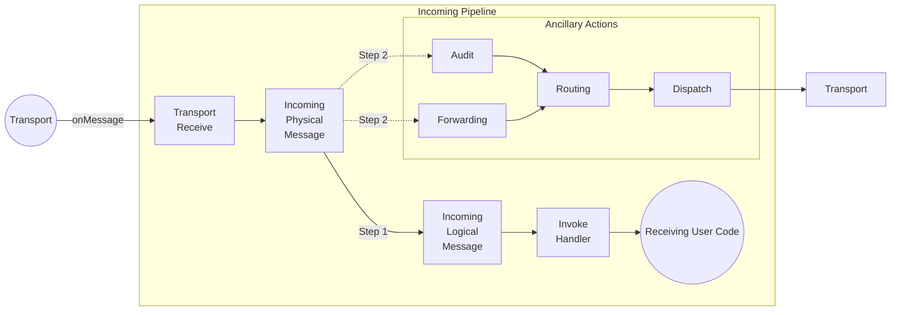

### Incoming pipeline stages

* Transport Receive: Behaviors in this stage are responsible for signaling failure or success to the transport. In this stage no outgoing operations are supported. This stage provides `ITransportReceiveContext` to its behaviors.
* Incoming Physical Message: Behaviors on this stage have access to the raw message body before it is deserialized. This stage provides `IIncomingPhysicalMessageContext` to its behaviors.
* Incoming Logical Message: This stage provides information about the received message type and its deserialized instance. It provides `IIncomingLogicalMessageContext` to its behaviors.
* Invoke Handlers: Each received message can be handled by multiple handlers. This stage will be executed once for every associated handler and provides `IInvokeHandlerContext` to the its behaviors.

The connection between the _incoming physical message_ stage and the Forwarding/Audit stages is an example of a fork. In both cases, the message will flow down the main path and then down the fork path. The fork paths are only followed if the corresponding feature (auditing, message forwarding) has been enabled.

