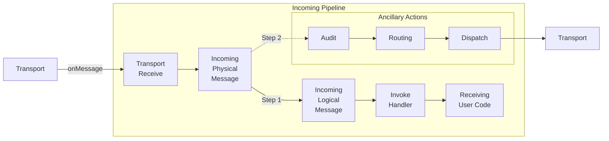

### Incoming Pipeline Stages

* TransportReceiveContext: Behaviors in this stage are responsible for signaling failure or success to the transport. In this stage no outgoing operations are supported. This stage provides `ITransportReceiveContext` to its behaviors.
* Incoming Physical Message: Behaviors on this stage have access the raw message body before it is deserialized. This stage provides `IIncomingPhysicalMessageContext` to its behaviors.
* Incoming Logical Message: This stage provides information about the received message type and it's deserialized instance. It provides `IIncomingLogicalMessageContext` to its behaviors.
* Invoke Handlers: Each received message can be handled by multiple handlers. This stage will be executed once for every associated handler and provides `IInvokeHandlerContext` to the its behaviors.

The connection between the Incoming Physical Message stage and the udit stages is an example of a fork. The message will flow down the main path and then down the fork path. The fork paths are only followed if the Audit feature has been enabled.

