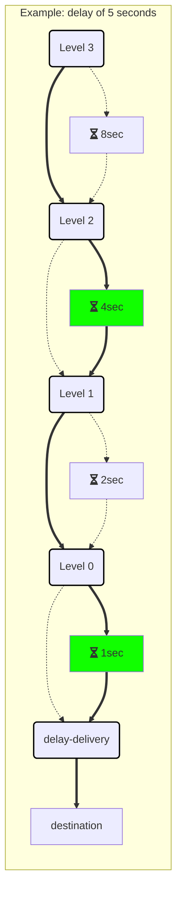

In Versions 4.3 and above, the RabbitMQ transport no longer relies on the [timeout manager](/nservicebus/messaging/timeout-manager.md) to implement [delayed delivery](/nservicebus/messaging/delayed-delivery.md). The transport now creates an infrastructure inside the broker to natively handle delaying messages.


## How it works

Upon starting the endpoint, the transport declares a set of topic exchanges, queues, and bindings that work together to provide the necessary infrastructure to support delayed messages. Exchanges and queues are grouped to provide 28 delay levels. There is one final delivery exchange in addition to the level exchanges. When a message needs to be delayed, the value of the desired delay is first converted to seconds. The binary representation of this value is then used as part of the routing key when the message is sent to the delay-level exchanges. The full routing key will be in the following format:

```
N.N.N.N.N.N.N.N.N.N.N.N.N.N.N.N.N.N.N.N.N.N.N.N.N.N.N.N.destination
```

Where 'N' is either `0` or `1` as necessary to represent the delay value, and "destination" is the name of endpoint the delayed message is intended for.


### Delay levels

Each exchange/queue pair that makes up a level represents one bit of the total delay value. By having 28 of these levels, corresponding to `2^27` through `2^0`, the delay infrastructure can delay a message for any value that can be represented by a 28-bit number. With 28 total levels, the maximum delay value is 268,435,455 seconds.

A level is created by declaring a topic exchange that is bound to a queue with a routing key of `1`, and is also bound to the exchange corresponding to `level - 1` with a routing key of `0`. The queue for the level is declared with an `x-message-ttl` value corresponding to `2^level` seconds. The queue is also declared with an `x-dead-letter-exchange` value corresponding to the `level - 1` exchange, so that when a message in the queue expires, it will be routed to the `level - 1` exchange.

```mermaid

graph TD

subgraph

exchangeN(Level N)
queueN[TTL 2^N]
exchangeN-1(Level N-1)

exchangeN -->|bit=1| queueN
exchangeN -->|bit=0| exchangeN-1
queueN -->|expired<br>message| exchangeN-1

classDef exchangeClass stroke:#000000,stroke-width:2px;
class exchangeN,exchangeN-1 exchangeClass

end
```

The levels are connected in this manner, from highest (27) to lowest (0). Each level's routing key's add wildcards as needed so that they are looking at the portion of the message's routing key that corresponds to its level.


### Delivery

The final delay-level exchange is bound to the delivery exchange instead of another level. Every endpoint that can receive a delayed message will have a binding to this exchange with a routing key corresponding to the endpoint's name, so the message will be delivered to the endpoint's queue.


### Example

Using a simplified version of the delay infrastructure that has 4 levels (0-3), here is an example of sending a message with a delay of 5 seconds to an endpoint called `destination`:

 1. The message is published to the level 3 exchange with the following routing key: (0.1.0.1.destination)
 1. The level 3 bit of the routing key is `0`, so the message is routed to the level 2 exchange. (**0**.1.0.1.destination)
 1. The level 2 bit of the routing key is `1`, so the message is delivered to the level 2 queue. (0.**1**.0.1.destination)
 1. After 4 seconds, the message expires and is routed to the level 1 exchange.
 1. The level 1 bit of the routing key is `0`, so the message is routed to the level 0 exchange. (0.1.**0**.1.destination)
 1. The level 0 bit of the routing key is `1`, so the message is delivered to the level 0 queue. (0.1.0.**1**.destination)
 1. After 1 second, the message expires and is routed to the delivery exchange.
 1. The final portion of routing key is `destination`, so the message is delivered to the endpoint's queue. (0.1.0.1.**destination**)




## Backwards compatibility

When using a version of the transport that supports delayed delivery natively, the endpoint continues to operate in a backwards-compatible manner by default. The timeout manager will continue to be enabled, so any delayed messages already stored in the endpoint's persistence database will be sent when their timeouts expire. New delayed messages will be sent through the delay infrastructure, but the endpoint cannot assume that other endpoints have also been upgraded, so it will incur some additional overhead when sending delayed messages to ensure that they can be delivered successfully.


### Disabling the timeout manager

Once an endpoint has no more delayed messages in its persistence database, there is no more need for the timeout manager. It can be disabled by calling:

snippet: rabbitmq-delay-disable-timeout-manager

At this point, the `.Timeouts` and `.TimeoutsDispatcher` exchanges and queues for the endpoint can be deleted from the broker. In addition, the endpoint no longer requires timeout persistence.


### Removing sending overhead

Once all endpoints have been upgraded to a version of the transport that supports delayed delivery natively, the extra overheard in sending a delayed message in a backwards-compatible manner can be removed by calling the following on each endpoint:

snippet: rabbitmq-delay-all-endpoints-support-delayed-delivery