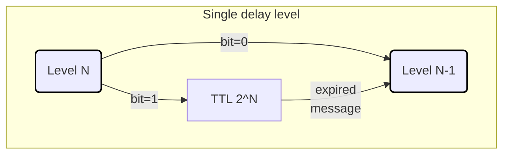
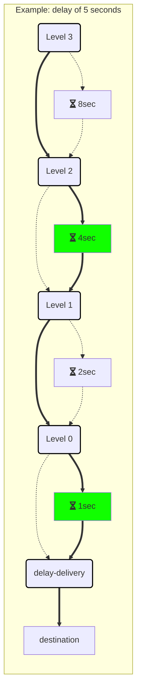

Starting with Version 4.3, the transport no longer relies on the [timeout manager](/nservicebus/messaging/timeout-manager.md) to implement [delayed delivery](/nservicebus/messaging/delayed-delivery.md). The transport now creates an infrastructure inside the broker to natively handle delaying messages.


## How it works

Upon starting the endpoint, the transport declares a set of topic exchanges, queues, and bindings that work together to provide the necessary infrastructure to support delayed messages. These exchange & queues are grouped into a series of levels. There is one final delivery exchange in addition to the level exchanges. When a message needs to be delayed, the value of the desired delay is first converted to seconds. The binary representation of this value is then used as part of the routing key when the message is sent to the delay-level exchanges. The full routing key will be in the following format:
```
N.N.N.N.N.N.N.N.N.N.N.N.N.N.N.N.N.N.N.N.N.N.N.N.N.N.N.N.destination
```
Where 'N' is either `0` or `1` as necessary to represent the delay value, and "destination" is the name of endpoint the delayed message is intended for.


### Delay levels

Each exchange/queue pair that makes up a level represents one bit of the total delay value. By having 28 of these levels, corresponding to 2^27 through 2^0, the delay infrastructure can delay a message for any value that can be represented by a 28-bit number. With 28 total levels, the maximum delay value is 268,435,455 seconds.

A level is created by declaring a topic exchange that is bound to a queue with a routing key of `1`, and is also bound to the exchange corresponding to `level - 1` with a routing key of `0`. The queue for the level is declared with an `x-message-ttl` value corresponding to `2^level` seconds. The queue is also declared with an `x-dead-letter-exchange` value corresponding to the `level - 1` exchange, so that when a message in the queue expires, it will be routed to the `level - 1` exchange.



The levels are connected in this manner, from highest (27) to lowest (0). Each level's routing key's add wildcards as needed so that they are looking at the portion of the message's routing key that corresponds to its level.


### Delivery

The final delay-level exchange is bound to the delivery exchange instead of another level. Every endpoint that can receive a delayed message will have a binding to this exchange with a routing key corresponding to the endpoint's name, so the message will be delivered to the endpoint's queue.


### Example




## Settings


### Disable the timeout manager

By default, the timeout manager continues to run to allow any preexisting delayed messages stored in the persistence database to be successfully sent. However, once the persistence database is empty, there is no more need for the timeout manager. It can be disabled by calling:

snippet: rabbitmq-delay-disable-timeout-manager

Once this has been called, the .Timeouts and .TimeoutsDispatcher exchanges and queues for the endpoint can be deleted from the broker.


### All endpoints support delayed delivery

When an endpoint supports delayed delivery it is responsible for ensuring that it can receive delayed messages from the delay infrastructure. However, it cannot assume that all other endpoints in the system are also capable of doing the same. Because of this, before each delayed message is sent, the endpoint first makes an additional call to bind the destination to the delay infrastructure.

Once all endpoints have been upgraded to version of the transport that supports delayed delivery, this behavior is no longer needed and can be disabled by calling:

snippet: rabbitmq-delay-all-endpoints-support-delayed-delivery
