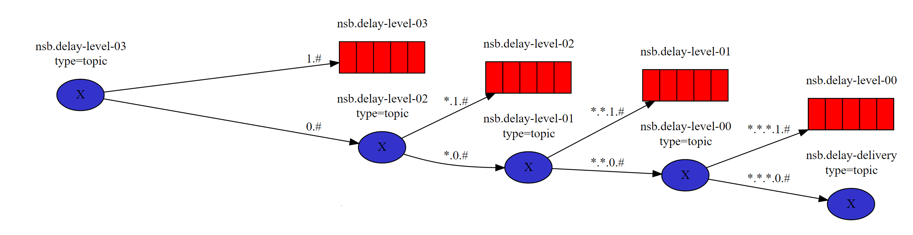

Starting with Version 4.3, the transport no longer relies on the [timeout manager](/nservicebus/messaging/timeout-manager.md) to implement [delayed delivery](/nservicebus/messaging/delayed-delivery.md). The transport now creates an infrastructure inside the broker to natively handle delaying messages.

## How it works

The transport sets up a series of exchanges, queues, and bindings that work together to provide the necessary infrastructure to support delayed messages. These exchange & queues are grouped into a series of levels, 0 - 27. There is one final "delivery" exchange in addition to the level.

### Delay levels

Each level represents a delay amount corresponding to a number of seconds equal to 2 ^ level seconds. This is achieved by declaring the queue for each level with an `x-message-ttl` value corresponding to level's delay amount. It is also declared with an `x-dead-letter-exchange` value corresponding to the next lowest level. This means a message will sit in the queue for the amount of time specified in  `x-message-ttl` and then be routed to the next level.

When a message needs to be delayed, the value of the desired delay is first converted to seconds. The binary representation of this value is then used as the routing key to determine which of the delay levels the message needs to go to. The routing key is build in the following manner:
x.x.x.x.x....x.destination-queue

Where:
 * x represent binary value for given level of delay, there are 28 of them separated by `.`
 * destination-queue - is the name of the destination queue to which the message will be delivered after the delay passes

The routing key then is used by exchanges of given levels to determine if the message should be delivered to the same level queue and wait the corresponding time or should it be delivered to next level exchange.

#### Example

Let's consider an example in which 4 levels are used (0-3). In such case the infrastructure looks as follows:
  

##### Level 3
Exchange `nsb.delay-level-03` has bindings checking most significant bit of the delay (`1.#` and `0.#`), routing the message to either `nsb.delay-level-03` queue or `nsb.delay-level-02` exchange. Queue `nsb.delay-level-03` has configured TTL of 8 seconds (2^level in seconds). After that time message is passed to `x-dead-letter-exchange` which in this case is `nsb.delay-level-02` exchange. 

When sending a message with a delay of 5 seconds to a queue called: `destinationQueue`: 
 * Routing key is assembled: `0.1.0.1.destinationQueue`
 * The message is passed to `nsb.delay-level-03` exchange. As the most significant bit is equals to 0 (`**0**.1.0.1.destinationQueue`)
 * The message is passed to `nsb.delay-level-02` exchange. As the next bit is equals to 1 (`0.**1**.0.1.destinationQueue`)
 * The message is passed to `nsb.delay-level-02` queue, where it is waiting for 4 seconds after which it uses dead letter exchange 
 * The message is passed to `nsb.delay-level-01` exchange. As the next bit is equals to 0 (`0.1.**0**.1.destinationQueue`)
 * The message is passed to `nsb.delay-level-00` exchange. As the next bit is equals to 1 (`0.1.0.**1**.destinationQueue`)
 * The message is passed to `nsb.delay-level-00` queue, where it is waiting for 1 second after which it uses dead letter exchange 
 * The message is passed to `nsb.delay-delivery` exchange, where it is being send to `destinationQueue` using chosen topology. 

## Settings

### Disable the timeout manager

By default, the timeout manager continues to run to allow any preexisting delayed messages stored in the persistence database to be successfully sent. However, once the persistence database is empty, there is no more need for the timeout manager. It can be disabled by calling:

snippet: rabbitmq-delay-disable-timeout-manager

Once this has been called, the .Timeouts and .TimeoutsDispatcher exchanges and queues for the endpoint can be deleted from the broker.

### All endpoints support delayed delivery

When an endpoint supports delayed delivery it is responsible for ensuring that it can receive delayed messages from the delay infrastructure. However, it cannot assume that all other endpoints in the system are also capable of doing the same. Because of this, before each delayed message is sent, the endpoint first makes an additional call to bind the destination to the delay infrastructure.

Once all endpoints have been upgraded to version of the transport that supports delayed delivery, this behavior is no longer needed and can be removed by calling:

snippet: rabbitmq-delay-all-endpoints-support-delayed-delivery
