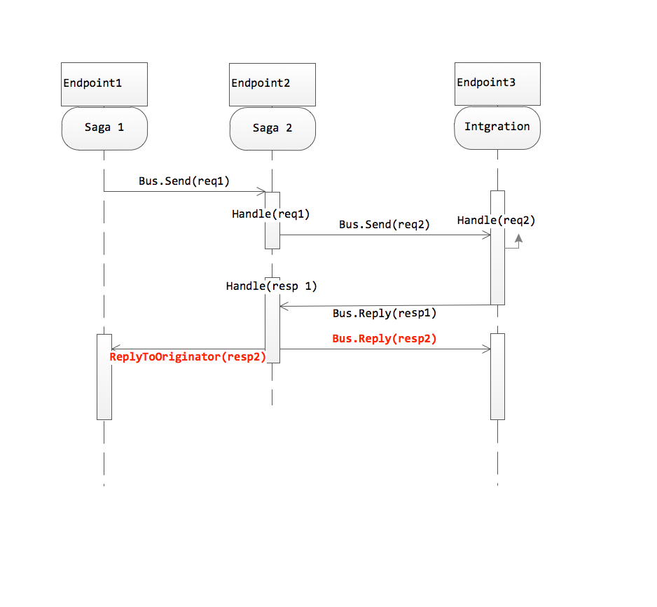

The reason that Bus.Reply(res2) is sent to Endpoint3 is that it is invoked in the context of handled res1, and the return address of res1 is Endpoint3. Calling ReplyToOriginator makes it clear to NServiceBus that you want the message to be delivered to the endpoint that was the originator of the saga.

The issue is not related to ConfigureHowToFindSaga as when you’re doing request/response, NServiceBus automatically adds the saga ID and type as headers to messages sent by the saga, and it also copies those headers onto response messages (in the example above, sent by Endpoint3) so the correct saga can be found (by Endpoint2).