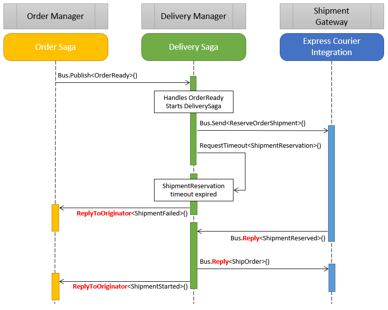

When building systems using the [request/response pattern](/nservicebus/messaging/reply-to-a-message.md) we are used to utilize the `Reply` method exposed by the `IBus` interface to reply to the sender of the incoming message.

The same `Reply` method can be used inside a `Saga` and it is important to understand that it can have a different semantic, otherwise it can lead to some unexpected behaviors.

> the `Reply` method always delivers the message to the sender address of the incoming message.

The following diagram details a scenario where two sagas and an integration endpoint utilize the request/response pattern to communicate. In red are highlighted the replies.

The reason why a call to `Bus.Reply<ShipOrder>()` sends a message to the `Shipment Gateway` is that it is invoked in the context of handling the `ShipmentReserved` message, and the return address of `ShipmentReserved` is `Shipment Gateway`.

In the context of a `Saga` it is not always clear, at a first look, who is the sender of a message. In the above sample when handling the expired `ShipmentReservation` timeout the sender of the message is the `Delivery Manager` endpoint, so in this case a `Reply` would be delivered to the `Delivery Manager`, that is not necessarily what we really want.

Calling `ReplyToOriginator` makes it clear to NServiceBus that we want the message to be delivered to the endpoint that was the originator of the saga.
