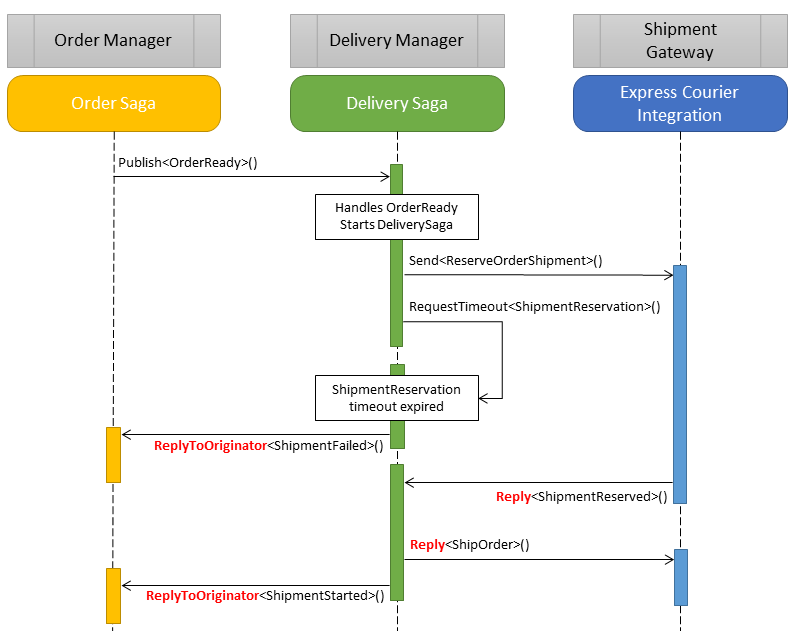

When building systems using the [request/response pattern](/nservicebus/messaging/reply-to-a-message.md), the `Reply` method exposed by the `IMessageHandlerContext` or `IBus` interface is used to reply to the sender of the incoming message.

The same `Reply` method can be used inside a `Saga` and it is important to understand that it can have a different semantic, otherwise it can lead to unexpected behavior.

Note: The `Reply` method always delivers the message to the sender address of the incoming message.

The following diagram details a scenario where two sagas and an integration endpoint utilize the request/response pattern to communicate. The replies are highlighted in red.

The reason a call to `Reply<ShipOrder>()` sends a message to the `Shipment Gateway` is that it is invoked in the context of handling the `ShipmentReserved` message, and the return address of `ShipmentReserved` is `Shipment Gateway`.

In the context of a `Saga` it is not always clear at first glance who the sender of a message is. In the above example, when handling the expired `ShipmentReservation` timeout the sender of the message is the `Delivery Manager` endpoint. In this case a `Reply` would be delivered to the `Delivery Manager`, and that is not necessarily the desired behavior.

Calling `ReplyToOriginator` makes it clear to NServiceBus that the message to be delivered to the endpoint was the originator of the saga.
