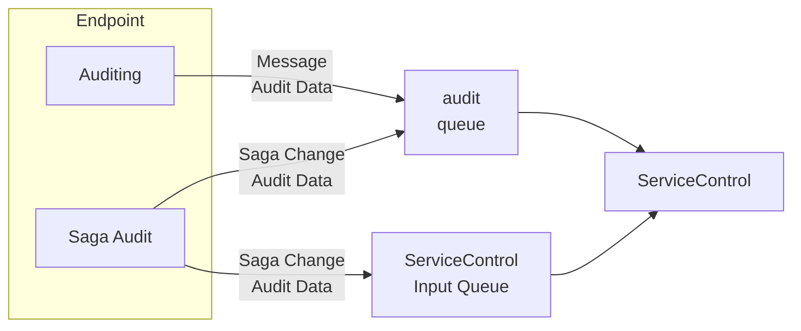

WARN: This plugin will result in an increase in the load placed on ServiceControl and the endpoint it is installed in. Make sure the environment is prepared for the increased load. Consider [scaling out audit processing](/servicecontrol/servicecontrol-instances/distributed-instances.md) if necessary.

The SagaAudit plugin enables the [Saga View feature in ServiceInsight](/serviceinsight/#the-saga-view). 

It is built specifically to help developers verify saga logic during development. It does this by capturing saga message behavior and changes in saga data/state as the saga is being processed. It then sends this information to a ServiceControl instance set up in the development environment. The information is available in the *Saga* view in ServiceInsight.

NOTE: Saga audit messages are only sent to ServiceControl when a message is processed successfully.

## Implementation

The SagaAudit plugin captures the following information:

 * The incoming messages (including timeouts) that initiate change in the saga
 * The outgoing messages that the saga sends
 * A snapshot of the current saga state

Note: In versions of ServiceControl prior to 4.13.0, saga state change data can only be processed via the `ServiceControl Queue` (the input queue of the main ServiceControl instance). Starting with version 4.13.0, the saga state change data can also be processed by the ServiceControl audit instance via the `audit` queue. The latter approach is recommended.

All this information is sent to and stored in ServiceControl. Note that the saga state audit data is transmitted to ServiceControl via a separate message and is serialized using the built in JSON Serializer of NServiceBus.

## Impact on ServiceControl performance

This plugin results in an increase in load in several areas:

 1. Endpoint load in order to capture the required information
 1. Network load due to the extra information sent to ServiceControl
 1. ServiceControl load in the areas of ingestion, correlation and data cleanup

The increase in load is proportional to size of the saga data multiplied by the number of messages the the saga receives. Since both these variables are dependent on the specific saga implementation it is not possible to give accurate predictions on the impact of this load in a production system. In versions of ServiceControl prior to 4.13.0, do not run SagaAudit plugin in production environments due to the increased load on the main ServiceControl instance. Starting with version 4.13.0, audit instances can process saga state change information from the SagaAudit plugin. In case the additional load from the SagaAudit plugin is too big for a single audit instance to handle, consider [scaling out ServiceControl audit processing](/servicecontrol/servicecontrol-instances/distributed-instances.md).

## Configuration

The SagaAudit plugin is enabled via:

snippet: SagaAuditNew_Enable

## Custom serialization

The SagaAudit plugin serializes the saga data objects using a simple json serializer. This serializer should be fine for most use cases. It handles all primitive types (including `TimeSpan` and `DateTime`), their nullable variants as well as nested objects. However, if more sophisticated mechanism is required, the serialization method can be provided by the user:

snippet: SagaAuditNew_CustomSerialization
