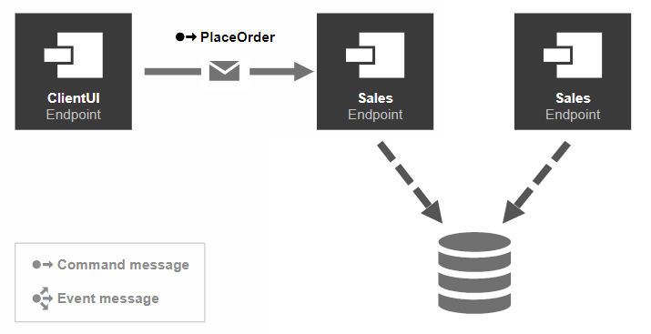
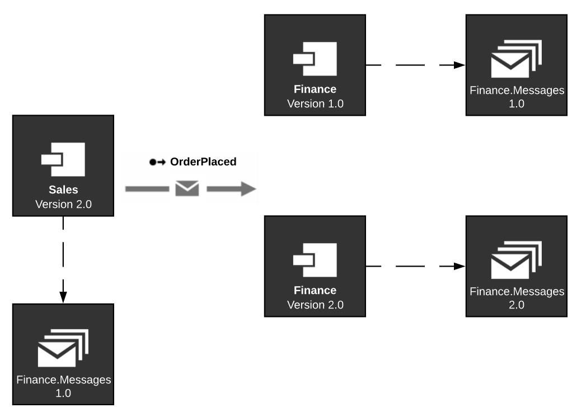

There are several reasons to scale out [logical endpoints](/nservicebus/endpoints/), such as to achieve higher message throughput, or to provide high availability.

## Splitting message handlers

If message throughput is an issue, the first method to consider is splitting up [message handlers](/nservicebus/handlers/) and [sagas](/nservicebus/sagas/) over multiple logical endpoints.

One message type might take considerably longer to process than other message types. The faster processing messages might suffer in throughput because of the slower processing messages. A good way to monitor and detect this is by using [ServicePulse's monitoring capabilities](/monitoring/metrics/in-servicepulse.md).

Separating slower messages from faster messages leads to higher throughput for the faster messages. For this reason, it can be beneficial to seperate different message types and their corresponding handlers into different logical endpoints.

## Scaling out to multiple nodes

An endpoint may reach maximum message throughput when resources such as CPU or disk are fully utilized. In such cases, it may be beneficial to scale out an endpoint to multiple nodes.

However, a centralized resource, such as a database, may also be a bottleneck. Scaling out an endpoint to another node that uses the same database may not improve message throughput, or could even reduce it.

### Competing consumers

The *[competing consumer pattern](https://www.enterpriseintegrationpatterns.com/patterns/messaging/CompetingConsumers.html)* is an established way to scale out endpoints using [broker transports](/transports/types.md#broker-transports). This is done by deploying multiple instances of an endpoint that will all start processing messages from the same queue. When a message is delivered, any of the endpoint instances could potentially process it. The NServiceBus transport will try to ensure that only one instance will actually process the message.

The image below shows the component `ClientUI` sending a command message to the logical endpoint `Sales`. But with messaging, the message is actually sent to the `Sales` queue. With two consumers competing for the `Sales` endpoint, both could potentially process the incoming message.

### Sender-side distribution

Because of the [federated nature of queues with MSMQ](/transports/types.md#federated-transports), with scaled out endpoints across different nodes, each node has its own physical queue. This makes it impossible to apply the *competing consumer pattern*. See [Sender Side Distribution](/transports/msmq/sender-side-distribution.md) for more information.

## High availability

Though not discussed here, there are many ways to achieve high availability for endpoints using infrastructure with either on-premise or cloud-based solutions. However, a different reason to try to achieve high availability is to make sure an endpoint continues to process messages while upgrading it to a newer version of either the endpoint itself or its messages. For more information on how to do message versioning, see [this sample](/samples/versioning/).

Upgrading an endpoint without stopping message processing, can be accomplished by also using the *competing consumer pattern*, without necessarily deploying multiple endpoint instances to different nodes. In order words, this can even be achieved by deploying two endpoint instances on the same node.

The following image explains the process.

Execute the following steps to upgrade an endpoint without downtime:

1. The `Sales` endpoint has a reference to version 1 of the message assembly `Finance.Messages`.
1. Take down one endpoint instance of `Finance` and upgrade it to version 2 of the message assembly `Finance.Messages`. During this time, `Sales` can continue sending messages and the running endpoint instance for `Finance` can continue processing them.
1. Bring the upgraded version of `Finance` back up so it can start processing version 1 messages.
1. Take down the still-running version 1 of `Finance` and upgrade it as well to version 2 of `Finance.Messages`
1. Update `Sales` to also have message assembly `Finance.Messages` version 2.
