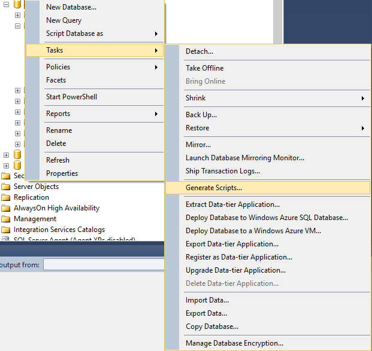

## Queues


### Primary queue

Each endpoint has a single table representing the primary queue. The name of the primary queue matches the name of the endpoint.

In a scale-out scenario this single queue is shared by all instances.


### Callback queues

Each endpoint has one or more tables representing callback queues. Their names consist of the endpoint name with appropriate suffixes (machine name in Version 2, user-specified or default suffixes in Version 3).

Since callback handlers are stored in-memory in the node that registers the callback, the same node should process the message representing reply. To guarantee this, in a scale-out scenario, each endpoint instance needs a dedicated callback queue.


### Other queues

Each endpoint also has queues required by timeout (the exact names and number of queues created depends on the version of the transport) and retry mechanisms.

Error and audit queues are usually shared among multiple endpoints.


### Queue table structure

Following SQL DDL is used to create a table and its index for a queue:

```sql
CREATE TABLE [schema].[queuename](
	[Id] [uniqueidentifier] NOT NULL,
	[CorrelationId] [varchar](255) NULL,
	[ReplyToAddress] [varchar](255) NULL,
	[Recoverable] [bit] NOT NULL,
	[Expires] [datetime] NULL,
	[Headers] [varchar](max) NOT NULL,
	[Body] [varbinary](max) NULL,
	[RowVersion] [bigint] IDENTITY(1,1) NOT NULL
) ON [PRIMARY];

CREATE CLUSTERED INDEX [Index_RowVersion] ON [schema].[queuename]
(
	[RowVersion] ASC
)
WITH (PAD_INDEX  = OFF, STATISTICS_NORECOMPUTE  = OFF, SORT_IN_TEMPDB = OFF, IGNORE_DUP_KEY = OFF, DROP_EXISTING = OFF, ONLINE = OFF, ALLOW_ROW_LOCKS  = ON, ALLOW_PAGE_LOCKS  = ON) ON [PRIMARY]

CREATE NONCLUSTERED INDEX [Index_Expires] ON [schema].[queuename]
(
	[Expires] ASC
)
INCLUDE
(
	[Id],
	[RowVersion]
)
WITH (PAD_INDEX = OFF, STATISTICS_NORECOMPUTE = OFF, SORT_IN_TEMPDB = OFF, DROP_EXISTING = OFF, ONLINE = OFF, ALLOW_ROW_LOCKS = ON, ALLOW_PAGE_LOCKS = ON)
```

Receiving messages is conducted by a `DELETE` statement from the top of the table (the oldest row according to the `[RowVersion]` column).

The tables are created by [installers](/nservicebus/operations/installers.md) when the application is started for the first time. It is required that the user account under which the installation of the host is performed has `CREATE TABLE` as well as `VIEW DEFINITION` permissions on the database in which the queues are to be created. The account under which the service runs does not have to have these permissions. Standard read/write/delete permissions (e.g. being member of `db_datawriter` and `db_datareader` roles) are enough.

### Creating table structure in Production

The scripts above, to generate the queues, do not have queue names. This may cause confusion when reviewed by a DBA. The scripts could, alternatively, be generated off the Development or Staging environment, and then directly executed on Production environment by DBAs to replicate that table structure. 

To generate this DDL script, right-click the database and from "Tasks" menu choose "Generate Scripts..." and generate the scripts for relevant tables.



### Indexes

Each queue table has a clustered index on the `[RowVersion]` column in order to speed up receiving messages from the queue table.

Starting from version 2.2.2, each queue table also has an additional non-clustered index on the `[Expires]` column. This index speeds up the purging of expired messages from the queue table. If the SQL Server transport discovers that a required index is missing, it will log an appropriate warning. The following SQL statement can be used to create the missing index:

snippet:sql-2.2.2-ExpiresIndex