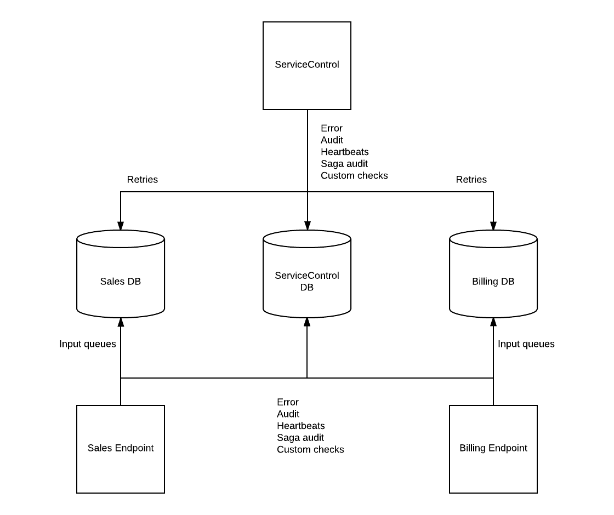

## Overview
Even though it is [recommended that all SQL Server transport queue tables are stored in a single SQL Server catalog](/#deployment-considerations), it is possible to use ServiceControl to monitor a multi-instance deployment of the SQL Server transport. A requirement for such a configuration is that all endpoints share `error` and `audit` queues and that these queues are stored in the same catalog as ServiceControl queues. Other queues used by individual endpoints may be stored in different SQL Server instances. The following diagram shows an example system configuration:

  

## ServiceControl configuration

### Distributed transactions
Multi-instance deployment of the SQL Server transport requires that the Distributed Transaction Coordinator (DTC) is used by all endpoints. This is also required by ServiceControl to support retry of failed messages. Default configuration of ServiceControl disables support for distributed transactions and it has to be turned of explicitly using `EnableDtc` configuration setting:

snippet:sc-enabledtc-config

NOTE: ServiceControl supports the DTC only for the SQL Server transport. The `EnableDtc` switch has no effect on other transports. 

### Multiple connection strings
The default SQL Server transport connection string used by ServiceControl must point at a SQL Server instance that stores `error`, `audit`, and ServiceControl queues. In order to support retry of failed messages, ServiceControl also has to be configured with connection strings for each individual endpoint:

snippet:sc-multi-instance-connection-strings

## Endpoint configuration

Each endpoint can use queues stored in any SQL Server instance except for shared `error` and `audit` queues, which need to be stored in an instance used by ServiceControl. This cannot be expressed in the configuration file but can be implemented using the [pull mode API](configuration.md#multiple-connection-strings-via-the-configuration-api-pull-mode):

snippet:sc-multi-instance-endpoint-connection-strings
