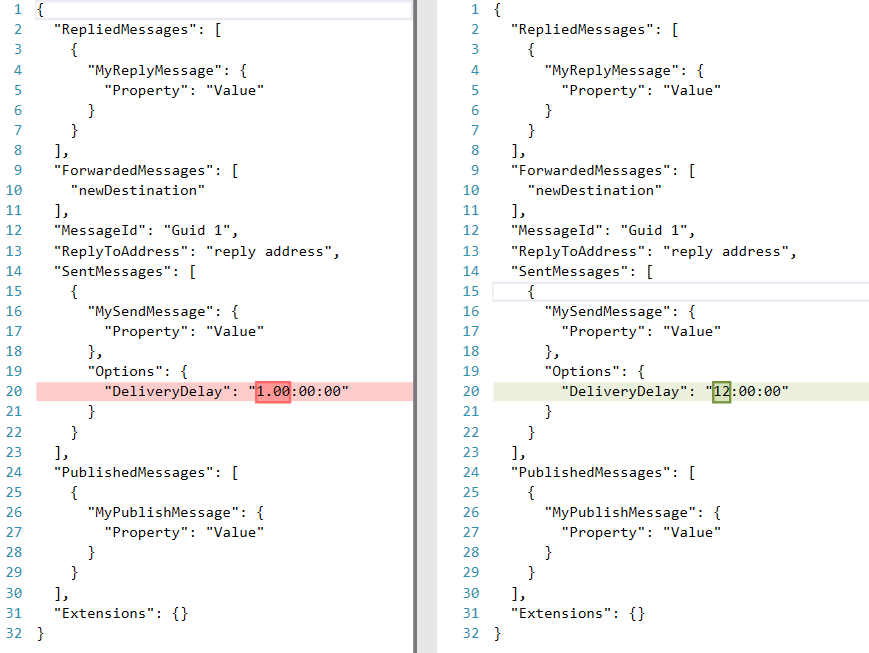

`NServiceBus.ApprovalTests` adds support for using [ApprovalTests](https://github.com/approvals/ApprovalTests.Net) to verify [NServiceBus Test Contexts](/samples/unit-testing/).

## Verifying a context

Given the following handler:

snippet: SimpleHandler

The test that verifies the resulting context:

snippet: HandlerTest

## Example behavior change

The next time there is a code change, that results in a different resulting interactions with NServiceBus, those changes can be visualized. For example if the `DelayDeliveryWith` is changed from 12 hours to 1 day:

snippet: SimpleHandlerV2

Then the resulting visualization diff would look as follows:

