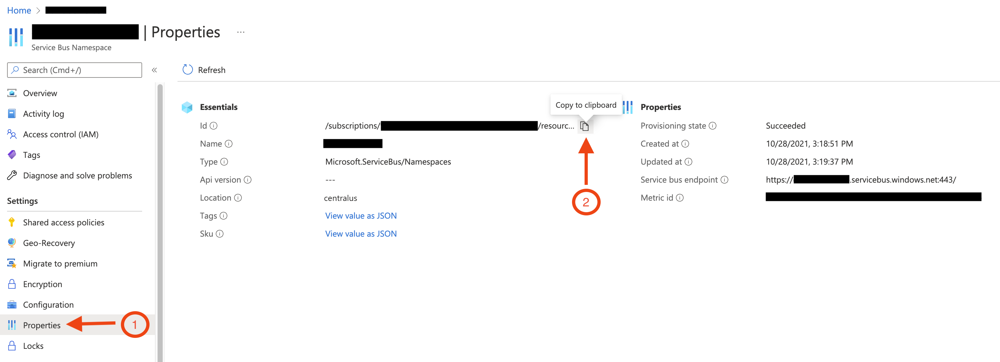

> [!WARNING]
> Starting 1 January 2027, all projects in active development will be required to use [ServicePulse](./../../servicepulse/usage.md) for usage data collection. Once configured, ServicePulse provides the ability to report usage instantly at any time, without needing to run an external tool or wait for data collection.
>
> The legacy Endpoint Throughput Counter tool is offered as an alternate option for customers who aren't able to use ServicePulse. If you encounter any issues installing ServicePulse in your environment, please reach out so we can assist in finding a solution.
>
> If necessary, [open a support case](https://customers.particular.net/request-support/licensing) to get help with installing or configuring ServicePulse for usage data collection.

The Endpoint Throughput Counter tool can typically be installed on a [user's workstation](#frequently-asked-questions-does-the-tool-need-to-run-on-my-production-server) and run against a production system to identify endpoints and measure their throughput over a period of time. ISVs who do not have access to their clients' production environments can run the tool in a pre-production environment to produce the validated list of endpoints.

## Installation

The tool can be installed as a .NET tool for Windows/Linux or as a self-contained Windows executable.

### .NET tool (recommended)

1. Install [.NET 8.0](https://dotnet.microsoft.com/en-us/download).
1. From a terminal window, use the following command to install the throughput counter:

   ```shell
   dotnet tool install -g Particular.EndpointThroughputCounter --add-source https://f.feedz.io/particular-software/packages/nuget/index.json
   ```

1. Run the tool by executing `throughput-counter`:

   ```shell
   throughput-counter [command] [options]
   ```

### Self-contained executable

In this mode, the target system does not need any version of .NET preinstalled.

1. Download the [self-contained Windows executable](https://s3.amazonaws.com/particular.downloads/EndpointThroughputCounter/Particular.EndpointThroughputCounter.zip).
1. Unzip the downloaded file.
1. Open a terminal window and navigate to the folder to which it was downloaded.
1. Execute the tool from the terminal by using its full name:

   ```shell
   Particular.EndpointThroughputCounter.exe [command] [options]
   ```

## Running the tool

The tool can collect data using various methods depending on the system's configuration. To run the tool, select the relevant section based on the [message transport](/transports/) used in the system to be measured:

<!-- following comment prevents VSCode Markdown plugin from messing up this list -->
<!-- no toc -->
- [Azure Service Bus](#running-the-tool-azure-service-bus)
- [Amazon SQS](#running-the-tool-amazon-sqs)
- [RabbitMQ](#running-the-tool-rabbitmq)
- [SQL Transport](#running-the-tool-sql-transport)
- [PostgreSQL Transport](#running-the-tool-postgresql-transport)
- Microsoft Message Queueing (MSMQ) – Use [ServiceControl data collection](#running-the-tool-servicecontrol)
- Azure Storage Queues – Use [ServiceControl data collection](#running-the-tool-servicecontrol)
- [Click here if unsure what message transport is used by the system](#determining-message-transport)

> [!TIP]
> If the system uses MSMQ or Azure Storage Queues but does not use ServiceControl, this tool cannot be used to measure throughput.
>
> If this or any other problem is encountered attempting to generate a throughput report, [open a support case](https://customers.particular.net/request-support/licensing).

### Azure Service Bus

#### Prerequisites

Collecting metrics from Azure Service Bus relies upon an existing set of Azure credentials set using the Azure Command Line Interface (CLI), which must be installed first:

1. Install the [Azure CLI](https://docs.microsoft.com/en-us/cli/azure/install-azure-cli).
2. From a command line, execute `az login`, which will open a browser to complete the authentication to Azure. The built-in role [Monitoring Reader](https://learn.microsoft.com/en-us/azure/azure-monitor/roles-permissions-security#monitoring-reader) is sufficient to access the required Azure Service Bus metrics.
3. Execute `az account set --subscription {SubscriptionId}`, where `{SubscriptionId}` is a Guid matching the subscription id that contains the Azure Service Bus namespace.

Completing these steps stores credentials that can be used by the tool.

#### Running the tool

To run the tool, the resource ID and the region for the Azure Service Bus namespace is needed.

In the Azure Portal, go to the Azure Service Bus namespace, click **Properties** in the side navigation (as shown in the screenshot below) and then copy the `Id` and `Location` values, which will be needed to run the tool. The `Id` value should have a format similar to `/subscriptions/{Guid}/resourceGroups/{rsrcGroupName}/providers/Microsoft.ServiceBus/namespaces/{namespaceName}`.

This screenshot shows how to copy the Service Bus Namespace's `Id` value - the `Location` value can be copied in the same way:



Execute the tool with the resource ID and region of the Azure Service Bus namespace.

If the tool was [installed as a .NET tool](/nservicebus/throughput-tool/#installation-net-tool-recommended):

```shell
throughput-counter azureservicebus [options] --resourceId /subscriptions/xxxxxxxx-xxxx-xxxx-xxxx-xxxxxxxxxxxx/resourceGroups/my-resource-group/providers/Microsoft.ServiceBus/namespaces/my-asb-namespace --region xxxxxxxxx
```

Or, if using the [self-contained executable](/nservicebus/throughput-tool/#installation-self-contained-executable):

```shell
Particular.EndpointThroughputCounter.exe azureservicebus [options] --resourceId /subscriptions/xxxxxxxx-xxxx-xxxx-xxxx-xxxxxxxxxxxx/resourceGroups/my-resource-group/providers/Microsoft.ServiceBus/namespaces/my-asb-namespace  --region xxxxxxxxx
```

#### Options

| Option | Description |
|-|-|
| <nobr>`--resourceId`</nobr> | **Required** – The resource ID of the Azure Service Bus namespace, which can be found in the Azure Portal as described above. |
| <nobr>`--region`</nobr> | **Required** – The Azure region where the Service Bus namespace is located, which can be found in the Azure Portal as described above. Note that the region value should be the [Programmatic name](https://learn.microsoft.com/en-us/azure/reliability/regions-list) for the region. |
| <nobr>`--serviceBusDomain`</nobr> | The Service Bus domain. Defaults to `servicebus.windows.net`. Only necessary for Azure customers using a [non-public/government cloud](https://learn.microsoft.com/en-us/rest/api/servicebus/). |
| <nobr>`--metricsDomain`</nobr> | The monitoring metrics domain. Defaults to `metrics.monitor.azure.com`. Only necessary for Azure customers using a [non-public/government cloud](https://learn.microsoft.com/en-us/dotnet/api/overview/azure/monitor.query-readme?view=azure-dotnet#configure-client-for-azure-sovereign-cloud). |
include: throughput-tool-global-options

#### What the tool does

First, the tool uses a `ServiceBusAdministrationClient` to [query the queue names](https://learn.microsoft.com/en-us/dotnet/api/azure.messaging.servicebus.administration.servicebusadministrationclient.getqueuesasync?view=azure-dotnet) from the namespace. Next, a `MetricsClient` is used to [query for `CompleteMessage` metrics](https://learn.microsoft.com/en-us/dotnet/api/azure.monitor.query.metricsclient.queryresourcesasync?view=azure-dotnet) for the past 30 days from each queue.

Using Azure Service Bus metrics allows the tool to capture the last 30 days worth of data at once. Although the tool collects 30 days worth of data, only the highest daily throughput is included in the report.

### Amazon SQS

#### Running the tool

Collecting metrics for SQS relies upon [AWSSDK.SQS](https://www.nuget.org/packages/AWSSDK.SQS) to discover queue names and [AWSSDK.CloudWatch](https://www.nuget.org/packages/AWSSDK.CloudWatch) to gather per-queue metrics.

Authentication to AWS requires a [AWS credentials profile](https://docs.aws.amazon.com/toolkit-for-visual-studio/latest/user-guide/keys-profiles-credentials.html), or credentials can be created from the `AWS_ACCESS_KEY_ID` and `AWS_SECRET_ACCESS_KEY` environment variables, if both are not empty. The tool uses default constructors for the SQS and CloudWatch clients and follows the [credential and profile resolution](https://docs.aws.amazon.com/sdk-for-net/v3/developer-guide/creds-assign.html) rules determined by the AWS SDK.

The AWS region can be specified either by command-line parameter or by the `AWS_REGION` environment variable.

If the tool was [installed as a .NET tool](/nservicebus/throughput-tool/#installation-net-tool-recommended), execute the tool as shown:

```shell
throughput-counter sqs [options]
```

Or, if using the [self-contained executable](/nservicebus/throughput-tool/#installation-self-contained-executable):

```shell
Particular.EndpointThroughputCounter.exe sqs [options]
```

#### Options

| Option | Description |
|-|-|
| <nobr>`--profile`</nobr> | The name of a local [AWS credentials profile](https://docs.aws.amazon.com/toolkit-for-visual-studio/latest/user-guide/keys-profiles-credentials.html). If not included, credentials can be read from the `AWS_ACCESS_KEY_ID` and `AWS_SECRET_ACCESS_KEY` environment variables. |
| <nobr>`--region`</nobr> | The AWS region to use when accessing AWS services. If not provided, the default profile value or `AWS_REGION` environment variable will be used. |
| <nobr>`--prefix`</nobr> | Report only on queues that begin with a specific prefix. This is commonly used when one AWS account must contain queues for multiple projects or multiple environments.<br/><br/>Example: `--prefix "prod-"` |
include: throughput-tool-global-options

#### What the tool does

The tool first queries the SQS API to [fetch all queue names](https://docs.aws.amazon.com/AWSSimpleQueueService/latest/APIReference/API_ListQueues.html). Then, for each queue that is discovered, the tool queries the [CloudWatch API](https://docs.aws.amazon.com/AmazonCloudWatch/latest/APIReference/API_GetMetricStatistics.html) for the `NumberOfMessagesDeleted` metrics for the past 30 days.

Unlike ServiceControl, using SQS and CloudWatch metrics allows the tool to capture the last 30 days' worth of data at once, which means that the report will be generated without delay. Although the tool collects 30 days worth of data, only the highest daily throughput is included in the report.

### RabbitMQ

#### Running the tool

To collect data from RabbitMQ, the [management plugin](https://www.rabbitmq.com/management.html) must be enabled on the RabbitMQ broker. The tool will also require a login that can access the management UI.

Execute the tool, providing the RabbitMQ management URL, as in this example, where the RabbitMQ broker is running on localhost.

If the tool was [installed as a .NET tool](/nservicebus/throughput-tool/#installation-net-tool-recommended):

```shell
throughput-counter rabbitmq [options] --apiUrl http://localhost:15672
```

Or, if using the [self-contained executable](/nservicebus/throughput-tool/#installation-self-contained-executable):

```shell
Particular.EndpointThroughputCounter.exe rabbitmq [options] --apiUrl http://localhost:15672
```

The tool will prompt for the username and password to access the RabbitMQ management interface. After that, it will take its initial reading, then sleep for 24 hours before taking its final reading and generating a report.

#### Options

| Option | Description |
|-|-|
| <nobr>`--apiUrl`</nobr> | **Required** – The URL for the RabbitMQ management site. Generally this will be `http://<rabbitmq-hostname>:15672` |
include: throughput-tool-global-options

#### What the tool does

After performing an interactive login to the RabbitMQ Management API, the tool will:

1. Query `/api/overview` to get basic information about the system, ensure that the current version of RabbitMQ is compatible with the tool, and that the necessary plugins are installed to be able to get queue throughput details.
2. Query `/api/queues?page=1&page_size=500&name=&use_regex=false&pagination=true` to discover queue names and to get the message stats for each queue. If more than 500 queues are present, the additional pages of data will be requested as well.
3. The queries to `/api/queues` will be repeated every 5 minutes over the 24-hour tool runtime. This way, the tool can continue counting if a restart of a RabbitMQ server instance causes the message stats to reset.

### SQL Transport

#### Running the tool

Once installed, execute the tool with the database connection string used by SQL Server endpoints.

If the tool was [installed as a .NET tool](/nservicebus/throughput-tool/#installation-net-tool-recommended):

```shell
throughput-counter sqlserver [options] --connectionString "Server=SERVER;Database=DATABASE;User=USERNAME;Password=PASSWORD;"
```

Or, if using the [self-contained executable](/nservicebus/throughput-tool/#installation-self-contained-executable):

```shell
Particular.EndpointThroughputCounter.exe sqlserver [options] --connectionString "Server=SERVER;Database=DATABASE;User=USERNAME;Password=PASSWORD;"
```

The tool will run for slightly longer than 24 hours in order to capture a beginning and ending identity value for each queue table.

#### Options

Either the `--connectionString` or `--connectionStringSource` must be used to provide the tool with connection string information.

| Option | Description |
|-|-|
| <nobr>`--connectionString`</nobr> | A single database connection string<sup>1</sup> that will provide at least read access to all queue tables. |
| <nobr>`--addCatalogs`</nobr> | When the `--connectionString` parameter points to a single database, but multiple database catalogs on the same server also contain NServiceBus message queues, the `--addCatalogs` parameter specifies additional database catalogs to search. The tool replaces the `Database` or `Initial Catalog` parameter in the connection string with the additional catalog and queries all of them. With this option, only a single database server is supported.<br/><br/>Example: `--connectionString <Catalog1String> --addCatalogs Catalog2 Catalog3 Catalog4` |
| <nobr>`--connectionStringSource` | Provide a file containing database connection strings (one per line) instead of specifying a single connection string as a tool argument. The tool will scan the databases provided by all connection strings in the file for NServiceBus queue tables. With this option, multiple catalogs in multiple database servers are supported.<br/><br/>Example: `--connectionStringSource <PathToFile>` |
include: throughput-tool-global-options

<sup>1</sup> See [examples of SQL Server connection strings](https://www.connectionstrings.com/sql-server/). Authentication is often via username/password `User Id=myUsername;Password=myPassword`, integrated security `Integrated Security=true`, or active directory with MFA `Authentication=ActiveDirectoryInteractive;UID=user@domain.com`.

> [!NOTE]
> In recent versions of Microsoft's Sql Server drivers encryption has been enabled by default. When trying to connect to a Sql Server instance that uses a self-signed cerftificate, the tool may display an exception stating *[The certificate chain was issued by an authority that is not trusted](https://learn.microsoft.com/en-us/troubleshoot/sql/connect/certificate-chain-not-trusted?tabs=ole-db-driver-19)*. To bypass this exception update the connection string to include `;Trust Server Certificate=true`.

#### What the tool does

The tool executes the following SQL queries on the database connection strings provided.

##### Find queues

The tool uses this query to discover what tables in a SQL database catalog have the table structure that matches an NServiceBus queue table. This query is executed only once when the tool is first run.

```sql
SET TRANSACTION ISOLATION LEVEL READ UNCOMMITTED

SELECT C.TABLE_SCHEMA as TableSchema, C.TABLE_NAME as TableName
FROM [INFORMATION_SCHEMA].[COLUMNS] C
WHERE
	(C.COLUMN_NAME = 'Id' AND C.DATA_TYPE = 'uniqueidentifier') OR
	(C.COLUMN_NAME = 'CorrelationId' AND C.DATA_TYPE = 'varchar') OR
	(C.COLUMN_NAME = 'ReplyToAddress' AND C.DATA_TYPE = 'varchar') OR
	(C.COLUMN_NAME = 'Recoverable' AND C.DATA_TYPE = 'bit') OR
	(C.COLUMN_NAME = 'Expires' AND C.DATA_TYPE = 'datetime') OR
	(C.COLUMN_NAME = 'Headers') OR
	(C.COLUMN_NAME = 'Body' AND C.DATA_TYPE = 'varbinary') OR
	(C.COLUMN_NAME = 'RowVersion' AND C.DATA_TYPE = 'bigint')
GROUP BY C.TABLE_SCHEMA, C.TABLE_NAME
HAVING COUNT(*) = 8
```

##### Get snapshot

The tool uses this query to get a snapshot of the identity value for each queue table. It is executed once per queue table when the tool is first run, then again at the end of the tool execution. The snapshots are compared to determine how many messages were processed in that table while the tool was running.

```sql
select IDENT_CURRENT('[SCHEMA_NAME].[TABLE_NAME]')
```

### PostgreSQL Transport

#### Running the tool

Once installed, execute the tool with the database connection string used by PostgreSQL endpoints.

If the tool was [installed as a .NET tool](/nservicebus/throughput-tool/#installation-net-tool-recommended):

```shell
throughput-counter postgresql [options] --connectionString "Server=SERVER;Database=DATABASE;Port=5432;User Id=USERID;Password=PASSWORD;"
```

Or, if using the [self-contained executable](/nservicebus/throughput-tool/#installation-self-contained-executable):

```shell
Particular.EndpointThroughputCounter.exe postgresql [options] --connectionString "Server=SERVER;Database=DATABASE;Port=5432;User Id=USERID;Password=PASSWORD;"
```

The tool will run for slightly longer than 24 hours in order to capture a beginning and ending identity value for each queue table.

#### Options

Either the `--connectionString` or `--connectionStringSource` must be used to provide the tool with connection string information.

| Option | Description |
|-|-|
| <nobr>`--connectionString`</nobr> | A single database connection string<sup>1</sup> that will provide at least read access to all queue tables. |
| <nobr>`--addDatabases`</nobr> | When the `--connectionString` parameter points to a single database, but multiple databases on the same server also contain NServiceBus message queues, the `--addDatabases` parameter specifies additional databases to search. The tool replaces the `Database` parameter in the connection string with the additional database and queries all of them. With this option, only a single database server is supported.<br/><br/>Example: `--connectionString <Database1String> --addDatabases Database2 Database3 Database4` |
| <nobr>`--connectionStringSource` | Provide a file containing database connection strings (one per line) instead of specifying a single connection string as a tool argument. The tool will scan the databases provided by all connection strings in the file for NServiceBus queue tables. With this option, multiple databases in multiple database servers are supported.<br/><br/>Example: `--connectionStringSource <PathToFile>` |
include: throughput-tool-global-options

<sup>1</sup> See [examples of PostgreSQL connection strings](https://www.connectionstrings.com/postgresql/). Authentication is often via username/password `User Id=myUsername;Password=myPassword`.

#### What the tool does

The tool executes the following PostgreSQL queries on the database connection strings provided.

##### Find queues

The tool uses this query to discover what tables in a PostgreSQL database have the table structure that matches an NServiceBus queue table. This query is executed only once when the tool is first run.

```sql
SET TRANSACTION ISOLATION LEVEL READ UNCOMMITTED;

SELECT C.TABLE_SCHEMA as TableSchema, C.TABLE_NAME as TableName
FROM information_schema.columns C
WHERE
    (C.COLUMN_NAME = 'id' AND C.DATA_TYPE = 'uuid') OR
    (C.COLUMN_NAME = 'expires' AND C.DATA_TYPE = 'timestamp without time zone') OR
    (C.COLUMN_NAME = 'headers' AND C.DATA_TYPE = 'text') OR
    (C.COLUMN_NAME = 'body' AND C.DATA_TYPE = 'bytea') OR
    (C.COLUMN_NAME = 'seq' AND C.DATA_TYPE = 'integer')
GROUP BY C.TABLE_SCHEMA, C.TABLE_NAME
HAVING COUNT(*) = 5
```

##### Get snapshot

The tool uses this query to get a snapshot of the identity value for each queue table. It is executed once per queue table when the tool is first run, then again at the end of the tool execution. The snapshots are compared to determine how many messages were processed in that table while the tool was running.

```sql
select last_value from "TABLE_NAME.SEQUENCE_NAME";
```

### ServiceControl

#### Prerequisites

The tool should be used with a [supported version of ServiceControl](/servicecontrol/upgrades/supported-versions.md).

> [!NOTE]
> Do not attempt to install ServiceControl just to run the throughput tool on an MSMQ or Azure Storage Queues system. In order to successfully collect any data, every system endpoint must be modified to send data to the new ServiceControl installation or there will be no data to collect. Instead, reach out to a licensing specialist to suggest alternate ways to estimate the system throughput needed for licensing.

#### Running the tool

Once installed, execute the tool with the URLs for the ServiceControl and monitoring APIs.

If the tool was [installed as a .NET tool](/nservicebus/throughput-tool/#installation-net-tool-recommended):

```shell
throughput-counter servicecontrol [options] --serviceControlApiUrl http://localhost:33333/api/ --monitoringApiUrl http://localhost:33633/
```

Or, if using the [self-contained executable](/nservicebus/throughput-tool/#installation-self-contained-executable):

```shell
Particular.EndpointThroughputCounter.exe servicecontrol [options] --serviceControlApiUrl http://localhost:33333/api/ --monitoringApiUrl http://localhost:33633/
```

Because ServiceControl contains, at maximum, the previous 1 hour of monitoring data, the tool will query the ServiceControl API 24 times with a one-hour sleep period between each attempt in order to capture a total of 24 hours worth of data.

For endpoints that do not have monitoring enabled, the tool will fall back to querying [message audit data](/nservicebus/operations/auditing.md) to determine how many messages have been processed each hour.

#### Options

| Option | Description |
|-|-|
| <nobr>`--serviceControlApiUrl`</nobr> | **Required** – The URL of the ServiceControl API. In the [ServiceControl Management Utility](/servicecontrol/servicecontrol-instances/deployment/scmu.md), find the instance identified as a **ServiceControl Instance** and use the value of the **URL** field, as shown in the screenshot below. |
| <nobr>`--monitoringApiUrl`</nobr> | **Required** – The URL of the Monitoring API. In the [ServiceControl Management Utility](/servicecontrol/monitoring-instances/deployment/scmu.md), find the instance identified as a **Monitoring Instance** and use the value of the **URL** field, as shown in the screenshot below. |
include: throughput-tool-global-options

This screenshot shows how to identify the instance types and locate the required URLs:


#### What the tool does

The tool will send HTTP requests to both the [ServiceControl primary instance](/servicecontrol/servicecontrol-instances/) and the [ServiceControl monitoring instance](/servicecontrol/monitoring-instances/).

##### Primary instance

The following requests will be sent to the primary instance:

* `<PrimaryUrl>`: Makes sure the URL is valid and that the ServiceControl version is compatible with the tool.
* `<PrimaryUrl>/endpoints`: Discovers endpoint names.
* `<PrimaryUrl>/configuration/remotes`: Discovers information about connected audit instances, and verifies that their versions are compatible with the tool.
* `<PrimaryUrl>/endpoints/{EndpointName}/audit-count`: Requested only once per endpoint, and retrieves throughput information for endpoints with auditing enabled.

##### Monitoring instance

The following requests will be sent to the monitoring instance:

* `<MonitoringUrl>`: Makes sure the URL is valid and that the ServiceControl version is compatible with the tool.
* `<MonitoringUrl>/monitored-endpoints?history=60`: Retrieved once per hour to get throughput data for endpoints with monitoring enabled.

## Masking private data

The generated report will contain the names of endpoints/queues. Certain strings can be masked in the report file if the queue names contain confidential or proprietary information.

```shell
throughput-counter [command] [options] --queueNameMasks Samples
```

This will result in a report file with masked data, such as:

```json
{
  "QueueName": "***.RabbitMQ.SimpleReceiver",
  "Throughput": 0
}
```

## Updating

To update the tool to the latest version, execute the following command in a terminal window:

```shell
dotnet tool update -g Particular.EndpointThroughputCounter --add-source https://f.feedz.io/particular-software/packages/nuget/index.json
```

## Uninstalling

To uninstall the tool, execute the following command in a terminal window:

```shell
dotnet tool uninstall -g Particular.EndpointThroughputCounter
```

## Determining message transport

Often, the original developer will know what message transport is in use, but this section makes the assumption that the original developer(s) of the system are not available.

### Find NServiceBus processes

An NServiceBus system is made of multiple physical processes that all communicate using messages. Often, this will include one or more web or front-end applications that serve as the user interface plus one or more background services that process messages generated by the front-end applications. The various processes may be located on multiple hosts or virtual machines.

Each NServiceBus application will contain a `NServiceBus.dll` and/or `NServiceBus.Core.dll` in its runtime directory. There may also be other DLLs with names starting with `NServiceBus.`. These can be collectively called **NServiceBus assemblies**.

There are various ways to find NServiceBus processes:

1. Look for NServiceBus assemblies in the `bin` directory of any running web applications configured in IIS.
2. Use <kbd>Windows</kbd> + <kbd>R</kbd> to run `services.msc` and look for services configured to **Log On As** either `Network Service` or a domain account. Ignore the typical services that ship with Windows.
  1. Right-click the service and select **Properties**.
  2. Copy the folder part of the **Path to executable** and look in that path for NServiceBus assemblies.
3. Search the hard drive for `NServiceBus.Core.dll`. Any location where this is found is usually the runtime directory of an NServiceBus application.

It's generally sufficient to find one NServiceBus application, as in most cases, the throughput tool will reveal how many exist in total.

### Look for transport DLLs

Examine the executable directory of the NServiceBus services. The presence of any of the DLLs listed below will determine what message transport is used, which in turn dictates the data collection mechansim.

| DLL Name | Message Transport | Collection Method |
|-|-|-|
| `NServiceBus.Transport.AzureServiceBus.dll` | Azure Service Bus | [Azure Service Bus](#running-the-tool-azure-service-bus) |
| `NServiceBus.Azure.Transports.WindowsAzureServiceBus.dll` | Azure Service Bus | [Azure Service Bus](#running-the-tool-azure-service-bus) |
| `NServiceBus.Transport.SQS.dll` | Amazon SQS | [Amazon SQS](#running-the-tool-amazon-sqs) |
| `NServiceBus.AmazonSQS.dll` | Amazon SQS | [Amazon SQS](#running-the-tool-amazon-sqs) |
| `NServiceBus.Transport.RabbitMQ.dll` | RabbitMQ | [RabbitMQ](#running-the-tool-rabbitmq) |
| `NServiceBus.Transports.RabbitMQ.dll` | RabbitMQ | [RabbitMQ](#running-the-tool-rabbitmq) |
| `NServiceBus.Transport.SQLServer.dll` | SQL Server Transport | [SQL Server Transport](#running-the-tool-sql-transport) |
| `NServiceBus.Transports.SQLServer.dll` | SQL Server Transport | [SQL Server Transport](#running-the-tool-sql-transport) |
| `NServiceBus.Transport.PostgreSQL.dll` | PostgreSQL Transport | [PostgreSQL Transport](#running-the-tool-postgresql-transport) |
| `NServiceBus.Transport.Msmq.dll` | MSMQ | See [For MSMQ or Azure Storage Queues](#determining-message-transport-for-msmq-or-azure-storage-queues) below |
| `NServiceBus.Azure.Transports.WindowsAzureStorageQueues.dll` | Azure Storage Queues | See [For MSMQ or Azure Storage Queues](#determining-message-transport-for-msmq-or-azure-storage-queues) below |
| `NServiceBus.Transport.AzureStorageQueues.dll` | Azure Storage Queues | See [For MSMQ or Azure Storage Queues](#determining-message-transport-for-msmq-or-azure-storage-queues) below |

If one of the DLLs in the first column exists, follow the link in the third column to use that data collection mechanism.

#### If no transport DLLs exist

If none of the DLLs above appears in the service's runtime directory, but an `NServiceBus.Core.dll` does exist, the system probably uses MSMQ as its message transport, as that transport was built into the `NServiceBus.Core.dll` until NServiceBus version 7.0.

It is possible to validate that MSMQ is the message transport by checking the status of the MSMQ service:

1. On the Windows server hosting the service, open **Computer Management** by pressing <kbd>Windows</kbd> + <kbd>R</kbd> and running `compmgmt.msc`.
2. In the left pane, expand **Services and Applications** > **Message Queuing**.
3. For a server that processes backend requests, clicking on **Private Queues** will likely show a number of queues.
4. If there are no private queues, especially in the case of a load-balanced web server, clicking on **Outgoing Queues** will likely show connections where messages are sent to other servers. These server names are good places to look for additional NServiceBus services.

If these steps aren't possible, such as if the Message Queuing service doesn't exist, email contact@particular.net for help identifying the message transport.

### For MSMQ or Azure Storage Queues

When using the MSMQ or Azure Storage Queues transport, the only way to collect throughput data using the throughput tool is if the system also has an instance of [ServiceControl](/servicecontrol/) installed.

Note that ServiceControl is a form of a database, and is commonly installed on its own virtual machine.

To find where a ServiceControl instance might be:

1. Find an instance on the current server by using <kbd>Windows</kbd> + <kbd>R</kbd> to run `services.msc` and look for services that contain the word `ServiceControl` in either the **Name** or **Description** column.
2. If the system has been determined to use the MSMQ transport, it might be possible to find the ServiceControl server by following the steps under the [If no transport DLLs exist](#determining-message-transport-look-for-transport-dlls-if-no-transport-dlls-exist) to find the Outgoing Queues. An outgoing queue for `error` or `audit` (or a queue name containing one of those words) will likely point to the ServivceControl server.

If a ServiceControl instance can't be found, email contact@particular.net for instructions on how to estimate the number of endpoints and system throughput.

## Frequently Asked Questions

### What does the tool do

The tool measures the number of endpoints used in a system, along with each endpoint's maximum daily throughout. After collecting this data, it produces a report in the directory where the tool was run.

### Why should I run the tool

The tool is available as an alternate option for customers who are not able to use [ServicePulse](./../../servicepulse/usage.md) to measure their endpoint throughput.

It assists in gathering the information needed for licensing NServiceBus and the Particular Service Platform as required for production systems. Particular Software also uses the information in aggregate to better serve customer needs.

### Does the tool automatically submit the report to Particular Software

No, the tool does not automatically submit report data to Particular Software or any other party. The collected data is only used to generate a local report. That report can then be sent to Particular Software as needed.

### Where do I find the generated local report

The generated local report can be found in the same directory from which the tool ran.

### How do I choose a data collection method from all of the options

The data collection method to use depends on the message transport of the system being measured. Refer to the documentation on [Running the tool](/nservicebus/throughput-tool/#running-the-tool) to learn more about the data collection methods for different message transport configurations.

### Does the tool need to run on my production server

No, in most cases, the tool does not need to be run on a production server. Often, the tool can be run on a developer workstation that has access to a production environment. The ability to do this depends on the configuration of the production system.

See [How does the tool measure throughput](#frequently-asked-questions-how-does-the-tool-measure-throughput) below for details on how the tool behaves when analyzing data from each collection method.

### How do I decide which data collection option to use

Refer to the [Running the tool](/nservicebus/throughput-tool/#running-the-tool) section of the documentation to select the correct data collection option based on the message transport used by the system.

### What if I have a hybrid system with multiple message transports

The tool should be run for each environment, using the data collection method appropriate for that environment.

### How will running the tool affect my system

The tool was designed to be lightweight and non-intrusive. The load from running the tool on a production system is insignificant and unnoticeable. Even in system configurations that require a longer execution time, queries are infrequent and most of the tool runtime is spent waiting.

The technical details of how the tool will interact with a running system are documented in the section above for each data collection option:

- [Azure Service Bus](#running-the-tool-azure-service-bus-what-the-tool-does)
- [Amazon SQS](#running-the-tool-amazon-sqs-what-the-tool-does)
- [RabbitMQ](#running-the-tool-rabbitmq-what-the-tool-does)
- [SQL Transport](#running-the-tool-sql-transport-what-the-tool-does)
- [ServiceControl](#running-the-tool-servicecontrol-what-the-tool-does)

### How long will it take to run the tool

When using [Azure Service Bus](#running-the-tool-azure-service-bus) or [Amazon SQS](#running-the-tool-amazon-sqs), the tool will gather historical information from the cloud provider and then exit immediately.

When using any other data collection method, the query will run for approximately 24 hours in order to collect enough data to calculate the difference between initial and final readings.

### How does the tool measure throughput

The answer depends on the data collection mechanism.

#### [Azure Service Bus](#running-the-tool-azure-service-bus)

The tool queries Azure Service Bus to get the queue names in the namespace. Then, for each queue, it queries the [Azure Monitor Metrics endpoint](https://learn.microsoft.com/en-us/rest/api/monitor/metrics/list?tabs=HTTP) to determine the maximum daily throughput from the previous 30 days for each queue.

The tool can be run from any workstation that can access the Azure Service Bus namespace.

See the [technical details](#running-the-tool-azure-service-bus-what-the-tool-does) for more information.

#### [Amazon SQS](#running-the-tool-amazon-sqs)

The tool queries AWS using the [ListQueues API](https://docs.aws.amazon.com/AWSSimpleQueueService/latest/APIReference/API_ListQueues.html) to get the queue names in the namespace. Then, it queries the [AWS Cloudwatch GetMetricStatistics API](https://docs.aws.amazon.com/AmazonCloudWatch/latest/APIReference/API_GetMetricStatistics.html) to gather daily throughput measurements for each queue.

The tool can be run from any workstation that can access AWS services.

See the [technical details](#running-the-tool-amazon-sqs-what-the-tool-does) for more information.

#### [RabbitMQ](#running-the-tool-rabbitmq)

The tool queries the [Management API](https://www.rabbitmq.com/management.html#http-api) to get a list of queues. Then, for each queue, it queries the [RabbitMQ monitoring queue metrics endpoint](https://www.rabbitmq.com/monitoring.html#queue-metrics) to retrieve the queue throughput at the beginning of the run. This query is repeated every 5 minutes (to guard against counter resets if the broker is restarted) for a period of 24 hours to determine daily throughput.

The tool can be run from any workstation that can access the RabbitMQ Management interface.

See the [technical details](#running-the-tool-rabbitmq-what-the-tool-does) for more information.

#### [SQL Transport](#running-the-tool-sql-transport)

The tool queries SQL Server to find tables that look like queues based on their column structure, and gathers the throughput for each table. This process happens once when first executing the tool then again after 24 hours. Measurements are based on the differences in throughput between these first and second data gathers.

The tool can be run from any workstation with access to the database containing the queue tables.

See the [technical details](#running-the-tool-sql-transport-what-the-tool-does) for more information, including the exact SQL queries used by the tool.

#### [ServiceControl](#running-the-tool-servicecontrol)

The tool requires a [ServiceControl Monitoring](/servicecontrol/monitoring-instances/) instance to be used.

The tool queries the monitoring instance once every hour to get the per-endpoint throughput information for the last hour. It repeats this query 23 additional times to gather information for a 24-hour period.

For endpoints not configured to [send metrics data to ServiceControl](/monitoring/metrics/install-plugin.md), the tool inspect Audit information to find how many messages have been successfully processed.

See the [technical details](#running-the-tool-servicecontrol-what-the-tool-does) for more information.

### What if my system's queue names contain proprietary information I don't want on the report

System queue names can easily be masked on the report file. See [Masking private data](/nservicebus/throughput-tool/#masking-private-data) for details.

### The report contains information that shouldn't be counted

The report generated by the tool may contain data for queues that should not be counted as part of a license with Particular Software. This is because naming conventions for queues vary quite a bit between different solutions, and it's better for the licensing specialists at Particular Software to have a complete picture of the entire system usage.

The raw report data will be processed by a tool that will ignore throughput caused, for example, by ServiceControl and related tools that should not be counted for licensing purposes.

If there is any question about the number of endpoints based on the report data, provide a list of queues that should not be counted as NServiceBus endpoints and the reason for each to the licensing specialist along with the report file.

### Can I inspect the tool's source code

Yes, just like NServiceBus and all the Particular Service Platform tools, the [EndpointThroughputCounter source code](https://github.com/Particular/Particular.EndpointThroughputCounter) is available on GitHub.

### The tool threw an error

Particular Software can help. Open a [non-critical support case](https://particular.net/support) and include the output of the application as well as the stack trace for the exception.
