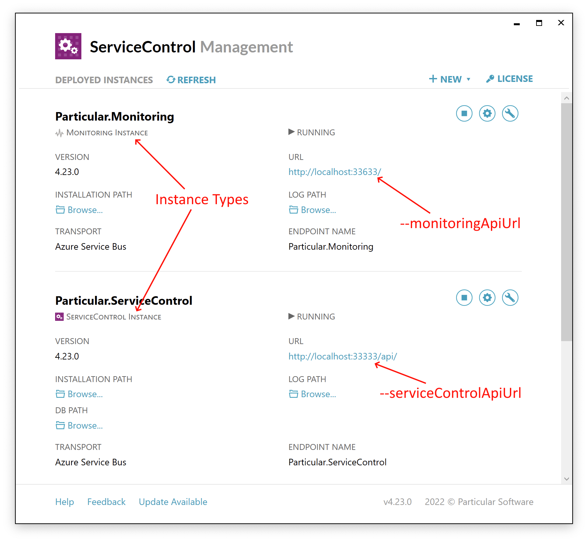

The Particular throughput tool can be installed locally and run against a production system to discover the throughput of each endpoint in a system over a period of time.

This article details how to collect endpoint and throughput data using data from [ServiceControl](/servicecontrol/). Refer to the [throughput counter main page](./) for information how to install/uninstall the tool or for other data collection options.

## Running the tool

Once installed, execute the tool with the URLs for the ServiceControl and monitoring APIs, as in this example:

```shell
throughput-counter servicecontrol --serviceControlApiUrl http://localhost:33333/api/ --monitoringApiUrl http://localhost:33633/
```

Because ServiceControl contains, at maximum, the previous 1 hour of monitoring data, the tool will query the ServiceControl API 24 times with a one-hour sleep period between each attempt in order to capture a total of 24 hours worth of data.

For endpoints that do not have monitoring enabled, the tool will fall back to querying [message audit data](/nservicebus/operations/auditing.md) to determine how many messages have been processed each hour.

## Options

| Option | Description |
|-|-|
| <nobr>`--serviceControlApiUrl`</nobr> | **Required** – The URL of the ServiceControl API. In the [ServiceControl Management Utility](/servicecontrol/installation.md), find the instance identified as a **ServiceControl Instance** and use the value of the **URL** field, as shown in the screenshot below. |
| <nobr>`--monitoringApiUrl`</nobr> | **Required** – The URL of the Monitoring API. In the [ServiceControl Management Utility](/servicecontrol/installation.md), find the instance identified as a **Monitoring Instance** and use the value of the **URL** field, as shown in the screenshot below. |
include: throughput-tool-global-options

This screenshot shows how to identify the instance types and locate the required URLs:

