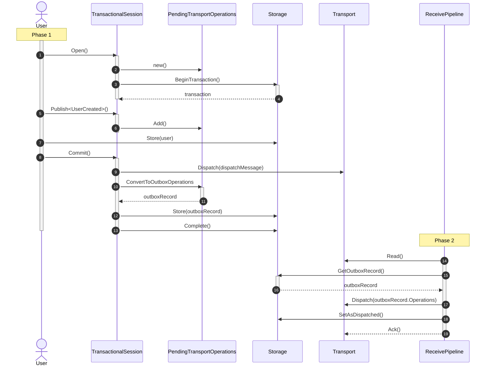

This article describes how to achieve consistency when modifying business data and sending messages, similar to the [outbox](/nservicebus/outbox), but outside the context of an NServiceBus message handler.

youtube: https://www.youtube.com/watch?v=-UOyxjnlYXs

## The consistency problem

Consider an ASP.NET Core controller that creates a user in the business database and publishes a `UserCreated` event. If a failure occurs during the execution of the request, two scenarios may occur, depending on the order of operations.

1. **Zombie record**: The controller creates the `User` in the database first, then publishes the `UserCreated` event. If a failure occurs between these two operations:
    * The user is created in the database, but the `UserCreated` event is not published.
    * This results in a user in the database, known as a zombie record, which is never announced to the rest of the system.
2. **Ghost message**: The controller publishes the `UserCreated` event first, then creates the user in the database. If a failure occurs between these two operations:
    * The `UserCreated` event is published, but the user is not created in the database.
    * The rest of the system is notified about the creation of the user, but the user record is never created. This inconsistency causes errors, as parts of the system expect the record to exist in the database.

In the context of a message handler, the [NServiceBus Outbox](/nservicebus/outbox) feature can mitigate this problem. However, these scenarios require that the operations occur within a message handler.

A common technique to address this problem on the client side is to defer all operations to a message handler. This entails sending a message to create the user and publishing the `UserCreated`-event from within a message handler. However, this approach is not always feasible. Here are two examples:

* Existing applications often have non-trivial processing logic in controllers. Moving all of it into dedicated message handlers could entail significant effort.
* Processing logic in the controller may assume specific side effects to occur within the scope of the request, e.g., validation, notifications, or error handling. The logic may, therefore, not be ready for the asynchronous, fire-and-forget approach required when offloading work into message handlers.

The `TransactionalSession`, when combined with [outbox](/nservicebus/outbox), solves this problem for messages sent and/or published outside the context of a message handler.

## Usage

partial: sendonly

To use the transactional session, first install the [transactional session package for a supported persister](/nservicebus/transactional-session/persistences) in the project.

Next, enable the session integration on the endpoint as follows:

snippet: enabling-transactional-session

To ensure atomic consistency across database and message operations, enable the [outbox](/nservicebus/outbox):

snippet: enabling-outbox

The transactional session can be resolved from the container, and must be opened:

snippet: opening-transactional-session

Sending messages in an atomic manner is done through the `ITransactionalSession` instance:

snippet: sending-transactional-session

The persistence-specific database session is accessible via the `transactionalSession.SynchronizedStorageSession` property or via dependency injection. See the [persistence-specific documentation](/nservicebus/transactional-session/persistences) for more details.

Once all the operations that are part of the atomic request have been executed, the session should be committed:

snippet: committing-transactional-session

Disposing of the transactional session without committing will roll back any changes that were made.

> [!NOTE]
> The `Commit` operation may fail and throw an exception for reasons outlined in the [failure scenarios section](#failure-scenarios).

## Requirements

The transactional session feature requires a supported persistence package to store outgoing messages. This feature is currently supported for the following persistence packages:

* [Azure Table](/persistence/azure-table)
* [CosmosDB](/persistence/cosmosdb)
* [SQL](/persistence/sql)
* [NHibernate](/persistence/nhibernate)
* [RavenDB](/persistence/ravendb)
* [MongoDB](/persistence/mongodb)
* [DynamoDB](/persistence/dynamodb/)

## Design considerations

It's recommended to not mix the processing of dispatch messages with business messages in order to get:

- Predictable dispatch message processing: Processing of dispatch messages will be more reliable since there is no risk of getting delayed behind slow business messages
- More accurate metrics: Metrics like critical time and queue length will accurately represent the performance of the dispatch message processing and not be skewed by business messages
- Simplified management: Knowing that the endpoint only processes dispatch messages makes it possible to always retry all failed messages related to the endpoint via tools like ServicePulse

When configuring endpoints for usage measurement in ServicePulse, mark dedicated transactional session processor endpoints with the appropriate [endpoint type indicator](/servicepulse/usage.md#setting-an-endpoint-type-endpoint-type-indicators).

partial: design-considerations

partial: remote-processor

## Transaction consistency

To guarantee atomic consistency across database and message operations, the transactional session requires the [outbox](/nservicebus/outbox) to be enabled. This combination of features provides the strongest consistency guarantees and is, therefore, the recommended, safe-by-default configuration.

> [!NOTE]
> The outbox must be [enabled explicitly](/nservicebus/outbox/#enabling-the-outbox) on the endpoint configuration.

With the outbox disabled, database and message operations are not applied until the session is committed. All database operations share the same database transaction and are committed first. When the database operations complete successfully, the message operations are [batch-dispatched by the transport](/nservicebus/messaging/batched-dispatch.md). The message operations and the database changes are not guaranteed to be atomic. This might lead to zombie records or ghost messages in case of a failure during the commit phase.

## How it works

The transactional session feature guarantees that all outgoing message operations are eventually consistent with the data operations.

Returning to the earlier example of a message handler that creates a `User` and then publishes a `UserCreated` event, the following process occurs. Details are described following the diagram.



Internally, the transactional session doesn't use a single transaction that spans all the operations. The transactional session acknowledgement occurs in two separate phases:

### Phase 1

1. The user opens a transactional session.
2. A set of `PendingTransportOperations` is initialized and collects the message operations.
3. A transaction is started on the storage seam.
4. The storage returns an open transaction.
5. The user can execute any required message operations using the transactional session.
6. Transport operations are captured by the `PendingTransportOperations`
7. The user can store any data using the persistence-specific session, which is accessible through the transactional session.
8. When all operations are registered, the user calls `Commit` on the transactional session.
9. A `DispatchMessage` to complete the transaction is sent. This message is independent of the message operations and is not stored in the outbox record.
10. The message operations (`PendingTransportOperations`) are converted into an outbox record.
11. The outbox record is returned to the transactional session
12. The outbox record is saved to the storage seam.
13. The transaction is committed, and the outbox record and business data modifications are stored atomically.

> [!NOTE]
> When no message operations are executed in the transactional session, steps 9 through 12 are skipped (and as a consequence Phase 2 is also skipped) to avoid wasting queue and database resources.

### Phase 2

The `DispatchMessage` is processed as follows:

* Find the outbox record.
  * If it exists, and it hasn't been marked as dispatched, and there are pending operations:
    * Dispatch the messages, and mark the outbox record as dispatched.
  * If it doesn't exist yet, delay the processing of the dispatch message.

## Failure scenarios

The transactional session provides atomic store-and-send guarantees, similar to the outbox feature (except for incoming message de-duplication). The dispatch message is used to ensure that **exactly one** of the following outcomes occurs:

* Transaction finishes with data being stored, and outgoing messages eventually sent - when the `Commit` path successfully stores the `OutboxRecord`
* Transaction finishes with no visible side effects - when the dispatch message stores the `OutboxRecord`

Sending the dispatch message first ensures that, eventually, the transaction will have an atomic outcome. If the `Commit` of the `OutboxRecord` succeeds, the dispatch message will ensure the outgoing operations are sent.

### Failure to send the dispatch message

If sending the dispatch message fails, the transactional session changes will roll back, and an error will be raised to the user committing the session.

If the transaction completes and the dispatch message fails to process through all the retry attempts, the dispatch message will be moved to the error queue and the outgoing messages will not be dispatched. Once the error is resolved, the dispatch message must be manually retried in ServicePulse to ensure the outgoing messages are dispatched. If the messages are not manually retried, the stored outgoing messages will never be delivered. If that's undesirable, the system must be returned to a consistent state via other means.

### Failure to commit the outbox record

If the `Commit` fails, the dispatch message will (after the [maximum commit duration](#advanced-configuration-maximum-commit-duration) elapses) eventually be consumed, leaving no side effects.

### Commit takes too long

When the commit takes longer than the [maximum commit duration](#advanced-configuration-maximum-commit-duration), the dispatch message will result in a tombstone record in the outbox preventing the commit from succeeding. The following exception is thrown:

`Failed to commit the transactional session. This might happen if the maximum commit duration is exceeded`

A variation of this is when using a remote processing endpoint that does not have the transactional session enabled. In this scenario, the tombstone record will be created immediately when the dispatch message is processed, forcing a rollback of the commit. When this happens, the following exception is thrown:

`Failed to commit the transactional session. This might happen if the maximum commit duration is exceeded or if the transactional session has not been enabled on the configured processor endpoint - MyProcessorEndpoint`

## Limitations

* The transport must have the same or higher availability guarantees as the database.

## Advanced configuration

### Maximum commit duration

The maximum commit duration limits the amount of time it can take for a transaction to commit the changes before the operation times out. The value can be configured when opening the session.

The default value for the maximum commit duration is `TimeSpan.FromSeconds(15)`.

snippet: configuring-timeout-transactional-session

The maximum commit duration does not represent the total transaction time, but rather the time it takes to complete the commit operation (as observed from the perspective of the dispatch message). In practice, the observed total commit time might be longer due to delays in the transport caused by latency, delayed delivery, load on the input queue, endpoint concurrency limits, and more.

When the dispatch message is consumed, but the outbox record is not yet available in storage, the following formula is applied to delay the message (see [Phase 2](#how-it-works-phase-2)):

```csharp
CommitDelayIncrement = 2 * CommitDelayIncrement;
RemainingCommitDuration = RemainingCommitDuration
  - (CommitDelayIncrement > RemainingCommitDuration 
      ? RemainingCommitDuration
      : CommitDelayIncrement);
```

partial: config

### Metadata

It is possible to add metadata (e.g. tenant information) transactional session dispatch message via custom headers. These headers can be accessed by a [custom behavior](/nservicebus/pipeline/manipulate-with-behaviors.md#add-a-new-step) when the dispatch message is received in the `TransportReceive` part of the pipeline.

snippet: configuring-metadata-transactional-session
