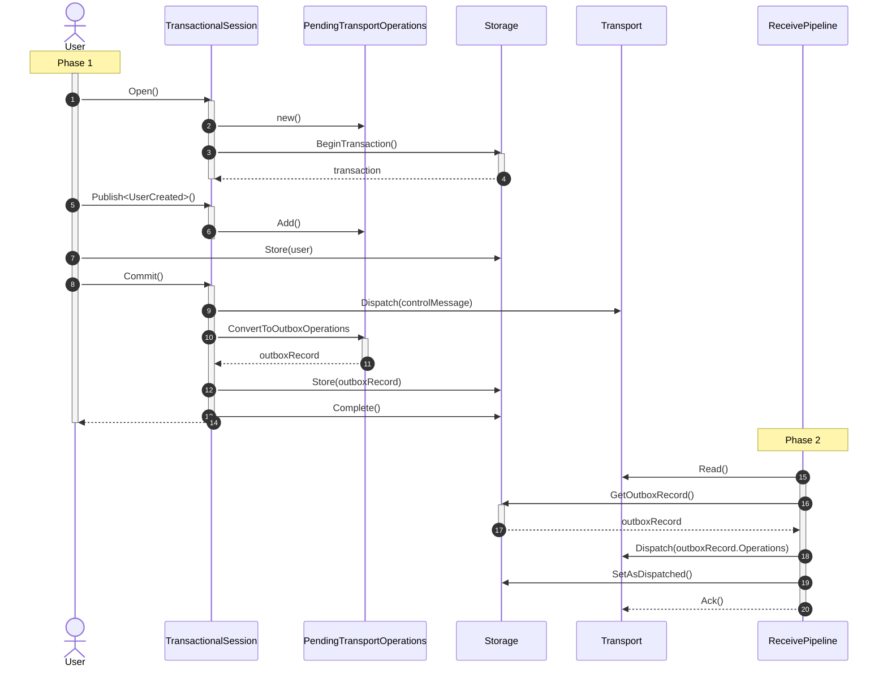

## The consistency problem

Consider an ASP.NET Core controller that creates a `User` in the business database, and also publishes a `UserCreated` event. If a failure occurs during the execution of the request, two scenarios may occur, depending on the order of operations.

1. **Phantom record**: The controller creates the `User` in the database first, then publishes the `UserCreated` event. If a failure occurs between these two operations:
    * The `User` is created in the database, but the `UserCreated` event is not published.
    * This results in a `User` in the database, known as a phantom record, which is never announced to the rest of the system.
2. **Ghost message**: The controller publishes the `UserCreated` event first, then creates the `User` in the database. If a failure occurs between these two operations:
    * The `UserCreated` event is published, but the `User` is not created in the database.
    * The rest of the system is notified about the creation of the `User`, but the `User` does not exist in the database. This causes further errors in the system which expect the `User` to exist in the database.

When in the context of a message handler, this problem can be mitigated through the Outbox feature, however, this problem remains unsolved outside of the context of a message handler.
The only way to address this problem on the client-side, is to defer all operations to the message handler. This entails sending a message to create the user and publishing the `UserCreated`-event from that message handler.
However, there are scenarios where this approach is not feasible:
- Existing applications that want to introduce messaging, already have quite some logic in controllers. Moving all that logic into dedicated message handlers requires a lot of effort, and might no be feasible from day one.
- There may be other scenarios in which it's not feasible to delay the database operation.

The `TransactionalSession` feature solves exactly this problem.

## Usage

To use the transactional session, first, the `NServiceBus.TransactionalSession`-package needs to be installed in the project.

Then, the feature needs to be enabled on the endpoint:

snippet: enabling-transactional-session

The transactional session can be resolved from the container, and needs to be opened:

snippet: opening-transactional-session

To send messages in an atomic manner, they can be sent through the `ITransactionalSession`:

snippet: sending-transactional-session

Once all the operations that are part of this request have been executed, the session should be committed:

snippet: committing-transactional-session

TODO: disposing without committing rolls back the session

## Requirements

The transactional session feature requires a persistence in order to store outgoing messages. This feature is currently supported for the following persistence packages:

* [Azure Table](/persistence/azure-table)
* [CosmosDB](/persistence/cosmosdb)
* [SQL](/persistence/sql)
* [NHibernate](/persistence/nhibernate)
* [RavenDB](/persistence/ravendb)
* [MongoDB](/persistence/mongodb)

## How it works

The transactional session feature guarantees that all outgoing message operations are eventually consistent with the data operations.

Returning to the earlier example of a message handler which creates a `User` and then publishes a `UserCreated` event, the following process occurs. Details are described following the diagram.

There is no single transaction that spans all the operations. The operations occur in two separate phases:

### Phase 1

1. The user opens a transactional session.
2. A set of `PendingOperations` is initialized, in which the message operations will be collected.
3. A transaction is started on the storage seam.
4. The user can execute any message operations that are needed on the transactional session.
5. The user can store any data using the persistence-specific session that is exposed on the transactional session.
6. When all operations have been registered, the user calls ´Commit´ on the transactional session.
7. A control message is dispatched to the local queue.
8. The message operations are converted and stored into an outbox record.
9. The transaction is committed and the outbox record and business data-modifications done by the user are atomically stored.

### Phase 2

The endpoint receives the control message, and processes it as follows:
   * Find the outbox record.
   * If it exists, it hasn't been marked as dispatched, and there are pending operations, dispatch those operations, and set the outbox record as dispatched.
   * If it doesn't exist, processing of the control message is delayed to a later point.

## Important design consideration

* The transactional session uses a control message that is sent to the local queue. Due to this design, this feature requires a full endpoint and cannot be used in send-only endpoints.

- dedup should be done by the user based on session
