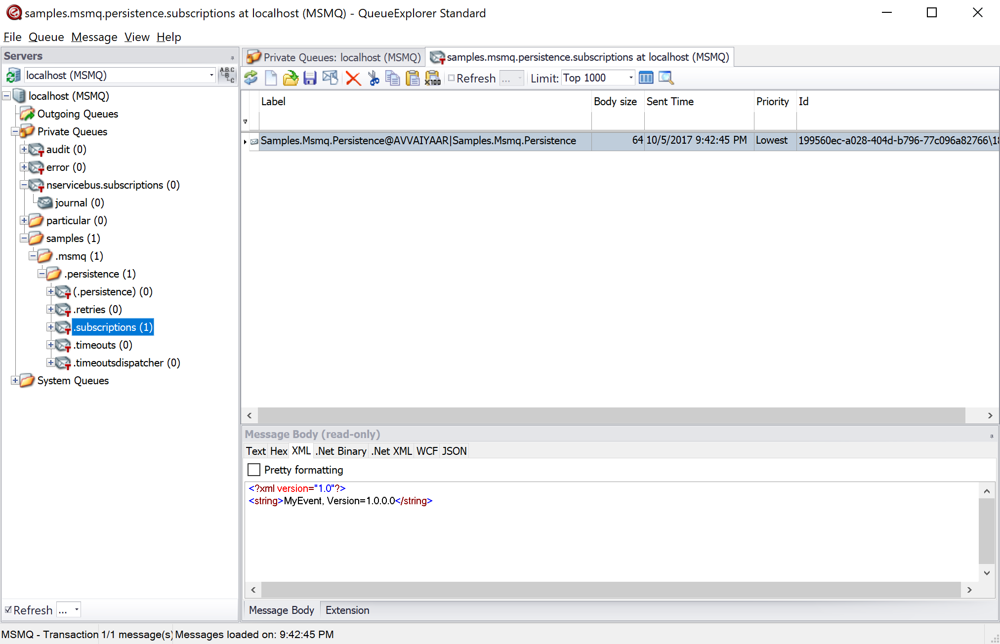

When using Msmq Subscription storage in NServiceBus Versions 5.x and Versions 6.x, when a subscription queue is not configured, the subscription storage queue automatically defaulted to `NServiceBus.Subscriptions`. However, as this queue name was not endpoint specific, endpoints deployed to the same server could potentially share the same subscriptions queue which is undesirable. 

To rectify this, starting from Versions 1.0 and above of NServiceBus.Transport.Msmq, if a queue called `NServiceBus.Subscriptions` is detected, an exception will be thrown to prevent potential loss of messages. 

To move messages from the `NServiceBus.Subscriptions` queue to the new queue, refer to the instructions outlined below.

## Create the subscriptions queue

Create a transactional queue called [EndpointName].Subscriptions and substitute the actual name of the endpoint. This can be done by using the PowerShell scripts, [Windows MMC Snap-in or other tools like QueueExplorer](/transports/msmq/viewing-message-content-in-msmq.md#windows-native-tools). If creating queues manually using UI tools, ensure that the queues are marked, "transactional". 

### Using PowerShell Script

Use the `CreateQueue` function that's part of `CreateQueues.ps1`. This PowerShell script comes with the NServiceBus.Transport.Msmq NuGet package and is copied to a subfolder called `NServiceBus.Transport.Msmq` in the output folder of any project referencing it. Browse to the output folder to locate the scripts, for example, `bin\Debug\net461\NServiceBus.Transport.Msmq`. 

2. [Load the `CreateQueues.ps1` PowerShell script](https://technet.microsoft.com/en-us/library/bb613481.aspx) and run the `CreateQueue` function as shown below:

```
    # CreateQueue -QueueName "EndpointName.Subscriptions" -Account $env:USERNAME
```


## Move the subscription messages 

Once the new queue is created, use a tool like [QueueExplorer](http://www.cogin.com/mq/index.php) to locate the messages in the `NServiceBus.Subscriptions` queue and move them to the newly created subscriptions queue. If the `NServiceBus.Subscriptions`queue was being shared among multiple endpoints, select only the messages intended for the endpoint that is being upgraded to NServiceBus.Transport.Msmq package. Identify which messages need to be moved by inspecting the message body and looking for the event information and also by inspecting the subscriber queue name in the `LABEL` column.

Select the identified messages first on the right-hand pane and then right click to select the `Cut` option. Now select the newly created subscriptions queue by clicking on the name of the queue. Right click on the messages pane and select the `Paste` option to move the messages. 

Once all the subscription messages have been moved, delete the `NServiceBus.Subscriptions` queue.

WARNING: If more than one endpoint is sharing the same queue, ensure that individual subscription queues are first created and all the relevant messages are either moved or copied to the appropriate newly created queues before deleting the `NServiceBus.Subscriptions` queue. QueueExplorer can also be used to copy messages, if a copy of the same subscription message needs to be added to more subscription queues.


