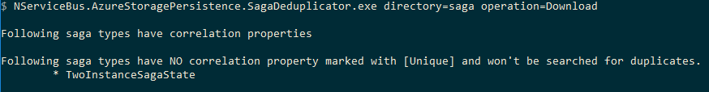

## Summary

This document explains how to upgrade and patch a system for [Azure Storage Persistence bug #26](https://github.com/Particular/NServiceBus.AzureStoragePersistence/issues/26) using the NServiceBus Azure hotfix release 6.2.4.

### How to know if a system may be affected

This bug will affect a system only if the following conditions are met on the same endpoint: 
- NServiceBus Version 5 or lower
- NServiceBus.Azure Version 6.2.3 or lower
- AzureStoragePersitence is used
- the endpoint contains a saga which has more than one `IAmStartedBy<T>`
- endpoint concurrency is set to > 1

## Patch Requirements
To deploy this fix throughout a system, all endpoints will need to be upgraded and saga data that has been stored by the Azure Storage persister will need to be patched.

### Upgrading endpoints

All endpoints using NServiceBus.Azure will need to be upgraded to version 6.2.4 or higher.

### Patching data
Saga data stored in Azure will need to be patched using the `NServiceBus.AzureStoragePersistence.SagaDeduplicator` utility which can be downloaded from [https://github.com/Particular/IssueDetection/releases/tag/nsb.asp.26](https://github.com/Particular/IssueDetection/releases/tag/nsb.asp.26).

## Patch steps

1. Download the de-duplication tool from [https://github.com/Particular/IssueDetection/releases/tag/nsb.asp.26](https://github.com/Particular/IssueDetection/releases/tag/nsb.asp.26) and put it on a computer that has internet access as well as the .NET Framework 4.5.2 installed.
2. Add an Azure Storage connection string to the `NServiceBus.AzureStoragePersistence.SagaDeduplicator.exe.config` file. Example:
```		
<configuration>  
  <connectionStrings>  
    <add name="sagas" connectionStrings="--anAzureStorageConnectionString--"/>  
	</connectionStrings> 
</configuration>
``` 
3. Copy endpoint dlls to the same folder as the de-duplication tool. These files will be scanned to find all implementations of IContainSagaData which will indicate the sagas that need to be verified in Azure Storage.
4. Run de-duplication utility (see below for details)
5. All class names returned by the de-duplication tool in the previous step will need to add the `[Unique]` attribute to one property. `IContainSagaData` classes without a property decorated by the `[Unique]` attribute will cause their sagas to throw exceptions post upgrade.
6. Update NServiceBus.Azure dependency to version 6.2.4 or higher in all endpoints that use it and release the updated endpoints.
7. Run de-duplication utility again (see below for details). This will fix problem saga data or list conflicts that were introduced to the data store while steps #5 and #6 were being performed.
8. If the de-duplication utility has output any classes that require the identification of a correlation property, then return to step #5 above and address those classes.

### Running the de-duplication utility
1. Open a commandline and run the following command: `NServiceBus.AzureStoragePersistence.SagaDeduplicator.exe directory=<directory> operation=Download` where:
	- **directory**: This should be the full path of the working directory that the de-duplication tool will use. The tool will need to have read, write and delete permissions on the folder selected. If there are any spaces in the directory path this value should be enclosed in double quotes. If the tool was run previously, ensure that the directory indicated is empty. Example: `directory="C:\my working folder\deduplication"`
2. The utility will output a list of saga data classes that it found while scanning the assemblies provided. The list of classes is split into two categories: those classes that have a correlation property and those that do not. 

   

  The saga classes that do have a correlation property will have their data de-duplicated. The classes that do not have a correlation property will need to have the `[Unique]` attribute added later steps. Make note of the classes in this list for use later.

3. The de-duplication utility will have fixed the data for all saga instances that it could. There can, however, be situations where the utility was unable to resolve the correct saga instance. When this happens the de-duplication tool will download conflicting sagas to the working directory that was provided as a command line parameter. Every set of conflicting sagas is downloaded to a separate directory containing files named with conflicting sagas identifiers. For example, running the utility with `directory=data` against an assembly that has a `TwoInstanceSagaState` class that implements `IContainSagaData` will result in a following structure:
```
data
└───TwoInstanceSagaState
    └───d10c2f15-06d2-1370-e0ee-781710b5d598
        └───0e36dc9a-eec0-455c-a4d3-b8b275711d15
        └───8ee2f4b2-eaf2-4d12-a87e-a5e000aaa815
```
where the `0e36dc9a-eec0-455c-a4d3-b8b275711d15` and `8ee2f4b2-eaf2-4d12-a87e-a5e000aaa815` folders contain the JSON payload of each of the conflicting sagas. In addition to the saga properties the JSON payload contains a property, `"$Choose_this_saga"`, to indicate which of the conflicting sagas is to be used as the selected saga.
```
{
  "OrderId": "8ca3f5a2-009f-4796-9727-d8493e47288f",
  "Id": "0e36dc9a-eec0-455c-a4d3-b8b275711d15",
  "Originator": "Originator",
  "Name": "Test",
  "OriginalMessageId": "fe0414cd-d440-494a-b21a-a5e000aaa68e",
  "$ETag": "W/\"datetime'2016-04-06T08%3A21%3A23.7356692Z'\"",
  "$Choose_this_saga": false
}
```
Initially, its value is `"$Choose_this_saga": false`. For each set of conflicting sagas, one saga should be updated accordingly and marked chosen by setting the `$Choose_this_saga` property to `true`.
```
{
  "OrderId": "8ca3f5a2-009f-4796-9727-d8493e47288f",
  "Id": "0e36dc9a-eec0-455c-a4d3-b8b275711d15",
  "Originator": "Originator",
  "Name": "------------------------This is updated name------------------",
  "OriginalMessageId": "fe0414cd-d440-494a-b21a-a5e000aaa68e",
  "$ETag": "W/\"datetime'2016-04-06T08%3A21%3A23.7356692Z'\"",
  "$Choose_this_saga": true
}
```
This saga selection will need to be performed on all sagas that are downloaded to the file system.
4. Once all conflicting sagas have been resolved, run the following command: `NServiceBus.AzureStoragePersistence.SagaDeduplicator.exe directory=<directory> operation=Upload`. This step will update the Azure Storage to contain the conflicted sagas that were marked `"$Choose_this_saga": true` in step #3.
	- All of the commandline parameters, with the exception of `operation=Upload`, should be exactly the same as they were in step #1.


## After the patch process
Once the patch process has been completed there will be exceptions thrown, and logged, when duplicates are found in the course of normal message processing. The exception that is logged will be `DuplicateSagaFoundException` and will have the following message structure:

	Sagas of type {sagaType.Name} with the following identifiers '<comma separated list of message identifiers>' are considered duplicates because of the violation of the Unique property {propertyName}.

When this happens the involved messages will be sent to the error queue. There are two ways to re-queue these messages.
1. If ServiceControl and ServicePulse are running then follow the instructions for [Failed Message Retry using ServicePulse](/servicepulse/#failed-message-retry) to requeue the messages. 
2. To requeue messages without ServicePulse and/or ServiceControl in place the messages will need to be manually moved from the error queue to the appropriate processing queue. The way this is done will vary depending on which transport is being used.
