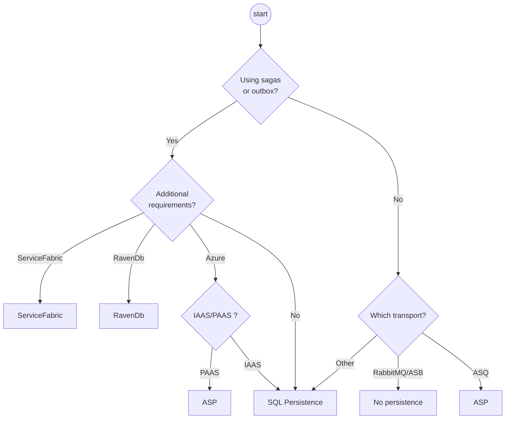

NServiceBus needs to store data for various purposes. This document is written to help select the right persister for NServiceBus from the [list of available persisters](/persistence/#available-persisters).

## Why does NServiceBus need storage?

NServiceBus needs a persister to store the state of sagas, enable the outbox and, sometimes, to make a transport feature complete.

- **Sagas**
  A powerful way to orchestrate long-running business processes is provided by [sagas](/nservicebus/sagas/). They contain state that needs to be persisted.
- **Outbox**
  The [outbox](nservicebus/outbox/) needs to store message details to provide deduplication. See the [persisters documentation](http://nservicebus/outbox/#persistence) for more details.
- **Subscription storage**
  Transports that don’t support publish and subscribe natively, need storage for the subscription data. See the [transport documentation](/transports/) for more details.
- **Timeouts**
  All transports except [MSMQ](/transports/msmq/) support native timeouts. Therefore, if MSMQ is selected, storage of timeout data is required.

## Persister decision chart

As guidance, this decision chart can be used to select an appropriate persister. It is by no means an end to all discussions and additional considerations have been added to this document, to make the best decision possible.

## Making the decision

This section provides considerations that aren’t included or immediately visible in the decision chart. The selected transport might influence the decision for a persister. See the [selecting a transport guidance](/transports/selecting.md) for more information.

Most users will eventually start recognizing the benefits of sagas in their business system. For this reason, it is important for any system to consider selecting a persister.

If a datastore has already been selected to store business data and NServiceBus has a persister for that specific datastore, it can be beneficial to select that specific persister. If NServiceBus doesn’t have a persister for the specific data store or multiple data stores are used, any of the NServiceBus persisters can be used. The result is a hybrid solution of multiple data stores to store both business data and NServiceBus specific data.

### Learning Persistence

The Learning Persistence is not meant for production usage.

### In-Memory

The In-Memory persister is not mentioned in the decision chart, as it is only usable in very specific scenarios where the volatility of data is not an issue. 

### Azure

There are multiple options available when endpoints are hosted in Windows Azure. The most commonly used persisters are Azure Storage and Azure SQL, the fully managed SQL Server solution in Azure.

The decision should be made whether you want to be fully Platform-as-a-Service (PaaS) enabled - and want to fully buy-in to Azure - or if you’re confident managing SQL Server yourself you may choose Infrastructure-as-a-Service (IaaS). Although there are other small considerations to be made for either option.

Azure SQL

- Supports local transactions
- Supports Outbox
- Better tooling support with SQL Management Studio

Azure Storage

- Cheaper
- Automatically scales
- A turn-key solution, meaning no maintenance

### SQL Persistence

This persister stores saga data as a JSON blob. This gives much better performance and maintainability than the NHibernate persister. The NHibernate persister stores data in tabular format, creating multiple tables for sagas, especially when using complex data types.

Since SQL Server and PostgreSQL have great support for querying JSON data, this persister is recommended over NHibernate.

### Service Fabric

Only relevant if endpoints are hosted in ServiceFabric. Read this (TBA) hosting guidance section.

### RavenDB

If a business system already stores its data in RavenDB, NServiceBus supports storing data inside RavenDB as well. This removes the need to introduce additional storage.

### What if a preferred persistence is missing?

If the NServiceBus persisters are lacking an option for a specific data store, there are additional options to be found in the [community extensions](/components/#persisters). Although Particular Software support will do its best to help with these extensions, they are not officially supported.

### What is the recommended choice?

If it is hard to select a proper persister, the SQL Persister is one of the recommended choices. Relational databases are historically most often used for business applications and many developers have knowledge on them. This persister also supports [multiple database engines](/persistence/sql/#supported-sql-implementations) and can be used with many OR/M, like Entity Framework, NHibernate, Dapper and others.

Where NHibernate also supports multiple database engines, the SQL Persister does not depend on any additional library and is the most likely to support the latest trends in both .NET and the mentioned database engines.

If it is still hard to make a decision it is recommended to [get in contact](https://particular.net/support) with Particular Software.

## Migrating to a different persister

There is always the option to migrate to a different persister, although it is not the easiest task. Before doing so, it is important to consider carefully which of the available NServiceBus persisters is the right one for you. For help in selecting the right persister and migrating to a different persister [contact us for help](https://particular.net/support).
