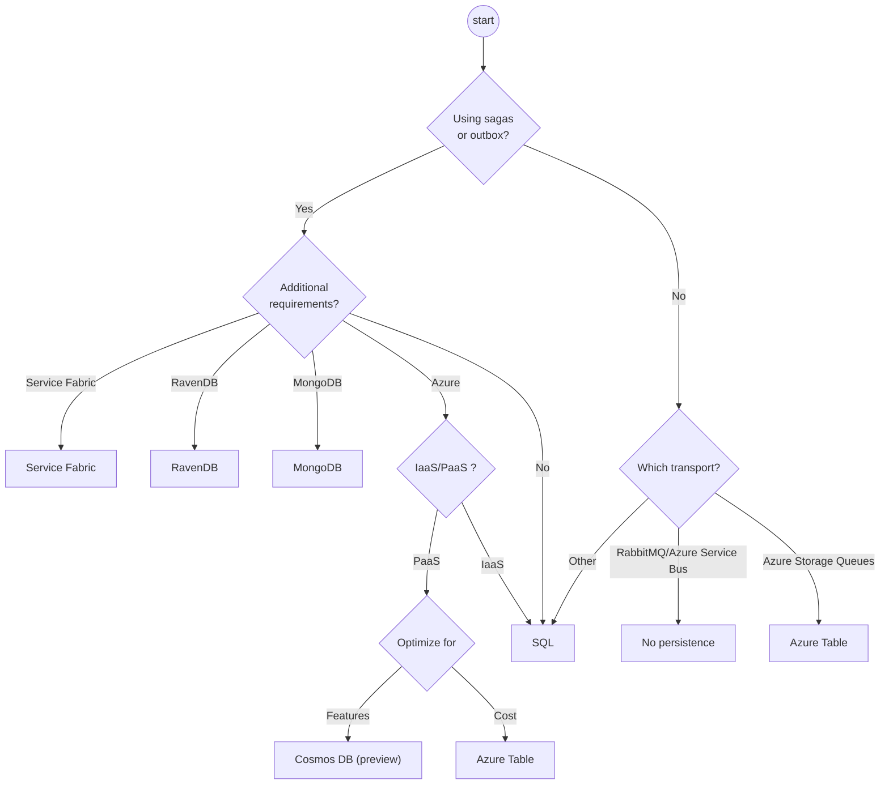

NServiceBus stores data for various purposes. This document contains guidelines to help select the right persister for NServiceBus from the [list of supported persisters](/persistence/#supported-persisters).

## How NServiceBus uses storage

NServiceBus uses persisters to store the state of sagas, to enable the outbox, and to provide other features for some transports.

- **Sagas**
  A powerful way to orchestrate long-running business processes is provided by [sagas](/nservicebus/sagas/). Sagas maintain state over a period of time and this state must be persisted.
- **Outbox**
  The [outbox](/nservicebus/outbox/) stores message details in order to prevent processing duplicated messages. See the [persistence documentation](/nservicebus/outbox/#persistence) for more details.
- **Subscription storage**
  Transports that don’t support publish and subscribe natively use storage for the subscription data. See the [transport documentation](/transports/) for more details.
- **Timeouts**
  Unlike other transports, [MSMQ](/transports/msmq/) does not support native timeouts. Therefore, if MSMQ is selected as the transport, storage of timeout data is required.

## Persister decision chart

As guidance, this decision chart can be used to select an appropriate persister. It is meant only as a starting point to further discussions; additional considerations are included below to help make an informed decision.

## Making the decision

This section provides considerations that aren’t included or immediately visible in the decision chart. The selected transport might influence the decision for a persister. See [Selecting a Transport](/transports/selecting.md) for more information.

Most users will eventually start recognizing the benefits of sagas in their business system. For this reason, it is important for any system to consider selecting a persister.

If a datastore has already been selected to store business data and NServiceBus has a persister for that specific datastore, that persister is a logical choice. If NServiceBus doesn’t have a persister for the specific data store or multiple data stores are used, any of the NServiceBus persisters can be used. The result is a hybrid solution of multiple data stores to store both business data and NServiceBus-specific data.

### Learning persistence

The learning persister is not meant for production usage.

### Non-durable

The non-durable persister is not mentioned in the decision chart, as it is appropriate only in very specific scenarios where the volatility of data is not an issue.

### Azure

There are several options available when endpoints are hosted in Microsoft Azure. The most commonly used persisters are Azure Storage, Azure Cosmos DB and Azure SQL, the fully managed SQL Server solution in Azure.

One factor in the decision is whether the system is fully platform-as-a-service-enabled and whether it is designed to run fully on Azure in which case, the Azure Storage Table or Azure Cosmos DB persistence may be appropriate. The choice between Azure Storage Table and Azure Cosmos DB boils down to a difference in cost vs capabilities.

Alternatively, some organizations are more comfortable managing SQL Server and may choose an infrastructure-as-a-service solution (using the SQL persister with SQL Server on a Virtual Machine).

**Azure SQL**

- Supports local transactions
- Supports outbox
- Better tooling support with SQL Server Management Studio

**Azure Storage**

- Usually cheaper
- Automatically scales
- A turn-key solution, meaning no maintenance

**Azure Cosmos DB (preview)**

- Supports transactions on the same partition
- Supports outbox
- Geo redundancy
- Lower latency
- Automatically scales
- A turn-key solution, meaning no maintenance

### SQL persistence

This persister stores saga data as a JSON blob. This gives much better performance and maintainability than the NHibernate persister, which stores data in tabular format, creating multiple tables for sagas.

Since SQL Server and PostgreSQL have great support for querying JSON data, this persister is recommended over NHibernate.

SQL Persistence [allows accessing the `DbConnection` and `DbTransaction`](/persistence/sql/accessing-data.md) from within message handlers to enable saving business data and NServiceBus data within the same transaction.

### MongoDB

If a business system already stores its data in MongoDB, NServiceBus supports storing data inside MongoDB as well. This removes the need to introduce additional storage.

With MongoDB 4.0 and greater, MongoDB supports multi-document transactions. Message handlers [can access the transaction](/persistence/mongodb/#transactions-shared-transactions) to atomically commit business and NServiceBus data.

### NHibernate

For new development, this persister is not recommended. Instead, use the SQL persister.

### Service Fabric

This option is relevant only if endpoints are hosted in Service Fabric.

### RavenDB

If a business system already stores its data in RavenDB, NServiceBus supports storing data inside RavenDB as well. This removes the need to introduce additional storage.

RavenDB Persistence [allows accessing the `IAsyncRavenSession`](/persistence/ravendb/#shared-session) from within message handlers to enable saving business data and NServiceBus data with the same `SaveChanges()` call.

### The recommended choice

If there is no obvious contender based on the guidelines presented here, the SQL persister is the recommended default. Relational databases are often used for business applications and many developers have knowledge on them. The SQL persister also supports [multiple database engines](/persistence/sql/#supported-sql-implementations) and can be used with many object/relational mappers, such as Entity Framework, NHibernate, Dapper, and others.

Even though the NHibernate persister also supports multiple database engines, the SQL persister does not depend on additional libraries and is more likely to support the latest trends in both .NET and the supported database engines.

After reviewing the requirements, and if the SQL persister is not a viable option, [get in contact](https://particular.net/support) with Particular Software and a Solution Architect will help based on specific requirements.

## Migrating to a different persister

Migrating from one persister to another is not a trivial task. For help in selecting the right persister and migrating to a different persister [contact Particular Software for help](https://particular.net/support).
