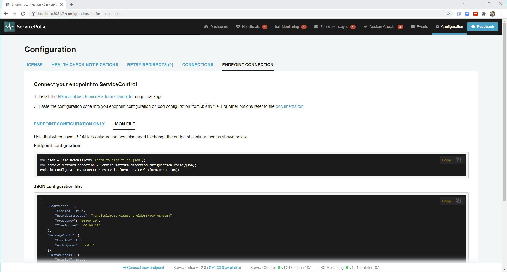

The ServicePlatform Connector plugin provides a unified API to connect an NServiceBus endpoint to the Particular Service Platform by configuring:

- an [error queue](/nservicebus/recoverability/configure-error-handling.md#configure-the-error-queue-address-using-code) address
- [message auditing](/nservicebus/operations/auditing.md)
- [saga auditing](/nservicebus/sagas/saga-audit.md)
- [performance metrics](/monitoring/metrics/) collection
- [custom checks](/monitoring/custom-checks/install-plugin.md)
- [heartbeats](/monitoring/heartbeats/)

## JSON

The connection details can be parsed from JSON with [a specific configuration schema](json-schema.md).

snippet: PlatformConnector-FromJson

The JSON file looks like this:

snippet: PlatformConnector-json

A JSON file specific to a concrete deployment of the ServicePlatform is available via ServicePulse.

## Code first

The connection details can be constructed in code.

snippet: PlatformConnector-CodeFirst

## Combined

Configuration can be loaded from JSON and then overridden in code.

snippet: PlatformConnector-Combo