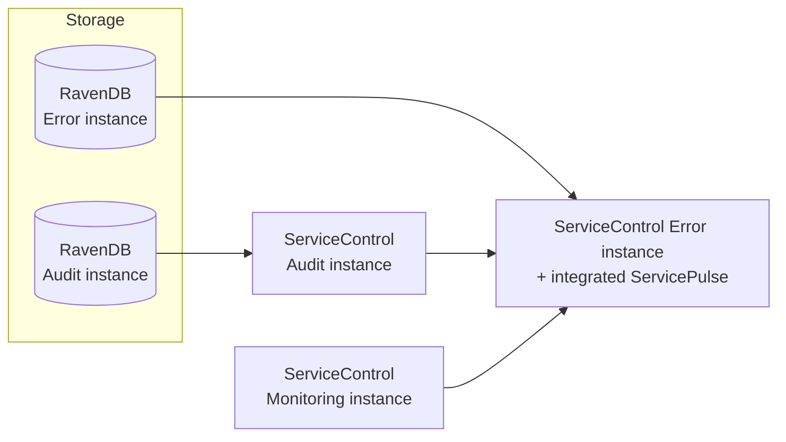

The Particular Service Platform can be deployed using Linux containers instead of Windows hosting. This page gives an overview of how the pieces fit together and links to the detailed deployment guide for each one. It's the starting point for anyone setting up the platform in containers for the first time; each linked page has the full configuration reference for that piece.

## Component overview

Only the Error and Audit instances need a RavenDB container; Monitoring instances don't store any data. Audit and Monitoring instances are optional, but recommended: an Error instance is required to run ServiceControl at all.

## Deploying the pieces

Deploy the pieces in this order:

1. **RavenDB**, one container per Error or Audit instance. See [Managing ServiceControl RavenDB instances via Containers](/servicecontrol/ravendb/containers.md).
2. **ServiceControl Error instance**, the only required piece. Enable [integrated ServicePulse](/servicecontrol/servicecontrol-instances/integrated-servicepulse.md) on this container so no separate ServicePulse container is needed. See [Deploying ServiceControl Error instances using Containers](/servicecontrol/servicecontrol-instances/deployment/containers.md).
3. **ServiceControl Audit instance** (optional), if audit message history is needed. See [Deploying ServiceControl Audit instances using containers](/servicecontrol/audit-instances/deployment/containers.md).
4. **ServiceControl Monitoring instance** (optional), if endpoint performance monitoring is needed. See [Deploying ServiceControl Monitoring instances using containers](/servicecontrol/monitoring-instances/deployment/containers.md).

A standalone ServicePulse container is still available, and is needed to view a Monitoring instance and an Error instance from a single address, or to manage more than one Error instance from the same ServicePulse. See [Running ServicePulse in containers](/servicepulse/containerization) for that scenario.

## Next steps

include: platform-container-examples

- Migrating an existing Windows-hosted installation to containers: [Migrate ServiceControl to container deployment](/servicecontrol/migrations/windows-to-containers.md).
- Deploying alongside MassTransit: [Deploying the MassTransit Connector](/servicecontrol/masstransit/docker-deployment.md).
